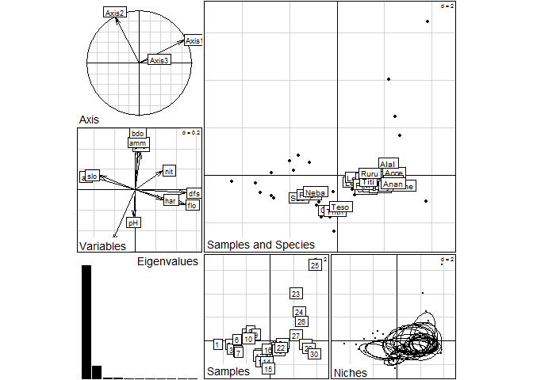
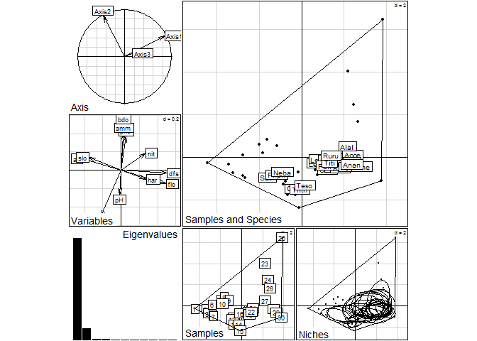
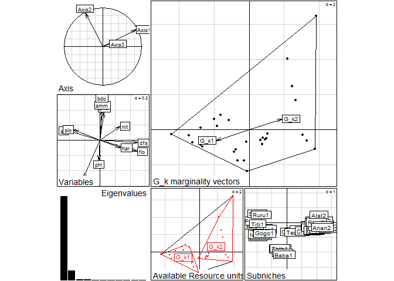
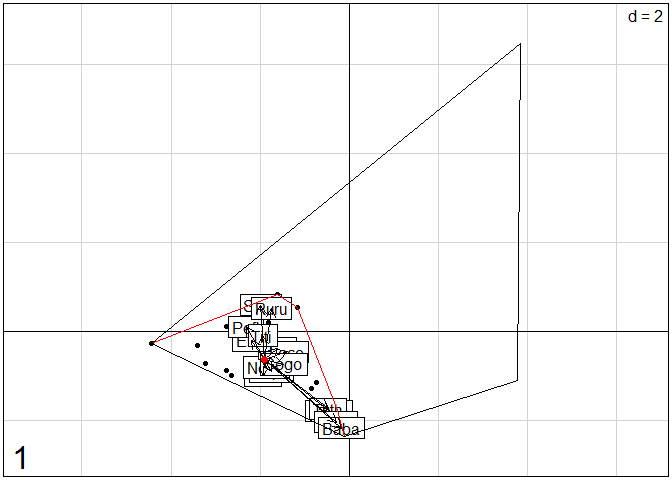
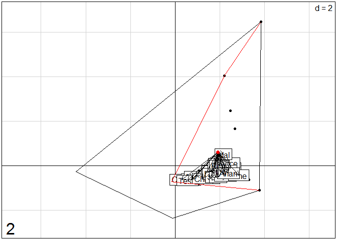

Subniche Documentation for the Within Outlying Mean Indexes calculations (WitOMI)
================

[subniche](https://cran.r-project.org/web/packages/subniche/index.html) is an open-source R (R Core Team, 2017) package that implements functions useful for the calculation of the Within Outlying Mean Indexes (WitOMI) and their respective statistical tests (Karasiewicz, 2017; Karasiewicz et al., 2017). It consists of complementary calculations to the Outlying Mean Index analysis (OMI) (Dolédec et al., 2000). OMI analysis can be implemented with the `niche` function from the [ade4](https://cran.r-project.org/web/packages/ade4/index.html) package (Dray and Dufour, 2007). WitOMI analysis enables to explore niche shift in a community and environmental constraints within an Euclidean space, with graphical displays. The method allows to divide the realized niche, estimated from the `niche` function into subniches defined by a factor (time, space), which creates the subsets of habitat conditions.

How to get started
------------------

Install and load the R package from [CRAN](https://cran.r-project.org/) using the following commands on the R console:

``` r
#install.packages("subniche")

library(subniche)
```

    ## Loading required package: ade4

\`

To install the most recent version from GitHub:

``` r
#install.packages("devtools")

#devtools::install_github("KarasiewiczStephane/WitOMI")

#library("subniche")
```

Generate the data required to run this example
----------------------------------------------

Get the data set “doubs” from the [ade4](https://cran.r-project.org/web/packages/ade4/index.html) package (Dray and Dufour, 2007). This data set includes, fish species abundances along with environmental variables, and spatial coordinates for 30 sites.

``` r
data(doubs)
```

Performing the OMI analysis
---------------------------

The first step consists of performing a PCA on the environmental table.

``` r
dudi1 <- dudi.pca(doubs$env, scale = TRUE, scan = FALSE, nf = 3)

scatter(dudi1)
```


The graph display the correlation between the different environmental variables. Next the OMI analysis uses the standardized environmental table from the PCA in combination with the faunistic data to performed the OMI analysis.

The standardized environmental table can be extracted from the `dudi1` with `$tab` as follow:

|         dfs|         alt|         slo|         flo|          pH|         har|         pho|         nit|         amm|         oxy|         bdo|
|-----------:|-----------:|-----------:|-----------:|-----------:|-----------:|-----------:|-----------:|-----------:|-----------:|-----------:|
|  -1.3663398|   1.6958649|   3.2180111|  -1.2002177|  -0.8783101|  -2.4786185|  -0.6355549|  -1.0463273|  -0.5616922|   1.2902811|  -0.6361105|
|  -1.3525018|   1.6883693|   0.6366483|  -1.1912278|  -0.2927700|  -2.7801536|  -0.6239502|  -1.0463273|  -0.2933679|   0.4178490|  -0.8466851|
|  -1.2942368|   1.6209095|   0.8286972|  -1.1462779|   1.4638501|  -2.0564694|  -0.5891358|  -1.0319349|  -0.4275300|   0.5096840|  -0.4255360|
|  -1.2337868|   1.3960435|   0.6959575|  -1.1052611|  -0.2927700|  -0.8503290|  -0.5311120|  -1.0391311|  -0.5616922|   0.7392714|  -1.0046160|
|  -1.2119374|   1.3773046|   0.3956458|  -1.0990805|   0.2927700|  -0.1266447|  -0.2061782|  -0.8160490|  -0.0250436|  -0.6382529|   0.2851530|
|  -1.1325513|   1.3660613|   0.6959575|  -1.0867193|  -0.8783101|  -1.5740132|  -0.4150642|  -1.0823083|  -0.5616922|   0.3719316|   0.0482567|
|  -1.1733368|   1.3473225|   1.3624801|  -1.0226657|   0.2927700|   0.1145833|  -0.5659263|  -1.0823083|  -0.5616922|   0.7851889|  -0.7677196|
|  -1.0109230|   1.1636819|   0.4709591|  -1.1743716|   0.2927700|   0.4764255|  -0.4150642|  -0.8952072|  -0.2397030|  -1.0974277|   0.7852675|
|  -0.8550639|   1.0137712|  -0.1814423|  -0.9777159|  -0.2927700|   0.2351974|  -0.2990164|  -0.6001630|  -0.2397030|  -1.0055927|   0.0219348|
|  -0.6474947|   0.5078225|   1.7390465|  -0.6855417|  -2.0493902|  -0.2472588|  -0.5775311|  -0.6505364|  -0.5348598|   0.2800966|  -0.2149615|
|  -0.4697863|   0.0056217|   0.9228388|  -0.1292871|   0.2927700|   0.5970395|  -0.2990164|  -0.0388595|  -0.5616922|   0.9688588|  -0.6361105|
|  -0.4042381|  -0.0168650|   0.0708572|  -0.1236683|  -0.8783101|  -0.0060307|  -0.6007406|  -0.8304414|  -0.5616922|   1.2902811|  -0.5571451|
|  -0.3226670|  -0.1180547|   0.3137426|  -0.0618623|   0.2927700|   0.7176535|  -0.5775311|  -0.8160490|  -0.5616922|   1.3821161|  -0.7150760|
|  -0.2600321|  -0.1780190|  -0.1814423|  -0.0562435|   1.4638501|   0.7176535|  -0.3338307|  -0.3051188|  -0.5616922|   1.3361986|  -0.3465706|
|  -0.1704496|  -0.2492265|  -0.9091569|   0.0448937|   3.2204702|  -0.0060307|  -0.1829686|  -0.4706314|  -0.5616922|   1.0606937|  -0.7940414|
|  -0.0145905|  -0.3991373|   0.2704375|  -0.3427990|  -0.2927700|   0.1145833|  -0.4150642|   0.2489885|  -0.4275300|   0.4178490|  -0.6361105|
|   0.0771769|  -0.5003270|  -0.9091569|   0.1179372|  -0.2927700|   0.3558114|  -0.4150642|   0.6087984|  -0.0250436|   0.3719316|  -0.1359960|
|   0.1682161|  -0.5602913|  -0.5278834|   0.1572684|  -0.2927700|   0.2351974|  -0.0669209|   0.3929125|  -0.0250436|   0.4178490|  -0.6097887|
|   0.2672667|  -0.6427422|  -0.9091569|   0.2078370|   0.2927700|  -0.1266447|   0.0491269|   0.3929125|  -0.1592057|   0.5556015|  -0.4781797|
|   0.4355070|  -0.7326886|  -0.5278834|   0.2584056|  -0.2927700|  -0.0060307|  -0.2990164|   0.9686084|   0.2432807|   0.4178490|  -0.6097887|
|   0.6794919|  -0.8226350|  -0.3386587|   0.2808805|  -0.8783101|  -0.0663377|  -0.4150642|   0.3929125|  -0.2933679|  -0.1790782|  -0.2676051|
|   0.7727160|  -0.8526171|  -0.0468198|   0.3202116|   0.2927700|   0.1145833|  -0.4150642|  -0.0244671|  -0.3738652|  -0.1331607|  -0.0833524|
|   0.8477323|  -0.8825993|  -0.1814423|   0.3707802|   0.2927700|   0.6573465|   2.3700822|   1.3284183|   2.5240372|  -1.4188500|   2.9699782|
|   0.9234768|  -0.9013381|  -1.2913718|   0.4247201|  -0.2927700|   0.7779606|   0.9775090|   0.6087984|   1.0482536|  -1.9239423|   1.8907838|
|   1.0188858|  -0.9388158|  -0.9091569|   0.9270349|  -0.8783101|   0.8382676|   4.2500561|   3.2713921|   4.2681451|  -2.4290345|   3.0489436|
|   1.2381081|  -1.0025279|  -0.9091569|   0.9495098|  -0.8783101|   0.4764255|   1.0123234|   0.9686084|   0.2432807|  -1.4647675|   0.9958420|
|   1.3495400|  -1.0325100|  -0.1814423|   0.9776035|   0.2927700|   0.2351974|   0.0259173|   0.9686084|   0.1359510|  -1.0055927|   0.3114748|
|   1.5061274|  -1.0737354|  -1.2913718|   1.1798779|   1.4638501|   0.8382676|   0.2115938|   1.6882283|   0.2432807|  -0.5923355|  -0.1623179|
|   1.7049569|  -1.1187086|  -0.7641788|   2.5564677|  -1.4638501|   1.4413378|  -0.1249448|  -0.0244671|  -0.2933679|  -0.1790782|  -0.2412833|
|   1.9307339|  -1.1599341|  -1.5615582|   2.6295112|   0.8783101|   1.3810308|   0.1071508|  -0.0388595|  -0.2933679|  -0.5464180|  -0.1886397|

The next step is to perform the OMI analysis from Dolédec et al. (2000) by implementing the function `niche` from the [ade4](https://cran.r-project.org/web/packages/ade4/index.html) package (Dray and Dufour, 2007).

``` r
nic1 <- niche(dudi1, doubs$fish, scann = FALSE)

nic1
```

    ## Niche analysis
    ## call: niche(dudiX = dudi1, Y = doubs$fish, scannf = FALSE)
    ## class: niche dudi 
    ## 
    ## $rank (rank)     : 11
    ## $nf (axis saved) : 2
    ## $RV (RV coeff)   :
    ## 
    ## eigen values: 2.672 0.3055 0.02933 0.01594 0.005201 ...
    ## 
    ##   vector length mode    content                    
    ## 1 $eig   11     numeric eigen values               
    ## 2 $lw    27     numeric row weigths (crossed array)
    ## 3 $cw    11     numeric col weigths (crossed array)
    ## 
    ##   data.frame nrow ncol content                                
    ## 1 $tab       27   11   crossed array (averaging species/sites)
    ## 2 $li        27   2    species coordinates                    
    ## 3 $l1        27   2    species normed scores                  
    ## 4 $co        11   2    variables coordinates                  
    ## 5 $c1        11   2    variables normed scores                
    ## 6 $ls        30   2    sites coordinates                      
    ## 7 $as        3    2    axis upon niche axis

``` r
plot(nic1)
```



The graph display the results of the OMI analysis within a two-dimensional Euclidean space. Its display the species niche position (labels in Samples and Species, top-right) and breadth (ellipses in Niches, bottom-right graph), within the

environmental gradients (summarized by Variables).

The species niche parameter (Inertia, OMI, Tol and Rtol) are calculated with the `niche.parameter` function from the [ade4](https://cran.r-project.org/web/packages/ade4/index.html) package (Dray and Dufour, 2007). More details on the niche parameters' calculation in Dolédec et al. (2000).

``` r
kable(niche.param(nic1))
```

|      |    inertia|        OMI|        Tol|      Rtol|   omi|   tol|  rtol|
|------|----------:|----------:|----------:|---------:|-----:|-----:|-----:|
| Cogo |   5.592708|  2.6560006|  0.8167845|  2.119923|  47.5|  14.6|  37.9|
| Satr |   9.365634|  3.5242789|  1.6636579|  4.177697|  37.6|  17.8|  44.6|
| Phph |   7.383686|  2.0454327|  1.4133937|  3.924860|  27.7|  19.1|  53.2|
| Neba |   7.302860|  1.3244021|  1.9888040|  3.989654|  18.1|  27.2|  54.6|
| Thth |   6.189998|  2.6687690|  0.5632649|  2.957964|  43.1|   9.1|  47.8|
| Teso |   5.781321|  2.0966432|  1.0009551|  2.683722|  36.3|  17.3|  46.4|
| Chna |   6.459330|  3.0036630|  0.9205975|  2.535070|  46.5|  14.3|  39.2|
| Chto |   4.791591|  2.0228932|  0.7891362|  1.979562|  42.2|  16.5|  41.3|
| Lele |   8.398481|  0.5832650|  3.0201993|  4.795016|   6.9|  36.0|  57.1|
| Lece |   9.047967|  0.6959801|  3.4093956|  4.942591|   7.7|  37.7|  54.6|
| Baba |   6.869906|  2.8240029|  1.1654461|  2.880457|  41.1|  17.0|  41.9|
| Spbi |   7.323117|  3.6481419|  1.5108744|  2.164101|  49.8|  20.6|  29.6|
| Gogo |   9.894373|  2.2051499|  2.8315484|  4.857674|  22.3|  28.6|  49.1|
| Eslu |   9.938425|  1.5285287|  4.4766835|  3.933213|  15.4|  45.0|  39.6|
| Pefl |   7.714630|  1.4293101|  3.8431119|  2.442208|  18.5|  49.8|  31.7|
| Rham |   8.698681|  4.9065929|  1.3761486|  2.415940|  56.4|  15.8|  27.8|
| Legi |   8.905122|  4.8252988|  1.3311280|  2.748696|  54.2|  14.9|  30.9|
| Scer |  12.235545|  4.2331196|  3.1770688|  4.825356|  34.6|  26.0|  39.4|
| Cyca |   9.149580|  5.2211179|  1.6530441|  2.275418|  57.1|  18.1|  24.9|
| Titi |   7.790130|  1.8106553|  3.3438706|  2.635604|  23.2|  42.9|  33.8|
| Abbr |   9.531568|  5.8043296|  1.3360409|  2.391197|  60.9|  14.0|  25.1|
| Icme |  12.076075|  8.4683537|  1.1244446|  2.483276|  70.1|   9.3|  20.6|
| Acce |  11.084037|  5.7953055|  1.1416389|  4.147093|  52.3|  10.3|  37.4|
| Ruru |   8.519888|  1.9475787|  2.8232349|  3.749074|  22.9|  33.1|  44.0|
| Blbj |   9.545674|  5.6984685|  1.1892862|  2.657919|  59.7|  12.5|  27.8|
| Alal |  12.048146|  4.9846448|  1.7027475|  5.360754|  41.4|  14.1|  44.5|
| Anan |   9.645091|  5.7954132|  1.3592329|  2.490445|  60.1|  14.1|  25.8|

The test for statistical significance can now be implemented

``` r
rtest(nic1,100)
```

    ## class: krandtest lightkrandtest 
    ## Monte-Carlo tests
    ## Call: as.krandtest(sim = t(sim), obs = obs)
    ## 
    ## Number of tests:   28 
    ## 
    ## Adjustment method for multiple comparisons:   none 
    ## Permutation number:   100 
    ##        Test       Obs    Std.Obs   Alter     Pvalue
    ## 1      Cogo 2.6560006  1.6996434 greater 0.07920792
    ## 2      Satr 3.5242789  7.9395684 greater 0.00990099
    ## 3      Phph 2.0454327  9.6726644 greater 0.00990099
    ## 4      Neba 1.3244021  5.8050166 greater 0.00990099
    ## 5      Thth 2.6687690  0.7461554 greater 0.17821782
    ## 6      Teso 2.0966432  0.7789756 greater 0.13861386
    ## 7      Chna 3.0036630  3.3215835 greater 0.01980198
    ## 8      Chto 2.0228932  1.9252240 greater 0.03960396
    ## 9      Lele 0.5832650  0.5392419 greater 0.16831683
    ## 10     Lece 0.6959801  2.9669429 greater 0.02970297
    ## 11     Baba 2.8240029  5.7693496 greater 0.00990099
    ## 12     Spbi 3.6481419  3.0664469 greater 0.02970297
    ## 13     Gogo 2.2051499  6.3030400 greater 0.00990099
    ## 14     Eslu 1.5285287  3.5402923 greater 0.01980198
    ## 15     Pefl 1.4293101  1.1934291 greater 0.11881188
    ## 16     Rham 4.9065929  5.6696001 greater 0.00990099
    ## 17     Legi 4.8252988  6.1485907 greater 0.00990099
    ## 18     Scer 4.2331196  3.7487619 greater 0.01980198
    ## 19     Cyca 5.2211179  5.5218441 greater 0.00990099
    ## 20     Titi 1.8106553  3.0072132 greater 0.03960396
    ## 21     Abbr 5.8043296  5.0082891 greater 0.00990099
    ## 22     Icme 8.4683537  4.7990154 greater 0.00990099
    ## 23     Acce 5.7953055  9.6652637 greater 0.00990099
    ## 24     Ruru 1.9475787  4.4921756 greater 0.01980198
    ## 25     Blbj 5.6984685  6.7948481 greater 0.00990099
    ## 26     Alal 4.9846448 10.1443914 greater 0.00990099
    ## 27     Anan 5.7954132  6.1950643 greater 0.00990099
    ## 28 OMI.mean 3.3980496 20.6529755 greater 0.00990099

Subsets creation
----------------

Herein, for the sake of the example, we will simply create two subsets. A `factor` needs to be made, in order to divide the data in two subsets. The first environmental variable, `doubs$env[,1]`,being the distance from the source ("dfs"") and sorted in increasing order, will determine the spatial factor dividing the realized into subniches.

``` r
N <- dim(nic1$ls)[1]

# N, is equal to the number of lines in the data.

fact <- factor(c(rep(1,N/2),rep(2,N/2)))

#Creates a factor which defines the subsets
```

Now that we have the factor for dividing the niche, the [subniche](https://cran.r-project.org/web/packages/subniche/index.html) function an be implemented as follow:

``` r
subnic1 <- subniche(nic1, fact)

subnic1
```

    ## WitOMI calculation
    ## call: niche(dudiX = dudi1, Y = doubs$fish, scannf = FALSE)
    ## class: subniche dudi 
    ## 
    ## $rank (rank)     : 11
    ## $nf (axis saved) : 2
    ## $RV (RV coeff)   :
    ## 
    ## eigen values: 2.672 0.3055 0.02933 0.01594 0.005201 ...
    ## 
    ##   vector  length mode    content                         
    ## 1 $eig    11     numeric eigen values                    
    ## 2 $lw     27     numeric row weigths (crossed array)     
    ## 3 $cw     11     numeric col weigths (crossed array)     
    ## 4 $factor 30     numeric factor used for creating subsets
    ## 
    ##   data.frame nrow ncol content                                
    ## 1 $tab       27   11   crossed array (averaging species/sites)
    ## 2 $li        27   2    species coordinates                    
    ## 3 $l1        27   2    species normed scores                  
    ## 4 $co        11   2    variables coordinates                  
    ## 5 $c1        11   2    variables normed scores                
    ## 6 $ls        30   2    sites coordinates                      
    ## 7 $as        3    2    axis upon niche axis                   
    ## 8 $G_k       2    2    G_k coordinates                        
    ## 9 $sub       54   2    species coordinates within each subset

The [subniche](https://cran.r-project.org/web/packages/subniche/index.html) function only add `items`to the `niche` list, which are `$factor`, `$G_k` and `$sub`(Karasiewicz, 2017). The function does not change the results of the OMI analysis from the `niche` function The folowing functions, `plot`, `refparam` and `rtest`, are used to display the same results as in the `ade4` package:

``` r
plot(subnic1)
```



The niche parameters from the OMI analysis can still be extracted with its respective significant test with `refparam`. The test for significance can also be applied, with `rtest` function.

``` r
kable(refparam(subnic1))
```

|      |    inertia|        OMI|        Tol|      Rtol|   omi|   tol|  rtol|
|------|----------:|----------:|----------:|---------:|-----:|-----:|-----:|
| Cogo |   5.592708|  2.6560006|  0.8167845|  2.119923|  47.5|  14.6|  37.9|
| Satr |   9.365634|  3.5242789|  1.6636579|  4.177697|  37.6|  17.8|  44.6|
| Phph |   7.383686|  2.0454327|  1.4133937|  3.924860|  27.7|  19.1|  53.2|
| Neba |   7.302860|  1.3244021|  1.9888040|  3.989654|  18.1|  27.2|  54.6|
| Thth |   6.189998|  2.6687690|  0.5632649|  2.957964|  43.1|   9.1|  47.8|
| Teso |   5.781321|  2.0966432|  1.0009551|  2.683722|  36.3|  17.3|  46.4|
| Chna |   6.459330|  3.0036630|  0.9205975|  2.535070|  46.5|  14.3|  39.2|
| Chto |   4.791591|  2.0228932|  0.7891362|  1.979562|  42.2|  16.5|  41.3|
| Lele |   8.398481|  0.5832650|  3.0201993|  4.795016|   6.9|  36.0|  57.1|
| Lece |   9.047967|  0.6959801|  3.4093956|  4.942591|   7.7|  37.7|  54.6|
| Baba |   6.869906|  2.8240029|  1.1654461|  2.880457|  41.1|  17.0|  41.9|
| Spbi |   7.323117|  3.6481419|  1.5108744|  2.164101|  49.8|  20.6|  29.6|
| Gogo |   9.894373|  2.2051499|  2.8315484|  4.857674|  22.3|  28.6|  49.1|
| Eslu |   9.938425|  1.5285287|  4.4766835|  3.933213|  15.4|  45.0|  39.6|
| Pefl |   7.714630|  1.4293101|  3.8431119|  2.442208|  18.5|  49.8|  31.7|
| Rham |   8.698681|  4.9065929|  1.3761486|  2.415940|  56.4|  15.8|  27.8|
| Legi |   8.905122|  4.8252988|  1.3311280|  2.748696|  54.2|  14.9|  30.9|
| Scer |  12.235545|  4.2331196|  3.1770688|  4.825356|  34.6|  26.0|  39.4|
| Cyca |   9.149580|  5.2211179|  1.6530441|  2.275418|  57.1|  18.1|  24.9|
| Titi |   7.790130|  1.8106553|  3.3438706|  2.635604|  23.2|  42.9|  33.8|
| Abbr |   9.531568|  5.8043296|  1.3360409|  2.391197|  60.9|  14.0|  25.1|
| Icme |  12.076075|  8.4683537|  1.1244446|  2.483276|  70.1|   9.3|  20.6|
| Acce |  11.084037|  5.7953055|  1.1416389|  4.147093|  52.3|  10.3|  37.4|
| Ruru |   8.519888|  1.9475787|  2.8232349|  3.749074|  22.9|  33.1|  44.0|
| Blbj |   9.545674|  5.6984685|  1.1892862|  2.657919|  59.7|  12.5|  27.8|
| Alal |  12.048146|  4.9846448|  1.7027475|  5.360754|  41.4|  14.1|  44.5|
| Anan |   9.645091|  5.7954132|  1.3592329|  2.490445|  60.1|  14.1|  25.8|

``` r
rtest(subnic1)
```

    ## class: krandtest lightkrandtest 
    ## Monte-Carlo tests
    ## Call: as.krandtest(sim = t(sim), obs = obs)
    ## 
    ## Number of tests:   28 
    ## 
    ## Adjustment method for multiple comparisons:   none 
    ## Permutation number:   99 
    ##        Test       Obs    Std.Obs   Alter Pvalue
    ## 1      Cogo 2.6560006  1.6750388 greater   0.08
    ## 2      Satr 3.5242789  7.8725089 greater   0.01
    ## 3      Phph 2.0454327  8.6523716 greater   0.01
    ## 4      Neba 1.3244021  6.7572432 greater   0.01
    ## 5      Thth 2.6687690  0.9872773 greater   0.13
    ## 6      Teso 2.0966432  0.3318879 greater   0.25
    ## 7      Chna 3.0036630  4.4000997 greater   0.01
    ## 8      Chto 2.0228932  1.3425713 greater   0.11
    ## 9      Lele 0.5832650  0.6904607 greater   0.19
    ## 10     Lece 0.6959801  3.0459267 greater   0.03
    ## 11     Baba 2.8240029  6.0186092 greater   0.01
    ## 12     Spbi 3.6481419  3.0418458 greater   0.02
    ## 13     Gogo 2.2051499  9.6395664 greater   0.01
    ## 14     Eslu 1.5285287  2.6594295 greater   0.04
    ## 15     Pefl 1.4293101  1.6410521 greater   0.07
    ## 16     Rham 4.9065929  5.8473357 greater   0.01
    ## 17     Legi 4.8252988  6.2699946 greater   0.01
    ## 18     Scer 4.2331196  3.7182145 greater   0.02
    ## 19     Cyca 5.2211179  5.9402914 greater   0.01
    ## 20     Titi 1.8106553  3.9243698 greater   0.01
    ## 21     Abbr 5.8043296  5.9627886 greater   0.01
    ## 22     Icme 8.4683537  4.4143469 greater   0.01
    ## 23     Acce 5.7953055  8.0610828 greater   0.01
    ## 24     Ruru 1.9475787  4.9050017 greater   0.01
    ## 25     Blbj 5.6984685  5.4763482 greater   0.01
    ## 26     Alal 4.9846448  9.7009470 greater   0.01
    ## 27     Anan 5.7954132  5.5511596 greater   0.01
    ## 28 OMI.mean 3.3980496 19.2157207 greater   0.01

Calculation of the WitOMI
-------------------------

The result of the test on marginality from the OMI analysis are important for the relevance of the WitOMI calculation. The following functions will still calculate the WitOMI even if the OMI are not significant. OMI must be significant if the WitOMI are to be used for interpretation. See Karasiewicz et al. (2017) for more details.

`margvect`displays the marginality vector of the suborigins,*G<sub>K</sub>* ,within the overall available habitat conditions (black polygon), the available resource under each subset habitat condition (red polygons), and the species subniche (species label).

``` r
margvect(subnic1)
```



`subplot` displays the subset's constraint of habitat conditions (red polygons), found within the overall available habitat condition (black polygons), and the corresponding species subniche positions. The arrows representing the marginality vectors from the sub-orgins *G<sub>K</sub>* (red dots), corresponds to the graphical representation of the WitOMI*G<sub>K</sub>*.

``` r
subplot(subnic1)
```



`subparam.refor` calculates the species marginality (WitOMI*G*), tolerance (Tol) and residual tolerance (Rtol) to the average habitat condition (*G*). For details on the parameters calculation see Karasiewicz et al. (2017).

``` r
kable(subparam.refor(subnic1))
```

|       |    inertia|   WitOMIG|        Tol|       Rtol|  witomig|   tol|  rtol|
|-------|----------:|---------:|----------:|----------:|--------:|-----:|-----:|
| Cogo1 |   7.045272|  4.299120|  0.6110560|  2.1350954|     61.0|   8.7|  30.3|
| Satr1 |  10.166060|  4.809033|  1.0997952|  4.2572324|     47.3|  10.8|  41.9|
| Phph1 |   8.800128|  3.925657|  0.7838193|  4.0906518|     44.6|   8.9|  46.5|
| Neba1 |   9.324223|  4.205376|  0.9177313|  4.2011155|     45.1|   9.8|  45.1|
| Thth1 |   6.138099|  3.969489|  0.3016098|  1.8670002|     64.7|   4.9|  30.4|
| Teso1 |   8.804533|  6.896211|  0.7056865|  1.2026356|     78.3|   8.0|  13.7|
| Chna1 |        NaN|       NaN|        NaN|        NaN|      NaN|   NaN|   NaN|
| Chto1 |        NaN|       NaN|        NaN|        NaN|      NaN|   NaN|   NaN|
| Lele1 |   9.105805|  3.247430|  0.3106105|  5.5477644|     35.7|   3.4|  60.9|
| Lece1 |   7.636651|  2.511241|  0.4280518|  4.6973588|     32.9|   5.6|  61.5|
| Baba1 |  10.817788|  9.820319|  0.5538589|  0.4436107|     90.8|   5.1|   4.1|
| Spbi1 |        NaN|       NaN|        NaN|        NaN|      NaN|   NaN|   NaN|
| Gogo1 |   9.149357|  3.069763|  0.2553458|  5.8242481|     33.6|   2.8|  63.7|
| Eslu1 |   8.038841|  5.390231|  0.6282152|  2.0203947|     67.1|   7.8|  25.1|
| Pefl1 |   7.488585|  6.179629|  0.0520222|  1.2569343|     82.5|   0.7|  16.8|
| Rham1 |        NaN|       NaN|        NaN|        NaN|      NaN|   NaN|   NaN|
| Legi1 |        NaN|       NaN|        NaN|        NaN|      NaN|   NaN|   NaN|
| Scer1 |   6.029779|  6.029779|  0.0000000|  0.0000000|    100.0|   0.0|   0.0|
| Cyca1 |        NaN|       NaN|        NaN|        NaN|      NaN|   NaN|   NaN|
| Titi1 |   8.132365|  4.501950|  0.5105516|  3.1198638|     55.4|   6.3|  38.4|
| Abbr1 |        NaN|       NaN|        NaN|        NaN|      NaN|   NaN|   NaN|
| Icme1 |        NaN|       NaN|        NaN|        NaN|      NaN|   NaN|   NaN|
| Acce1 |        NaN|       NaN|        NaN|        NaN|      NaN|   NaN|   NaN|
| Ruru1 |   5.764182|  4.960883|  0.0433191|  0.7599796|     86.1|   0.8|  13.2|
| Blbj1 |        NaN|       NaN|        NaN|        NaN|      NaN|   NaN|   NaN|
| Alal1 |        NaN|       NaN|        NaN|        NaN|      NaN|   NaN|   NaN|
| Anan1 |        NaN|       NaN|        NaN|        NaN|      NaN|   NaN|   NaN|
| Cogo2 |   1.598157|  1.126400|  0.0015276|  0.4702290|     70.5|   0.1|  29.4|
| Satr2 |   3.648305|  1.495458|  0.4522880|  1.7005586|     41.0|  12.4|  46.6|
| Phph2 |   2.780251|  1.482589|  0.1585091|  1.1391528|     53.3|   5.7|  41.0|
| Neba2 |   3.421842|  1.459884|  0.2575019|  1.7044555|     42.7|   7.5|  49.8|
| Thth2 |   6.397592|  3.615121|  1.5539258|  1.2285445|     56.5|  24.3|  19.2|
| Teso2 |   3.060430|  1.256070|  0.1777154|  1.6266442|     41.0|   5.8|  53.2|
| Chna2 |   6.459330|  3.003663|  0.9205975|  2.5350698|     46.5|  14.3|  39.2|
| Chto2 |   4.791591|  2.022893|  0.7891362|  1.9795616|     42.2|  16.5|  41.3|
| Lele2 |   8.124678|  2.687707|  1.4111402|  4.0258308|     33.1|  17.4|  49.6|
| Lece2 |   9.772696|  3.866684|  1.4530769|  4.4529348|     39.6|  14.9|  45.6|
| Baba2 |   6.573814|  3.216743|  1.1377791|  2.2192924|     48.9|  17.3|  33.8|
| Spbi2 |   7.323117|  3.648142|  1.5108744|  2.1641009|     49.8|  20.6|  29.6|
| Gogo2 |  10.021184|  3.956758|  1.4408292|  4.6235965|     39.5|  14.4|  46.1|
| Eslu2 |  10.489917|  4.937736|  1.4109339|  4.1412476|     47.1|  13.5|  39.5|
| Pefl2 |   7.769192|  4.018942|  1.6228627|  2.1273873|     51.7|  20.9|  27.4|
| Rham2 |   8.698681|  4.906593|  1.3761486|  2.4159397|     56.4|  15.8|  27.8|
| Legi2 |   8.905122|  4.825299|  1.3311280|  2.7486955|     54.2|  14.9|  30.9|
| Scer2 |  12.888783|  6.155192|  1.5991904|  5.1344008|     47.8|  12.4|  39.8|
| Cyca2 |   9.149580|  5.221118|  1.6530441|  2.2754181|     57.1|  18.1|  24.9|
| Titi2 |   7.716134|  4.169011|  1.2372010|  2.3099213|     54.0|  16.0|  29.9|
| Abbr2 |   9.531568|  5.804330|  1.3360409|  2.3911974|     60.9|  14.0|  25.1|
| Icme2 |  12.076075|  8.468354|  1.1244446|  2.4832764|     70.1|   9.3|  20.6|
| Acce2 |  11.084037|  5.795306|  1.1416389|  4.1470926|     52.3|  10.3|  37.4|
| Ruru2 |   9.039832|  3.920043|  1.2280129|  3.8917765|     43.4|  13.6|  43.1|
| Blbj2 |   9.545674|  5.698468|  1.1892862|  2.6579192|     59.7|  12.5|  27.8|
| Alal2 |  12.048146|  4.984645|  1.7027475|  5.3607540|     41.4|  14.1|  44.5|
| Anan2 |   9.645091|  5.795413|  1.3592329|  2.4904452|     60.1|  14.1|  25.8|

`rtestrefor` calculates the subniches' parameters from *G* with the respective significant test. The output of the `rtestrefor` function is an object of class `list`, which includes the results of the WitOMI*G* significant test, under each subset defined by the `$factor`.

``` r
refor <- rtestrefor(subnic1,100)
```

First,for each of the two subsets, the subset statictical significance is tested with the following null hypothesis that *G<sub>K</sub>* is not different from the overall average habitat conditions, represented by *G*. The subsets *P* value is equal to the product of equiprobabilities to find the same mean value for each variables (Karasiewicz et al., 2017).

``` r
refor[[1]]$Subsettest
```

    ## class: subkrandtest 
    ## Monte-Carlo tests
    ## Call: subkrandtest(sim = t(Xsim), obs = Xwobs, alter = "two-sided")
    ## 
    ## Number of tests:   11 
    ## 
    ## Adjustment method for multiple comparisons:   none 
    ## Permutation number:   100 
    ##    Test        Obs   Std.Obs     Alter     Pvalue
    ## 1   dfs -0.8603563 -4.885547 two-sided 0.00990099
    ## 2   alt  0.8413738  4.490193 two-sided 0.00990099
    ## 3   slo  0.6719200  3.903278 two-sided 0.00990099
    ## 4   flo -0.7343498 -4.401399 two-sided 0.00990099
    ## 5    pH  0.1366260  0.726248 two-sided 0.50495050
    ## 6   har -0.4844664 -2.501312 two-sided 0.00990099
    ## 7   pho -0.4568414 -2.474174 two-sided 0.00990099
    ## 8   nit -0.7834262 -4.190175 two-sided 0.00990099
    ## 9   amm -0.4543625 -2.347306 two-sided 0.00990099
    ## 10  oxy  0.5127452  2.614395 two-sided 0.00990099
    ## 11  bdo -0.3869307 -2.208088 two-sided 0.03960396
    ## Subsets Pvalue: 1.8285e-20 
    ## other elements: subpvalue call

``` r
refor[[2]]$Subsettest
```

    ## class: subkrandtest 
    ## Monte-Carlo tests
    ## Call: subkrandtest(sim = t(Xsim), obs = Xwobs, alter = "two-sided")
    ## 
    ## Number of tests:   11 
    ## 
    ## Adjustment method for multiple comparisons:   none 
    ## Permutation number:   100 
    ##    Test        Obs    Std.Obs     Alter     Pvalue
    ## 1   dfs  0.8603563  4.5694127 two-sided 0.00990099
    ## 2   alt -0.8413738 -4.3153630 two-sided 0.00990099
    ## 3   slo -0.6719200 -3.6345646 two-sided 0.00990099
    ## 4   flo  0.7343498  4.1404259 two-sided 0.00990099
    ## 5    pH -0.1366260 -0.9235943 two-sided 0.42574257
    ## 6   har  0.4844664  2.6403840 two-sided 0.00990099
    ## 7   pho  0.4568414  2.3935720 two-sided 0.00990099
    ## 8   nit  0.7834262  4.3405063 two-sided 0.00990099
    ## 9   amm  0.4543625  2.6621152 two-sided 0.00990099
    ## 10  oxy -0.5127452 -3.0533040 two-sided 0.00990099
    ## 11  bdo  0.3869307  1.9761552 two-sided 0.04950495
    ## Subsets Pvalue: 1.927096e-20 
    ## other elements: subpvalue call

Second the species marginality were tested for statistical significance following the null hypothesis that the species within each of the subsets is uninfluenced by its overall average habitat conditions (ubiquitous), for WitOMI*G* (Karasiewicz et al., 2017).

``` r
refor[[1]]$witomigtest
```

    ## class: subnikrandtest 
    ## Monte-Carlo tests
    ## Call: subnikrandtest(sim = t(sim), obs = obs, subpvalue = Xtest$subpvalue)
    ## 
    ## Number of tests:   28 
    ## 
    ## Adjustment method for multiple comparisons:   none 
    ## Permutation number:   100 
    ##        Test      Obs     Std.Obs   Alter     Pvalue  SubniPvalue
    ## 1      Cogo 4.299120 -0.54459446 greater 0.66336634 1.212966e-20
    ## 2      Satr 4.809033  0.13710002 greater 0.43564356 7.965744e-21
    ## 3      Phph 3.925657 -0.32976674 greater 0.61386139 1.122446e-20
    ## 4      Neba 4.205376 -0.11399778 greater 0.53465347 9.776141e-21
    ## 5      Thth 3.969489 -0.59990687 greater 0.68316832 1.249174e-20
    ## 6      Teso 6.896211  0.79035341 greater 0.25742574 4.707031e-21
    ## 7      Chna      NaN         NaN greater         NA           NA
    ## 8      Chto      NaN         NaN greater         NA           NA
    ## 9      Lele 3.247430 -1.02153870 greater 0.86138614 1.575045e-20
    ## 10     Lece 2.511241 -2.08802516 greater 1.00000000 1.828500e-20
    ## 11     Baba 9.820319  2.68031155 greater 0.03960396 7.241586e-22
    ## 12     Spbi      NaN         NaN greater         NA           NA
    ## 13     Gogo 3.069763 -1.30687524 greater 0.93069307 1.701773e-20
    ## 14     Eslu 5.390231  0.48730059 greater 0.29702970 5.431189e-21
    ## 15     Pefl 6.179629  0.46579442 greater 0.29702970 5.431189e-21
    ## 16     Rham      NaN         NaN greater         NA           NA
    ## 17     Legi      NaN         NaN greater         NA           NA
    ## 18     Scer 6.029779  0.65775282 greater 0.27722772 5.069110e-21
    ## 19     Cyca      NaN         NaN greater         NA           NA
    ## 20     Titi 4.501950  0.03540131 greater 0.43564356 7.965744e-21
    ## 21     Abbr      NaN         NaN greater         NA           NA
    ## 22     Icme      NaN         NaN greater         NA           NA
    ## 23     Acce      NaN         NaN greater         NA           NA
    ## 24     Ruru 4.960883  0.08561277 greater 0.45544554 8.327824e-21
    ## 25     Blbj      NaN         NaN greater         NA           NA
    ## 26     Alal      NaN         NaN greater         NA           NA
    ## 27     Anan      NaN         NaN greater         NA           NA
    ## 28 OMI.mean 4.921074 -0.02654215 greater 0.47524752 8.689903e-21
    ## 
    ## other elements: adj.method sub.pvalue subni.pvalue call

``` r
refor[[2]]$witomigtest
```

    ## class: subnikrandtest 
    ## Monte-Carlo tests
    ## Call: subnikrandtest(sim = t(sim), obs = obs, subpvalue = Xtest$subpvalue)
    ## 
    ## Number of tests:   28 
    ## 
    ## Adjustment method for multiple comparisons:   none 
    ## Permutation number:   100 
    ##        Test      Obs     Std.Obs   Alter    Pvalue  SubniPvalue
    ## 1      Cogo 1.126400 -1.10094378 greater 0.9900990 1.908016e-20
    ## 2      Satr 1.495458 -1.33804988 greater 0.9702970 1.869856e-20
    ## 3      Phph 1.482589 -1.94281110 greater 0.9900990 1.908016e-20
    ## 4      Neba 1.459884 -2.07270256 greater 1.0000000 1.927096e-20
    ## 5      Thth 3.615121 -0.49432518 greater 0.6534653 1.259290e-20
    ## 6      Teso 1.256070 -1.19346298 greater 0.9603960 1.850775e-20
    ## 7      Chna 3.003663 -0.55879003 greater 0.7524752 1.450092e-20
    ## 8      Chto 2.022893 -1.09732288 greater 0.9108911 1.755375e-20
    ## 9      Lele 2.687707 -1.02931011 greater 0.8514851 1.640894e-20
    ## 10     Lece 3.866684 -0.47013172 greater 0.6633663 1.278371e-20
    ## 11     Baba 3.216743 -0.71720290 greater 0.7425743 1.431012e-20
    ## 12     Spbi 3.648142 -0.54756949 greater 0.6633663 1.278371e-20
    ## 13     Gogo 3.956758 -0.46094672 greater 0.6435644 1.240210e-20
    ## 14     Eslu 4.937736  0.03651842 greater 0.4752475 9.158476e-21
    ## 15     Pefl 4.018942 -0.41460327 greater 0.6237624 1.202050e-20
    ## 16     Rham 4.906593 -0.16166748 greater 0.4554455 8.776873e-21
    ## 17     Legi 4.825299 -0.11942656 greater 0.4653465 8.967674e-21
    ## 18     Scer 6.155192  0.20193747 greater 0.3465347 6.678055e-21
    ## 19     Cyca 5.221118 -0.24395982 greater 0.4950495 9.540079e-21
    ## 20     Titi 4.169011 -0.34223180 greater 0.5544554 1.068489e-20
    ## 21     Abbr 5.804330 -0.10163816 greater 0.3663366 7.059659e-21
    ## 22     Icme 8.468354  0.06340810 greater 0.3267327 6.296452e-21
    ## 23     Acce 5.795305  0.17739685 greater 0.3069307 5.914849e-21
    ## 24     Ruru 3.920043 -0.54876197 greater 0.6435644 1.240210e-20
    ## 25     Blbj 5.698468  0.14793548 greater 0.3663366 7.059659e-21
    ## 26     Alal 4.984645 -0.02841905 greater 0.4059406 7.822865e-21
    ## 27     Anan 5.795413  0.06684187 greater 0.3762376 7.250460e-21
    ## 28 OMI.mean 3.982910 -2.16600251 greater 0.9900990 1.908016e-20
    ## 
    ## other elements: adj.method sub.pvalue subni.pvalue call

`subparam.subor` calculates the species marginality (WitOMI*G<sub>K</sub>*), tolerance (Tol) and residual tolerance (Rtol) to the subset average habitat condition (*G<sub>K</sub>*). For details on the parameters calculation see Karasiewicz et al. (2017).

``` r
kable(subparam.subor(subnic1))
```

|       |    inertia|  WitOMIG\_k|        Tol|       Rtol|  witomig\_k|   tol|  rtol|
|-------|----------:|-----------:|----------:|----------:|-----------:|-----:|-----:|
| Cogo1 |   7.683680|   4.9375290|  0.8586071|  1.8875443|        64.3|  11.2|  24.6|
| Satr1 |   5.590677|   0.2336491|  0.6031300|  4.7538976|         4.2|  10.8|  85.0|
| Phph1 |   5.006387|   0.1319164|  1.7218410|  3.1526301|         2.6|  34.4|  63.0|
| Neba1 |   5.195194|   0.0763470|  1.4612494|  3.6575974|         1.5|  28.1|  70.4|
| Thth1 |   6.686528|   4.5179183|  0.5087747|  1.6598352|        67.6|   7.6|  24.8|
| Teso1 |   9.903954|   7.9956322|  0.7939500|  1.1143722|        80.7|   8.0|  11.3|
| Chna1 |        NaN|         NaN|        NaN|        NaN|         NaN|   NaN|   NaN|
| Chto1 |        NaN|         NaN|        NaN|        NaN|         NaN|   NaN|   NaN|
| Lele1 |   6.384517|   0.5261420|  1.6281062|  4.2302688|         8.2|  25.5|  66.3|
| Lece1 |   5.620914|   0.4955039|  0.9367853|  4.1886253|         8.8|  16.7|  74.5|
| Baba1 |  12.350955|  11.3534854|  0.4823636|  0.5151059|        91.9|   3.9|   4.2|
| Spbi1 |        NaN|         NaN|        NaN|        NaN|         NaN|   NaN|   NaN|
| Gogo1 |   6.665555|   0.5859616|  3.8639595|  2.2156344|         8.8|  58.0|  33.2|
| Eslu1 |   3.229296|   0.5806859|  0.6727247|  1.9758851|        18.0|  20.8|  61.2|
| Pefl1 |   2.432845|   1.1238890|  0.2436634|  1.0652930|        46.2|  10.0|  43.8|
| Rham1 |        NaN|         NaN|        NaN|        NaN|         NaN|   NaN|   NaN|
| Legi1 |        NaN|         NaN|        NaN|        NaN|         NaN|   NaN|   NaN|
| Scer1 |   2.797308|   2.7973083|  0.0000000|  0.0000000|       100.0|   0.0|   0.0|
| Cyca1 |        NaN|         NaN|        NaN|        NaN|         NaN|   NaN|   NaN|
| Titi1 |   4.384417|   0.7540019|  0.5023238|  3.1280916|        17.2|  11.5|  71.3|
| Abbr1 |        NaN|         NaN|        NaN|        NaN|         NaN|   NaN|   NaN|
| Icme1 |        NaN|         NaN|        NaN|        NaN|         NaN|   NaN|   NaN|
| Acce1 |        NaN|         NaN|        NaN|        NaN|         NaN|   NaN|   NaN|
| Ruru1 |   3.337607|   2.5343078|  0.1953521|  0.6079467|        75.9|   5.9|  18.2|
| Blbj1 |        NaN|         NaN|        NaN|        NaN|         NaN|   NaN|   NaN|
| Alal1 |        NaN|         NaN|        NaN|        NaN|         NaN|   NaN|   NaN|
| Anan1 |        NaN|         NaN|        NaN|        NaN|         NaN|   NaN|   NaN|
| Cogo2 |   5.152885|   4.6811288|  0.1812153|  0.2905413|        90.8|   3.5|   5.6|
| Satr2 |   5.664872|   3.5120259|  0.4337765|  1.7190701|        62.0|   7.7|  30.3|
| Phph2 |   4.455101|   3.1574389|  0.2478767|  1.0497852|        70.9|   5.6|  23.6|
| Neba2 |   4.329963|   2.3680054|  0.7995549|  1.1624025|        54.7|  18.5|  26.8|
| Thth2 |   5.216749|   2.4342785|  0.0579261|  2.7245442|        46.7|   1.1|  52.2|
| Teso2 |   5.733520|   3.9291600|  0.4920778|  1.3122818|        68.5|   8.6|  22.9|
| Chna2 |   4.370565|   0.9148978|  0.7902789|  2.6653885|        20.9|  18.1|  61.0|
| Chto2 |   4.802004|   2.0333059|  0.4236999|  2.3449979|        42.3|   8.8|  48.8|
| Lele2 |   6.386763|   0.9497922|  2.3475977|  3.0893733|        14.9|  36.8|  48.4|
| Lece2 |   6.221847|   0.3158352|  2.5109458|  3.3950659|         5.1|  40.4|  54.6|
| Baba2 |   4.540331|   1.1832592|  0.3798608|  2.9772106|        26.1|   8.4|  65.6|
| Spbi2 |   5.145322|   1.4703463|  0.2863620|  3.3886133|        28.6|   5.6|  65.9|
| Gogo2 |   6.534522|   0.4700963|  2.5491780|  3.5152476|         7.2|  39.0|  53.8|
| Eslu2 |   6.346077|   0.7938952|  1.9151207|  3.6370608|        12.5|  30.2|  57.3|
| Pefl2 |   5.254466|   1.5042159|  0.3514706|  3.3987793|        28.6|   6.7|  64.7|
| Rham2 |   5.044424|   1.2523355|  0.6151289|  3.1769594|        24.8|  12.2|  63.0|
| Legi2 |   5.060638|   0.9808150|  0.8166984|  3.2631251|        19.4|  16.1|  64.5|
| Scer2 |   7.758808|   1.0252173|  2.5403983|  4.1931929|        13.2|  32.7|  54.0|
| Cyca2 |   5.390604|   1.4621416|  0.6408202|  3.2876420|        27.1|  11.9|  61.0|
| Titi2 |   4.519140|   0.9720175|  0.4263630|  3.1207593|        21.5|   9.4|  69.1|
| Abbr2 |   5.207288|   1.4800497|  0.8561839|  2.8710544|        28.4|  16.4|  55.1|
| Icme2 |   6.182745|   2.5750240|  1.1546843|  2.4530366|        41.6|  18.7|  39.7|
| Acce2 |   5.956953|   0.6682218|  1.5475129|  3.7412187|        11.2|  26.0|  62.8|
| Ruru2 |   5.557985|   0.4381958|  1.9152399|  3.2045495|         7.9|  34.5|  57.7|
| Blbj2 |   5.014302|   1.1670965|  0.8999156|  2.9472898|        23.3|  17.9|  58.8|
| Alal2 |   7.168875|   0.1053735|  1.2729217|  5.7905799|         1.5|  17.8|  80.8|
| Anan2 |   5.201754|   1.3520758|  0.9017012|  2.9479769|        26.0|  17.3|  56.7|

In a similar fashion, `rtestsubor` calculates the subniches' parameters from *G<sub>K</sub>* with the respective significance test. The output of the `rtestsubor` function is an object of class `list`, which includes the results of the WitOMI*G<sub>K</sub>* significance test, under each of the two subsets defined by the `$factor`.

``` r
subor <- rtestsubor(subnic1,100)
```

As previously, the subsets are tested.

``` r
subor[[1]]$Subsettest
```

    ## class: subkrandtest 
    ## Monte-Carlo tests
    ## Call: subkrandtest(sim = t(Xsim), obs = Xwobs, alter = "two-sided")
    ## 
    ## Number of tests:   11 
    ## 
    ## Adjustment method for multiple comparisons:   none 
    ## Permutation number:   100 
    ##    Test        Obs    Std.Obs     Alter     Pvalue
    ## 1   dfs -0.8603563 -4.4619475 two-sided 0.00990099
    ## 2   alt  0.8413738  4.3202373 two-sided 0.00990099
    ## 3   slo  0.6719200  3.3848679 two-sided 0.00990099
    ## 4   flo -0.7343498 -3.9771258 two-sided 0.00990099
    ## 5    pH  0.1366260  0.5340408 two-sided 0.67326733
    ## 6   har -0.4844664 -2.5140789 two-sided 0.00990099
    ## 7   pho -0.4568414 -2.2714792 two-sided 0.00990099
    ## 8   nit -0.7834262 -3.8716097 two-sided 0.00990099
    ## 9   amm -0.4543625 -2.7459839 two-sided 0.00990099
    ## 10  oxy  0.5127452  2.6397534 two-sided 0.01980198
    ## 11  bdo -0.3869307 -2.3463516 two-sided 0.01980198
    ## Subsets Pvalue: 2.438001e-20 
    ## other elements: subpvalue call

``` r
subor[[2]]$Subsettest
```

    ## class: subkrandtest 
    ## Monte-Carlo tests
    ## Call: subkrandtest(sim = t(Xsim), obs = Xwobs, alter = "two-sided")
    ## 
    ## Number of tests:   11 
    ## 
    ## Adjustment method for multiple comparisons:   none 
    ## Permutation number:   100 
    ##    Test        Obs    Std.Obs     Alter     Pvalue
    ## 1   dfs  0.8603563  4.8029083 two-sided 0.00990099
    ## 2   alt -0.8413738 -4.4218675 two-sided 0.00990099
    ## 3   slo -0.6719200 -3.6738257 two-sided 0.00990099
    ## 4   flo  0.7343498  4.4083655 two-sided 0.00990099
    ## 5    pH -0.1366260 -0.8313435 two-sided 0.43564356
    ## 6   har  0.4844664  2.9164027 two-sided 0.02970297
    ## 7   pho  0.4568414  2.2435218 two-sided 0.00990099
    ## 8   nit  0.7834262  4.0849993 two-sided 0.00990099
    ## 9   amm  0.4543625  2.3389042 two-sided 0.00990099
    ## 10  oxy -0.5127452 -2.6732442 two-sided 0.00990099
    ## 11  bdo  0.3869307  2.1209864 two-sided 0.03960396
    ## Subsets Pvalue: 4.732589e-20 
    ## other elements: subpvalue call

Second the species marginality were tested for significance following the null hypothesis that the species within a subset is uninfluenced by its subset average habitat conditions (ubiquitous), for WitOMI*G<sub>K</sub>* (Karasiewicz et al., 2017).

``` r
subor[[1]]$witomig_ktest
```

    ## class: subnikrandtest 
    ## Monte-Carlo tests
    ## Call: subnikrandtest(sim = t(sim), obs = obs, subpvalue = Xtest$subpvalue)
    ## 
    ## Number of tests:   28 
    ## 
    ## Adjustment method for multiple comparisons:   none 
    ##        Test        Obs    Std.Obs   Alter N.perm     Pvalue  SubniPvalue
    ## 1      Cogo  4.9375290  1.9862358 greater    100 0.03960396 9.655448e-22
    ## 2      Satr  0.2336491 -0.6681344 greater    100 0.73267327 1.786258e-20
    ## 3      Phph  0.1319164 -0.6787737 greater    100 0.74257426 1.810396e-20
    ## 4      Neba  0.0763470 -0.9679553 greater    100 0.86138614 2.100060e-20
    ## 5      Thth  4.5179183  1.8120647 greater     99 0.08000000 1.950400e-21
    ## 6      Teso  7.9956322  4.3919082 greater    100 0.01980198 4.827724e-22
    ## 7      Chna        NaN        NaN greater    100         NA           NA
    ## 8      Chto        NaN        NaN greater    100         NA           NA
    ## 9      Lele  0.5261420  0.1602444 greater    100 0.29702970 7.241586e-21
    ## 10     Lece  0.4955039  1.8188704 greater    100 0.06930693 1.689703e-21
    ## 11     Baba 11.3534854 23.8403358 greater    100 0.00990099 2.413862e-22
    ## 12     Spbi        NaN        NaN greater    100         NA           NA
    ## 13     Gogo  0.5859616  0.8896114 greater    100 0.22772277 5.551882e-21
    ## 14     Eslu  0.5806859  0.1146573 greater    100 0.36633663 8.931289e-21
    ## 15     Pefl  1.1238890  0.9268759 greater    100 0.11881188 2.896634e-21
    ## 16     Rham        NaN        NaN greater    100         NA           NA
    ## 17     Legi        NaN        NaN greater    100         NA           NA
    ## 18     Scer  2.7973083  1.6498771 greater    100 0.08910891 2.172476e-21
    ## 19     Cyca        NaN        NaN greater    100         NA           NA
    ## 20     Titi  0.7540019  0.4373797 greater    100 0.29702970 7.241586e-21
    ## 21     Abbr        NaN        NaN greater    100         NA           NA
    ## 22     Icme        NaN        NaN greater     99         NA           NA
    ## 23     Acce        NaN        NaN greater    100         NA           NA
    ## 24     Ruru  2.5343078  6.6019968 greater    100 0.00990099 2.413862e-22
    ## 25     Blbj        NaN        NaN greater    100         NA           NA
    ## 26     Alal        NaN        NaN greater    100         NA           NA
    ## 27     Anan        NaN        NaN greater    100         NA           NA
    ## 28 OMI.mean  2.5762852 10.0212844 greater    100 0.00990099 2.413862e-22
    ## 
    ## other elements: adj.method sub.pvalue subni.pvalue call

``` r
subor[[2]]$witomig_ktest
```

    ## class: subnikrandtest 
    ## Monte-Carlo tests
    ## Call: subnikrandtest(sim = t(sim), obs = obs, subpvalue = Xtest$subpvalue)
    ## 
    ## Number of tests:   28 
    ## 
    ## Adjustment method for multiple comparisons:   none 
    ## Permutation number:   100 
    ##        Test       Obs     Std.Obs   Alter     Pvalue  SubniPvalue
    ## 1      Cogo 4.6811288  0.97909894 greater 0.11881188 5.622878e-21
    ## 2      Satr 3.5120259  5.24641603 greater 0.00990099 4.685732e-22
    ## 3      Phph 3.1574389  6.89555058 greater 0.00990099 4.685732e-22
    ## 4      Neba 2.3680054  6.03448250 greater 0.00990099 4.685732e-22
    ## 5      Thth 2.4342785  0.08500050 greater 0.23762376 1.124576e-20
    ## 6      Teso 3.9291600  0.20794920 greater 0.17821782 8.434317e-21
    ## 7      Chna 0.9148978 -0.22888365 greater 0.47524752 2.249151e-20
    ## 8      Chto 2.0333059  0.52248665 greater 0.22772277 1.077718e-20
    ## 9      Lele 0.9497922  0.63828372 greater 0.18811881 8.902891e-21
    ## 10     Lece 0.3158352  0.28835130 greater 0.24752475 1.171433e-20
    ## 11     Baba 1.1832592  0.25177730 greater 0.23762376 1.124576e-20
    ## 12     Spbi 1.4703463  0.08117832 greater 0.28712871 1.358862e-20
    ## 13     Gogo 0.4700963 -0.15004113 greater 0.38613861 1.827435e-20
    ## 14     Eslu 0.7938952  0.05341207 greater 0.31683168 1.499434e-20
    ## 15     Pefl 1.5042159  0.59668289 greater 0.21782178 1.030861e-20
    ## 16     Rham 1.2523355  0.02410561 greater 0.36633663 1.733721e-20
    ## 17     Legi 0.9808150 -0.22484672 greater 0.42574257 2.014865e-20
    ## 18     Scer 1.0252173 -0.31052667 greater 0.46534653 2.202294e-20
    ## 19     Cyca 1.4621416 -0.04121624 greater 0.40594059 1.921150e-20
    ## 20     Titi 0.9720175  0.36270205 greater 0.20792079 9.840037e-21
    ## 21     Abbr 1.4800497 -0.24942589 greater 0.45544554 2.155437e-20
    ## 22     Icme 2.5750240 -0.10827756 greater 0.36633663 1.733721e-20
    ## 23     Acce 0.6682218 -0.37338379 greater 0.70297030 3.326870e-20
    ## 24     Ruru 0.4381958 -0.33559745 greater 0.52475248 2.483438e-20
    ## 25     Blbj 1.1670965 -0.22708377 greater 0.50495050 2.389723e-20
    ## 26     Alal 0.1053735 -0.80485857 greater 0.96039604 4.545160e-20
    ## 27     Anan 1.3520758 -0.24561769 greater 0.47524752 2.249151e-20
    ## 28 OMI.mean 1.5998609  0.85141612 greater 0.17821782 8.434317e-21
    ## 
    ## other elements: adj.method sub.pvalue subni.pvalue call

Reference
---------

Dolédec, S., Chessel, D., Gimaret-Carpentier, C., 2000. Niche separation in community analysis: A new method. Ecology 81, 2914. doi:[doi:10.1890/0012-9658(2000)081\[2914:NSICAA\]2.0.CO;2](https://doi.org/doi:10.1890/0012-9658(2000)081[2914:NSICAA]2.0.CO;2)

Dray, S., Dufour, A., 2007. The ade4 package: Implementing the duality diagram forEcologists. Journal of Statistical Software 22, 1–20.

Karasiewicz, S., 2017. Subniche: Within outlying mean indexes: Refining the omi analysis. doi:[https://zenodo.org/badge/DOI/10.5281/zenodo.438723.svg](https://doi.org/https://zenodo.org/badge/DOI/10.5281/zenodo.438723.svg)

Karasiewicz, S., Dolédec, S., Lefebvre, S., 2017. Within outlying mean indexes: Refining the omi analysis for the realized niche decomposition. PeerJ Preprints. doi:[https://doi.org/10.7287/peerj.preprints.2810v1](https://doi.org/https://doi.org/10.7287/peerj.preprints.2810v1)

R Core Team, 2017. R: A language and environment for statistical computing. R Foundation for Statistical Computing, Vienna, Austria.
