Subniche Documentation for the Within Outlying Mean Indexes calculations (WitOMI)
================

[subniche](https://cran.r-project.org/web/packages/subniche/index.html) is an open-source R (R Core Team, 2017) package that implements functions useful for the calculation of the Within Outlying Mean Indexes (WitOMI) and their respective statistical tests (Karasiewicz, 2017; Karasiewicz et al., 2017). It consists of complementary calculations to the Outlying Mean Index analysis (OMI) (Dolédec et al., 2000). OMI analysis can be implemented with the `niche` function from the [ade4](https://cran.r-project.org/web/packages/ade4/index.html) package (Dray and Dufour, 2007). WitOMI analysis enables to explore niche shift in a community and environmental constraints within an Euclidean space, with graphical displays. The method allows to divide the realized niche, estimated from the `niche` function into subniches defined by a factor (time, space), which creates the subsets of habitat conditions.

To get started 
-----------------

Install and load the R package from [CRAN](https://cran.r-project.org/) using the following commands on the R console:

``` r
install.packages("subniche")
library(subniche)
```

    ## Loading required package: ade4

    ## Loading required package: ade4

\` To install the most recent version from GitHub:

``` r
install.packages("devtools")
devtools::install_github("KarasiewiczStephane/WitOMI")
library(subniche)
install.packages("knitr")
library(knitr)
```

Generate the data required to run this example
----------------------------------------------

Get the data set “drome” from the [subniche](https://cran.r-project.org/web/packages/subniche/index.html) package (Karasiewicz et al., 2017). This data set includes, fish species occurence along with environmental variables.

``` r
drome
```

Performing the OMI analysis
---------------------------

The first step consists of performing a PCA on the environmental table.

``` r
dudi1 <- dudi.pca(drome$env[,-1], scale = TRUE, scan = FALSE, nf = 3)
scatter(dudi1)
```

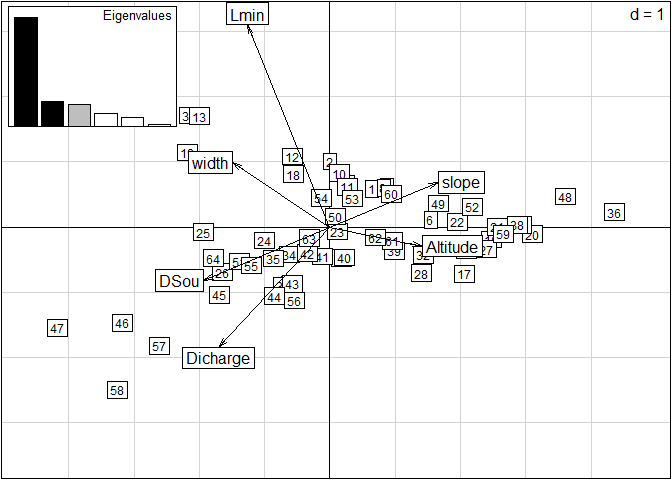

The graph displays the correlation between the different environmental variables. Then, the OMI analysis uses the standardized environmental table from the PCA in combination with the faunistic data to perform the OMI analysis. The standardized environmental table can be extracted from the `dudi1` with `$tab` as follow:

``` r
kable(dudi1$tab)
```

|    Altitude|        DSou|       slope|       width|        Lmin|    Dicharge|
|-----------:|-----------:|-----------:|-----------:|-----------:|-----------:|
|   0.1752807|  -0.4171664|  -0.0573732|  -0.1082431|   0.1345316|  -0.9354324|
|  -0.1279075|  -0.0076779|   0.2603861|  -0.1082431|   0.9474368|  -0.4717552|
|  -0.6837525|   1.0569922|  -0.4633989|   1.2112919|   2.1667946|   0.1542089|
|  -0.8353466|   1.4664807|  -0.8870779|   1.2112919|   2.9119577|   0.5483344|
|  -1.0374720|   1.7121738|  -0.8870779|  -0.1082431|   3.3184103|   0.7801730|
|  -0.0268448|  -0.9085526|  -0.0044133|  -1.0978944|  -0.4751473|  -1.2252306|
|  -0.2037046|  -0.6628595|   0.2603861|  -0.4381269|   0.1345316|  -0.8890647|
|  -0.2289702|  -0.5809618|   0.2603861|  -0.4381269|   0.1345316|  -0.8890647|
|  -0.3047673|  -0.4990641|  -0.2868660|   0.2216407|   0.1345316|  -0.8890647|
|  -0.4310957|  -0.2533710|   0.1015064|   0.2216407|   0.3716289|  -0.7847373|
|  -0.5068927|  -0.1714733|  -0.0573732|  -0.4381269|   0.3716289|  -0.7847373|
|  -0.5826898|  -0.0076779|  -0.4457456|  -0.4381269|   1.3877604|  -0.2515086|
|  -0.8858779|   0.6475037|  -0.5693187|   0.8814082|   2.1667946|   0.1773927|
|  -0.9111436|   0.8112991|  -0.8341181|   1.5411757|   2.4377630|   0.3049039|
|  -0.9869407|   1.0569922|  -1.1165707|   2.5308270|   2.4377630|   0.3049039|
|   3.1566310|  -1.3180411|  -0.3574792|  -0.7680106|  -0.4751473|  -0.8658808|
|   2.9545056|  -1.0723480|  -0.3574792|  -0.1082431|  -1.0848262|  -0.4949391|
|   1.5396274|  -0.3352687|  -0.0044133|   2.5308270|   0.4732421|   0.3512716|
|  -0.4058300|   0.2380152|   0.2427328|   2.8607107|   1.2184052|   1.2206663|
|   0.3774061|  -1.3999388|   1.4431567|  -1.7576619|  -1.0780520|  -1.4454772|
|   0.0236866|  -1.2361434|   1.3548902|  -1.4277781|  -0.8815999|  -1.2252306|
|  -0.2289702|  -0.9904503|   1.0194776|  -0.7680106|  -0.8815999|  -1.2252306|
|  -0.8858779|  -0.3352687|  -0.1279864|  -0.4381269|  -0.2041789|  -0.1935490|
|  -1.1132691|   0.2380152|  -1.2931037|   0.2216407|  -0.2041789|  -0.1935490|
|  -1.1890661|   0.5656060|  -1.3284103|   0.8814082|   0.2700158|   0.5483344|
|  -1.2648632|   0.8522479|  -1.4872899|  -0.7680106|   0.2700158|   0.7801730|
|   2.0449411|  -1.2361434|   0.4722256|  -0.7680106|  -0.8138578|  -0.6688180|
|   1.6912215|  -0.8266549|  -0.1456397|  -1.0978944|  -0.4074052|   0.2585362|
|   1.4890961|  -0.2533710|  -1.2931037|   0.2216407|  -0.0009526|   1.4061371|
|   1.2869706|  -0.1714733|  -1.3284103|   0.2216407|  -0.0009526|   1.4061371|
|   0.9332511|  -0.9904503|   0.3839591|  -1.0978944|  -0.8815999|  -0.9122485|
|   0.7311256|  -0.5809618|   0.1368130|  -0.7680106|  -0.7799868|  -0.6340422|
|   0.4279375|  -0.2533710|  -0.0573732|   0.2216407|  -0.4751473|   0.3512716|
|   0.0236866|   0.2380152|   0.2250795|   0.8814082|  -0.3057921|   0.8265407|
|  -0.1784389|   0.4837083|   0.2250795|   0.8814082|  -0.2719210|   0.9308680|
|   1.2869706|  -1.6456319|   3.4732853|  -1.7576619|  -1.0238583|  -1.3573786|
|   0.7816570|  -1.1951946|   1.9551021|  -1.0978944|  -0.9493420|  -1.1440871|
|   0.6805943|  -1.1542457|   1.9551021|  -1.0978944|  -0.9493420|  -1.1440871|
|   0.3016091|  -0.6628595|  -0.2339061|  -0.4381269|  -0.7461157|  -0.5644907|
|  -0.1279075|  -0.0076779|  -0.0573732|  -0.1082431|  -0.6106315|  -0.1008135|
|  -0.1784389|   0.0742198|  -0.3927858|   0.2216407|  -0.6106315|  -0.1008135|
|  -0.2289702|   0.2380152|  -0.3927858|   0.5515244|  -0.6106315|  -0.1008135|
|  -0.2795016|   0.4018106|  -0.7105450|  -0.4381269|  -0.3735342|   0.5831102|
|  -0.5321584|   0.8931968|  -0.4987055|  -0.7680106|  -0.2719210|   0.8729084|
|  -0.7848152|   1.3845830|  -0.4633989|  -0.1082431|  -0.0686947|   1.3597694|
|  -1.0880034|   2.2035600|  -0.9753444|   0.2216407|   0.2700158|   2.5189622|
|  -1.2395975|   2.8587416|  -1.1871839|   1.2112919|   0.2700158|   2.8667200|
|   0.3774061|  -1.4818365|   3.2261392|  -1.0978944|  -0.9696647|  -1.4338853|
|  -0.2289702|  -0.9904503|   1.1077441|  -0.7680106|  -0.3396631|  -0.8658808|
|  -0.8353466|  -0.3352687|  -0.4987055|  -0.7680106|   0.1345316|  -0.4369795|
|  -1.2395975|   0.8112991|  -1.0459576|   0.2216407|  -0.2719210|   0.2237604|
|   0.5290002|  -1.0723480|   1.4431567|  -1.0978944|  -0.2719210|  -0.7847373|
|   0.0236866|  -0.3352687|   0.1544663|   0.2216407|   0.0667895|  -0.4949391|
|  -0.3047673|   0.0742198|   0.1544663|   0.2216407|   0.2700158|  -0.2978763|
|  -0.8858779|   0.9750945|  -0.3574792|   1.2112919|  -0.8138578|   0.1078412|
|  -0.9364093|   1.1388899|  -0.3574792|  -0.7680106|  -0.8138578|   0.1078412|
|  -1.1890661|   1.7940715|  -1.0106510|   1.2112919|  -1.0780520|   1.7075272|
|  -1.3406602|   2.2854577|  -1.0636109|   0.8814082|  -1.0780520|   2.7508008|
|   1.5901588|  -1.0723480|   1.2842770|  -1.0978944|  -0.6783736|  -0.8195131|
|   1.1859079|  -0.8266549|   0.5781453|   1.8710595|  -0.6783736|  -0.8195131|
|   0.8321884|  -0.4171664|   0.3839591|  -0.4381269|  -0.2719210|  -0.0544458|
|   0.2763434|   0.0742198|   1.0018243|  -0.4381269|  -0.2041789|   0.0498815|
|   0.0994836|   0.1561175|   0.2074262|   0.2216407|   0.0667895|   0.5831102|
|  -0.3805643|   0.9750945|  -0.6752384|   0.2216407|   0.5409842|   1.4177290|

The next step performs the OMI analysis (Dolédec et al., 2000) by implementing the function `niche` from the [ade4](https://cran.r-project.org/web/packages/ade4/index.html) package (Dray and Dufour, 2007).

``` r
nic1 <- niche(dudi1, drome$fish, scann = FALSE)
nic1
```

    ## Niche analysis
    ## call: niche(dudiX = dudi1, Y = drome$fish, scannf = FALSE)
    ## class: niche dudi 
    ## 
    ## $rank (rank)     : 6
    ## $nf (axis saved) : 2
    ## $RV (RV coeff)   :
    ## 
    ## eigen values: 1.001 0.05759 0.01671 0.004818 0.001209 ...
    ## 
    ##   vector length mode    content                    
    ## 1 $eig   6      numeric eigen values               
    ## 2 $lw    13     numeric row weigths (crossed array)
    ## 3 $cw    6      numeric col weigths (crossed array)
    ## 
    ##   data.frame nrow ncol content                                
    ## 1 $tab       13   6    crossed array (averaging species/sites)
    ## 2 $li        13   2    species coordinates                    
    ## 3 $l1        13   2    species normed scores                  
    ## 4 $co        6    2    variables coordinates                  
    ## 5 $c1        6    2    variables normed scores                
    ## 6 $ls        64   2    sites coordinates                      
    ## 7 $as        3    2    axis upon niche axis

``` r
plot(nic1)
```

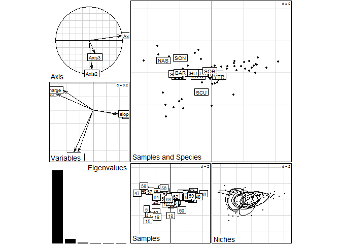

The graph displays the results of the OMI analysis within a two-dimensional Euclidean space. It represents the species niche position (labels in Samples and Species, top-right) and breadth (ellipses in Niches, bottom-right graph), within the environmental gradients (summarized by Variables). The species niche parameters (Inertia, OMI, Tol and Rtol) are calculated with the `niche.parameter` function from the [ade4](https://cran.r-project.org/web/packages/ade4/index.html) package (Dray and Dufour, 2007). More details about the niche parameters calculation are available in Dolédec et al. (2000).

``` r
kable(niche.param(nic1))
```

|     |    inertia|         OMI|        Tol|       Rtol|   omi|   tol|  rtol|
|-----|----------:|-----------:|----------:|----------:|-----:|-----:|-----:|
| SCU |   5.503685|   2.1488218|  1.5045397|  1.8503234|  39.0|  27.3|  33.6|
| OTR |   5.714861|   0.0777737|  2.4253953|  3.2116918|   1.4|  42.4|  56.2|
| YTR |   5.765225|   0.2630852|  1.6882102|  3.8139292|   4.6|  29.3|  66.2|
| MIN |   5.318492|   0.4460395|  2.5225244|  2.3499277|   8.4|  47.4|  44.2|
| STO |   5.908881|   0.7656741|  2.4125454|  2.7306619|  13.0|  40.8|  46.2|
| BLA |   4.989501|   0.4550558|  2.2738372|  2.2606074|   9.1|  45.6|  45.3|
| SOB |   3.714084|   0.0710025|  0.5129189|  3.1301626|   1.9|  13.8|  84.3|
| SON |   6.384992|   4.8872633|  0.7488491|  0.7488797|  76.5|  11.7|  11.7|
| NAS |  12.598843|  10.1993126|  1.6200685|  0.7794621|  81.0|  12.9|   6.2|
| GUD |   8.427877|   4.3080073|  0.9543342|  3.1655359|  51.1|  11.3|  37.6|
| CHU |   5.584996|   1.5776519|  1.6933570|  2.3139866|  28.2|  30.3|  41.4|
| STR |   9.917999|   5.2753874|  1.1855758|  3.4570355|  53.2|  12.0|  34.9|
| BAR |   8.344112|   3.8305122|  1.3016577|  3.2119418|  45.9|  15.6|  38.5|

The test for statistical significance can now be implemented. It corresponds to the comparison between the observed species' marginality and the simulated values, hereafter 100 random permutations, under the null hypothesis that each species is indifferent to its environment (Dolédec et al., 2000).

``` r
rtest(nic1,100)
```

    ## class: krandtest lightkrandtest 
    ## Monte-Carlo tests
    ## Call: as.krandtest(sim = t(sim), obs = obs)
    ## 
    ## Number of tests:   14 
    ## 
    ## Adjustment method for multiple comparisons:   none 
    ## Permutation number:   100 
    ##        Test         Obs    Std.Obs   Alter     Pvalue
    ## 1       SCU  2.14882183  1.6898494 greater 0.07920792
    ## 2       OTR  0.07777369  6.6301270 greater 0.00990099
    ## 3       YTR  0.26308521 10.3258807 greater 0.00990099
    ## 4       MIN  0.44603947  9.3195260 greater 0.00990099
    ## 5       STO  0.76567408 14.1890327 greater 0.00990099
    ## 6       BLA  0.45505584 16.9938878 greater 0.00990099
    ## 7       SOB  0.07100247 -0.6060945 greater 0.71287129
    ## 8       SON  4.88726327  3.6023144 greater 0.01980198
    ## 9       NAS 10.19931259  6.1321233 greater 0.00990099
    ## 10      GUD  4.30800731 17.7215982 greater 0.00990099
    ## 11      CHU  1.57765192 26.9201641 greater 0.00990099
    ## 12      STR  5.27538741  7.8434366 greater 0.00990099
    ## 13      BAR  3.83051220 12.5058985 greater 0.00990099
    ## 14 OMI.mean  2.63889133 15.6134372 greater 0.00990099

Subsets creation
----------------

Herein, for the sake of the example, we will create two subsets. A `factor` needs to be defined, in order to divide the data set in two subsets. We use the functions [cutree](https://stat.ethz.ch/R-manual/R-devel/library/stats/html/cutree.html) and [hclust](https://stat.ethz.ch/R-manual/R-devel/library/stats/html/hclust.html) to create a cluster, `k=2`, following the `ward.D` method. The function creates the subsets based on a dissimilarity matrix created with [dist](https://stat.ethz.ch/R-manual/R-devel/library/stats/html/dist.html), with the SUs of `nic1`. It divided the sampling domain into two subsets along the first OMI axis. Blue points correspond to downstream habitat conditions while red points are the upstream conditions.

``` r
# Creation of the factor
fact <- as.factor(as.numeric(cutree(hclust(dist(nic1$ls, "euclidean"), "ward.D"),k=2)))
# plotting the two subsets
s.class(nic1$ls, fact, col=c("red", "blue"),cellipse=0, cpoint=2, pch=3)
s.chull(nic1$ls, fact, col=c("red", "blue"),optchull = 1, add.plot = T)
```

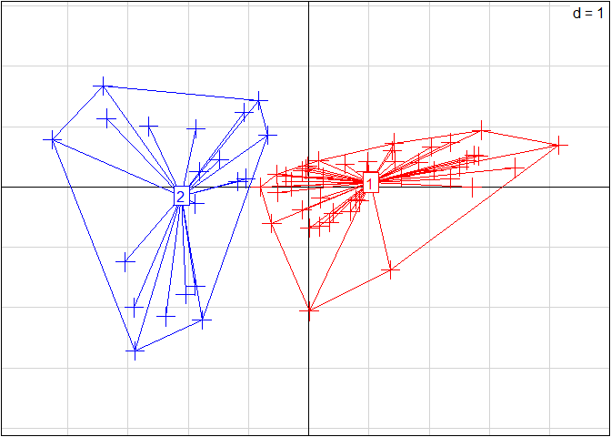

``` r
#According to the previous graph,(Variable in plot(nic1)), group 1 and 2 corresponds to upstream and downstream conditions respectively.
levels(fact)<- c("up", "down")
```

Now that we have the factor for dividing the niche, the [subniche](https://cran.r-project.org/web/packages/subniche/index.html) function can be implemented as follow:

``` r
subnic1 <- subniche(nic1, fact)
subnic1
```

    ## WitOMI calculation
    ## call: niche(dudiX = dudi1, Y = drome$fish, scannf = FALSE)
    ## class: subniche dudi 
    ## 
    ## $rank (rank)     : 6
    ## $nf (axis saved) : 2
    ## $RV (RV coeff)   :
    ## 
    ## eigen values: 1.001 0.05759 0.01671 0.004818 0.001209 ...
    ## 
    ##   vector  length mode    content                         
    ## 1 $eig    6      numeric eigen values                    
    ## 2 $lw     13     numeric row weigths (crossed array)     
    ## 3 $cw     6      numeric col weigths (crossed array)     
    ## 4 $factor 64     numeric factor used for creating subsets
    ## 
    ##   data.frame nrow ncol content                                
    ## 1 $tab       13   6    crossed array (averaging species/sites)
    ## 2 $li        13   2    species coordinates                    
    ## 3 $l1        13   2    species normed scores                  
    ## 4 $co        6    2    variables coordinates                  
    ## 5 $c1        6    2    variables normed scores                
    ## 6 $ls        64   2    sites coordinates                      
    ## 7 $as        3    2    axis upon niche axis                   
    ## 8 $G_k       2    2    G_k coordinates                        
    ## 9 $sub       26   2    species coordinates within each subset

The [subniche](https://cran.r-project.org/web/packages/subniche/index.html) function only adds `items`to the `niche` list, which are `$factor`, `$G_k` and `$sub`. The function does not change the previous results obtained with the OMI analysis from the `niche` function. The following functions, `plot`, `refparam` and `rtest`, are used to display the same results as in the `ade4` package:

``` r
plot(subnic1)
```

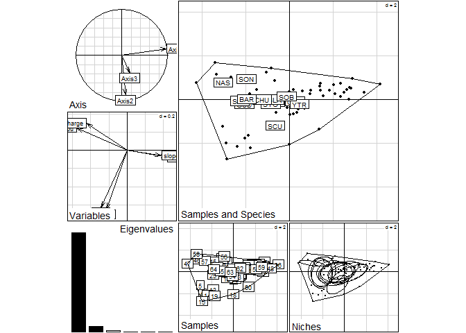

The niche parameters from the OMI analysis can still be extracted with its respective significant test with `refparam`. The test for significance can also be applied, with `rtest` function.

``` r
kable(refparam(subnic1))
```

|     |    inertia|         OMI|        Tol|       Rtol|   omi|   tol|  rtol|
|-----|----------:|-----------:|----------:|----------:|-----:|-----:|-----:|
| SCU |   5.503685|   2.1488218|  1.5045397|  1.8503234|  39.0|  27.3|  33.6|
| OTR |   5.714861|   0.0777737|  2.4253953|  3.2116918|   1.4|  42.4|  56.2|
| YTR |   5.765225|   0.2630852|  1.6882102|  3.8139292|   4.6|  29.3|  66.2|
| MIN |   5.318492|   0.4460395|  2.5225244|  2.3499277|   8.4|  47.4|  44.2|
| STO |   5.908881|   0.7656741|  2.4125454|  2.7306619|  13.0|  40.8|  46.2|
| BLA |   4.989501|   0.4550558|  2.2738372|  2.2606074|   9.1|  45.6|  45.3|
| SOB |   3.714084|   0.0710025|  0.5129189|  3.1301626|   1.9|  13.8|  84.3|
| SON |   6.384992|   4.8872633|  0.7488491|  0.7488797|  76.5|  11.7|  11.7|
| NAS |  12.598843|  10.1993126|  1.6200685|  0.7794621|  81.0|  12.9|   6.2|
| GUD |   8.427877|   4.3080073|  0.9543342|  3.1655359|  51.1|  11.3|  37.6|
| CHU |   5.584996|   1.5776519|  1.6933570|  2.3139866|  28.2|  30.3|  41.4|
| STR |   9.917999|   5.2753874|  1.1855758|  3.4570355|  53.2|  12.0|  34.9|
| BAR |   8.344112|   3.8305122|  1.3016577|  3.2119418|  45.9|  15.6|  38.5|

``` r
rtest(subnic1)
```

    ## class: krandtest lightkrandtest 
    ## Monte-Carlo tests
    ## Call: as.krandtest(sim = t(sim), obs = obs)
    ## 
    ## Number of tests:   14 
    ## 
    ## Adjustment method for multiple comparisons:   none 
    ## Permutation number:   99 
    ##        Test         Obs    Std.Obs   Alter Pvalue
    ## 1       SCU  2.14882183  1.9780204 greater   0.07
    ## 2       OTR  0.07777369  5.5075313 greater   0.01
    ## 3       YTR  0.26308521 12.1858520 greater   0.01
    ## 4       MIN  0.44603947  7.6868549 greater   0.01
    ## 5       STO  0.76567408 14.4029032 greater   0.01
    ## 6       BLA  0.45505584 20.5927841 greater   0.01
    ## 7       SOB  0.07100247 -0.7547935 greater   0.77
    ## 8       SON  4.88726327  2.7026550 greater   0.04
    ## 9       NAS 10.19931259  5.4283545 greater   0.01
    ## 10      GUD  4.30800731 20.1586180 greater   0.01
    ## 11      CHU  1.57765192 19.5749034 greater   0.01
    ## 12      STR  5.27538741  9.0049294 greater   0.01
    ## 13      BAR  3.83051220 12.8552496 greater   0.01
    ## 14 OMI.mean  2.63889133 13.9245420 greater   0.01

Calculation of the WitOMI (Spatial example)
-------------------------------------------

 The result of the test on marginality from the OMI analysis are important for the relevance of the WitOMI calculation. The following functions will still calculate the WitOMI even if the OMI are not significant. To be valid, the WitOMI analysis must be done only on species with significant OMI. Then, the probability for the WitOMI to be significant within the subset *G<sub>K</sub>* corresponds to the `$witomigtest$SubniPvalue` wihtin the `rtestrefor` function for WitOMI*G*. And the equivalent for the WitOMI*G<sub>K</sub>* is `$witomig_ktest$SubniPvalue` in the `rtestsubor`.

`margvect`displays the marginality vector of the suborigins,*G<sub>K</sub>* within the overall available habitat conditions (black polygon), the available resources under each subset habitat conditions (red polygons) and the species subniche (species label).

``` r
margvect(subnic1)
```

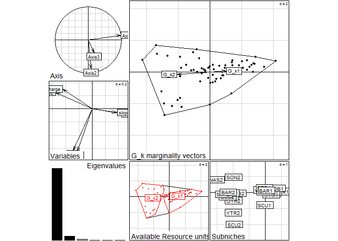

`subplot` displays the subset's constraint of habitat conditions (red polygons), found within the overall available habitat conditions (black polygons), and the corresponding species subniche positions. The arrows represent the marginality vectors from the sub-orgins *G<sub>K</sub>* (red dots) and corresponds to the graphical representation of the WitOMI*G<sub>K</sub>*.

``` r
subplot(subnic1)
```

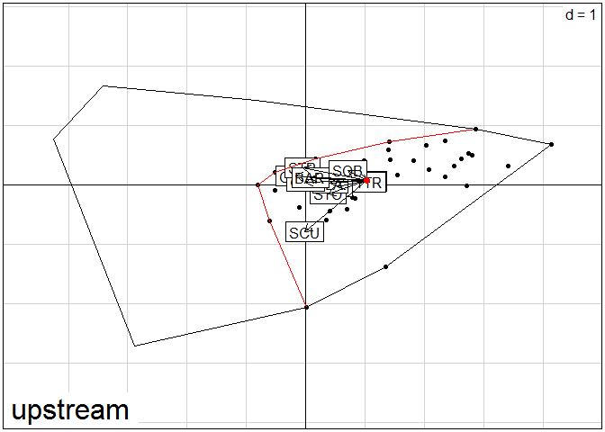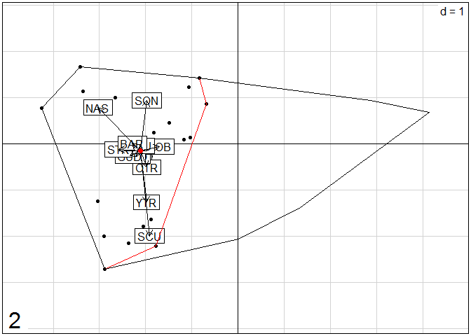

`subparam.refor` calculates the species marginality (WitOMI*G*), tolerance (Tol) and residual tolerance (Rtol) to the average habitat conditions (*G*). For details about the parameters calculation see Karasiewicz et al. (2017).

``` r
kable(subparam.refor(subnic1))
```

|         |    inertia|     WitOMIG|        Tol|       Rtol|  witomig|   tol|  rtol|
|---------|----------:|-----------:|----------:|----------:|--------:|-----:|-----:|
| SCUup   |   3.399535|   0.8822018|  1.3160556|  1.2012780|     26.0|  38.7|  35.3|
| OTRup   |   4.743091|   1.1205164|  1.6167368|  2.0058378|     23.6|  34.1|  42.3|
| YTRup   |   4.915133|   1.1479897|  1.6704008|  2.0967423|     23.4|  34.0|  42.7|
| MINup   |   2.824565|   0.3293892|  0.9591758|  1.5360003|     11.7|  34.0|  54.4|
| STOup   |   2.855969|   0.1982016|  0.6736997|  1.9840678|      6.9|  23.6|  69.5|
| BLAup   |   2.308870|   0.2007444|  0.7128120|  1.3953135|      8.7|  30.9|  60.4|
| SOBup   |   2.051601|   0.5881637|  0.6693959|  0.7940418|     28.7|  32.6|  38.7|
| SONup   |        NaN|         NaN|        NaN|        NaN|      NaN|   NaN|   NaN|
| NASup   |        NaN|         NaN|        NaN|        NaN|      NaN|   NaN|   NaN|
| GUDup   |   1.164352|   0.2547094|  0.4719874|  0.4376555|     21.9|  40.5|  37.6|
| CHUup   |   1.265915|   0.0259759|  0.1325920|  1.1073474|      2.1|  10.5|  87.5|
| STRup   |   1.857806|   1.8578063|  0.0000000|  0.0000000|    100.0|   0.0|   0.0|
| BARup   |   1.658331|   0.5157807|  0.0683361|  1.0742143|     31.1|   4.1|  64.8|
| SCUdown |   9.711984|   8.2109981|  0.0907551|  1.4102305|     84.5|   0.9|  14.5|
| OTRdown |   8.435816|   4.1418643|  1.0867398|  3.2072121|     49.1|  12.9|  38.0|
| YTRdown |   9.165592|   5.5840648|  1.5929660|  1.9885608|     60.9|  17.4|  21.7|
| MINdown |   8.505175|   4.6131522|  0.8145921|  3.0774309|     54.2|   9.6|  36.2|
| STOdown |   9.283153|   4.9264247|  0.8757168|  3.4810114|     53.1|   9.4|  37.5|
| BLAdown |   8.608352|   4.5345833|  0.8829193|  3.1908492|     52.7|  10.3|  37.1|
| SOBdown |   6.831239|   3.0898598|  1.0683130|  2.6730658|     45.2|  15.6|  39.1|
| SONdown |   6.384992|   4.8872633|  0.7488491|  0.7488797|     76.5|  11.7|  11.7|
| NASdown |  12.598843|  10.1993126|  1.6200685|  0.7794621|     81.0|  12.9|   6.2|
| GUDdown |   9.465524|   5.5154381|  0.5116158|  3.4384699|     58.3|   5.4|  36.3|
| CHUdown |   8.608352|   4.5345833|  0.8829193|  3.1908492|     52.7|  10.3|  37.1|
| STRdown |  11.069455|   6.8646154|  0.5809199|  3.6239195|     62.0|   5.2|  32.7|
| BARdown |   9.458409|   5.2563916|  0.5836204|  3.6183965|     55.6|   6.2|  38.3|

`rtestrefor` calculates the subniches' parameters from *G* with the respective significant test. The output of the `rtestrefor` function is an object of class `list`, which includes the results of the WitOMI*G* significant test, under each subset defined by the `$factor`.

``` r
refor <- rtestrefor(subnic1,100)
```

First,for each of the two subsets, the subset statictical significance is tested with the null hypothesis that *G<sub>K</sub>* is not different from the overall average habitat conditions represented by *G*. The subsets *P* value is equal to the product of equiprobabilities to find the same mean value for each variables (Karasiewicz et al., 2017).

``` r
refor[[1]]$Subsettest
```

    ## class: subkrandtest 
    ## Monte-Carlo tests
    ## Call: subkrandtest(sim = t(Xsim), obs = Xwobs, alter = "two-sided")
    ## 
    ## Number of tests:   6 
    ## 
    ## Adjustment method for multiple comparisons:   none 
    ## Permutation number:   100 
    ##       Test        Obs   Std.Obs     Alter     Pvalue
    ## 1 Altitude  0.4467398  5.641526 two-sided 0.00990099
    ## 2     DSou -0.5666773 -6.777756 two-sided 0.00990099
    ## 3    slope  0.3946332  4.746561 two-sided 0.00990099
    ## 4    width -0.3153794 -3.288177 two-sided 0.00990099
    ## 5     Lmin -0.3094155 -3.650813 two-sided 0.00990099
    ## 6 Dicharge -0.4451747 -4.781605 two-sided 0.00990099
    ## Subsets Pvalue: 9.420452e-13 
    ## other elements: subpvalue call

``` r
refor[[2]]$Subsettest
```

    ## class: subkrandtest 
    ## Monte-Carlo tests
    ## Call: subkrandtest(sim = t(Xsim), obs = Xwobs, alter = "two-sided")
    ## 
    ## Number of tests:   6 
    ## 
    ## Adjustment method for multiple comparisons:   none 
    ## Permutation number:   100 
    ##       Test        Obs   Std.Obs     Alter     Pvalue
    ## 1 Altitude -0.9147530 -5.063639 two-sided 0.00990099
    ## 2     DSou  1.1603393  6.972641 two-sided 0.00990099
    ## 3    slope -0.8080584 -3.908783 two-sided 0.00990099
    ## 4    width  0.6457769  3.427746 two-sided 0.00990099
    ## 5     Lmin  0.6335651  3.642002 two-sided 0.00990099
    ## 6 Dicharge  0.9115482  5.156716 two-sided 0.00990099
    ## Subsets Pvalue: 9.420452e-13 
    ## other elements: subpvalue call

Second, the species marginality is tested for statistical significance with the null hypothesis that each species within each subset is uninfluenced by its overall average habitat conditions (ubiquitous), for WitOMI*G* (Karasiewicz et al., 2017).

``` r
refor[[1]]$witomigtest
```

    ## class: subnikrandtest 
    ## Monte-Carlo tests
    ## Call: subnikrandtest(sim = t(sim), obs = obs, subpvalue = Xtest$subpvalue)
    ## 
    ## Number of tests:   14 
    ## 
    ## Adjustment method for multiple comparisons:   none 
    ##        Test        Obs    Std.Obs   Alter N.perm    Pvalue  SubniPvalue
    ## 1       SCU 0.88220184 -0.5675372 greater    100 0.7029703 6.622298e-13
    ## 2       OTR 1.12051638  0.3687786 greater    100 0.3663366 3.451057e-13
    ## 3       YTR 1.14798971  0.1304604 greater    100 0.4158416 3.917416e-13
    ## 4       MIN 0.32938916 -2.7444680 greater    100 1.0000000 9.420452e-13
    ## 5       STO 0.19820159 -3.6764114 greater    100 1.0000000 9.420452e-13
    ## 6       BLA 0.20074436 -3.9422360 greater    100 1.0000000 9.420452e-13
    ## 7       SOB 0.58816373 -1.0481577 greater    100 0.9009901 8.487734e-13
    ## 8       SON        NaN        NaN greater     97        NA           NA
    ## 9       NAS        NaN        NaN greater     94        NA           NA
    ## 10      GUD 0.25470940 -1.7428278 greater    100 1.0000000 9.420452e-13
    ## 11      CHU 0.02597593 -2.9923601 greater    100 1.0000000 9.420452e-13
    ## 12      STR 1.85780633  0.1069688 greater    100 0.3861386 3.637600e-13
    ## 13      BAR 0.51578065 -0.9776495 greater    100 0.9207921 8.674278e-13
    ## 14 OMI.mean 0.64740719 -2.4357870 greater    100 1.0000000 9.420452e-13
    ## 
    ## other elements: adj.method sub.pvalue subni.pvalue call

``` r
refor[[2]]$witomigtest
```

    ## class: subnikrandtest 
    ## Monte-Carlo tests
    ## Call: subnikrandtest(sim = t(sim), obs = obs, subpvalue = Xtest$subpvalue)
    ## 
    ## Number of tests:   14 
    ## 
    ## Adjustment method for multiple comparisons:   none 
    ##        Test       Obs     Std.Obs   Alter N.perm     Pvalue  SubniPvalue
    ## 1       SCU  8.210998  0.26817101 greater     86 0.25287356 2.382183e-13
    ## 2       OTR  4.141864 -1.10185311 greater    100 0.86138614 8.114647e-13
    ## 3       YTR  5.584065  1.78780845 greater    100 0.03960396 3.730872e-14
    ## 4       MIN  4.613152 -0.04845032 greater    100 0.56435644 5.316493e-13
    ## 5       STO  4.926425  0.58490353 greater    100 0.27722772 2.611611e-13
    ## 6       BLA  4.534583 -0.05263990 greater    100 0.49504950 4.663590e-13
    ## 7       SOB  3.089860 -1.36484465 greater    100 0.94059406 8.860822e-13
    ## 8       SON  4.887263 -0.52181416 greater     80 0.58024691 5.466188e-13
    ## 9       NAS 10.199313  0.62001928 greater     68 0.30434783 2.867094e-13
    ## 10      GUD  5.515438  0.21504292 greater    100 0.38613861 3.637600e-13
    ## 11      CHU  4.534583 -0.41713165 greater    100 0.65346535 6.155939e-13
    ## 12      STR  6.864615  0.28705343 greater    100 0.29702970 2.798154e-13
    ## 13      BAR  5.256392 -0.08874486 greater    100 0.46534653 4.383775e-13
    ## 14 OMI.mean  5.566042  0.23045629 greater    100 0.29702970 2.798154e-13
    ## 
    ## other elements: adj.method sub.pvalue subni.pvalue call

`subparam.subor` calculates the species marginality (WitOMI*G<sub>K</sub>*), tolerance (Tol) and residual tolerance (Rtol) to the subset average habitat conditions (*G<sub>K</sub>*). For details about the parameters calculation see Karasiewicz et al. (2017).

``` r
kable(subparam.subor(subnic1))
```

|      |   inertia|  WitOMIG\_k|        Tol|       Rtol|  witomig\_k|   tol|  rtol|
|------|---------:|-----------:|----------:|----------:|-----------:|-----:|-----:|
| SCU1 |  4.667445|   2.1501116|  0.8416367|  1.6756969|        46.1|  18.0|  35.9|
| OTR1 |  3.623817|   0.0012426|  0.9635811|  2.6589935|         0.0|  26.6|  73.4|
| YTR1 |  3.769511|   0.0023683|  0.7471943|  3.0199488|         0.1|  19.8|  80.1|
| MIN1 |  2.794045|   0.2988690|  1.0122406|  1.4829355|        10.7|  36.2|  53.1|
| STO1 |  3.170025|   0.5122576|  0.7835477|  1.8742197|        16.2|  24.7|  59.1|
| BLA1 |  2.509801|   0.4016752|  0.7324293|  1.3756961|        16.0|  29.2|  54.8|
| SOB1 |  1.604047|   0.1406096|  0.4103152|  1.0531224|         8.8|  25.6|  65.7|
| SON1 |       NaN|         NaN|        NaN|        NaN|         NaN|   NaN|   NaN|
| NAS1 |       NaN|         NaN|        NaN|        NaN|         NaN|   NaN|   NaN|
| GUD1 |  2.531369|   1.6217256|  0.0206516|  0.8889913|        64.1|   0.8|  35.1|
| CHU1 |  2.339495|   1.0995556|  0.2824601|  0.9574793|        47.0|  12.1|  40.9|
| STR1 |  2.897381|   2.8973807|  0.0000000|  0.0000000|       100.0|   0.0|   0.0|
| BAR1 |  2.595143|   1.4525929|  0.8751351|  0.2674153|        56.0|  33.7|  10.3|
| SCU2 |  5.492183|   3.9911970|  0.2671504|  1.2338352|        72.7|   4.9|  22.5|
| OTR2 |  4.471315|   0.1773629|  1.6893396|  2.6046123|         4.0|  37.8|  58.3|
| YTR2 |  4.976729|   1.3952018|  1.2150300|  2.3664967|        28.0|  24.4|  47.6|
| MIN2 |  3.927070|   0.0350466|  0.8819288|  3.0100942|         0.9|  22.5|  76.6|
| STO2 |  4.384113|   0.0273849|  1.2423933|  3.1143349|         0.6|  28.3|  71.0|
| BLA2 |  4.092662|   0.0188934|  0.6783537|  3.3954149|         0.5|  16.6|  83.0|
| SOB2 |  4.175797|   0.4344183|  0.2156571|  3.5257216|        10.4|   5.2|  84.4|
| SON2 |  2.804111|   1.3063827|  0.1263895|  1.3713393|        46.6|   4.5|  48.9|
| NAS2 |  4.402483|   2.0029526|  1.3323835|  1.0671471|        45.5|  30.3|  24.2|
| GUD2 |  4.036922|   0.0868360|  0.9774591|  2.9726266|         2.2|  24.2|  73.6|
| CHU2 |  4.092662|   0.0188934|  0.6783537|  3.3954149|         0.5|  16.6|  83.0|
| STR2 |  4.632032|   0.4271921|  0.8373510|  3.3674884|         9.2|  18.1|  72.7|
| BAR2 |  4.275254|   0.0732369|  0.6000366|  3.6019803|         1.7|  14.0|  84.3|

In a similar way, `rtestsubor` calculates the subniches' parameters from *G<sub>K</sub>* with the respective test for significance. The output of the `rtestsubor` function is an object of class `list`, which includes the results of the WitOMI*G<sub>K</sub>* significance test under each of the two subsets defined by the `$factor`.

``` r
subor <- rtestsubor(subnic1,100)
```

As previously, the subsets are tested.

``` r
subor[[1]]$Subsettest
```

    ## class: subkrandtest 
    ## Monte-Carlo tests
    ## Call: subkrandtest(sim = t(Xsim), obs = Xwobs, alter = "two-sided")
    ## 
    ## Number of tests:   6 
    ## 
    ## Adjustment method for multiple comparisons:   none 
    ## Permutation number:   100 
    ##       Test        Obs   Std.Obs     Alter     Pvalue
    ## 1 Altitude  0.4467398  5.003697 two-sided 0.00990099
    ## 2     DSou -0.5666773 -6.805470 two-sided 0.00990099
    ## 3    slope  0.3946332  4.495922 two-sided 0.00990099
    ## 4    width -0.3153794 -3.813484 two-sided 0.00990099
    ## 5     Lmin -0.3094155 -3.118210 two-sided 0.01980198
    ## 6 Dicharge -0.4451747 -4.993129 two-sided 0.00990099
    ## Subsets Pvalue: 1.88409e-12 
    ## other elements: subpvalue call

``` r
subor[[2]]$Subsettest
```

    ## class: subkrandtest 
    ## Monte-Carlo tests
    ## Call: subkrandtest(sim = t(Xsim), obs = Xwobs, alter = "two-sided")
    ## 
    ## Number of tests:   6 
    ## 
    ## Adjustment method for multiple comparisons:   none 
    ## Permutation number:   100 
    ##       Test        Obs   Std.Obs     Alter     Pvalue
    ## 1 Altitude -0.9147530 -5.454170 two-sided 0.00990099
    ## 2     DSou  1.1603393  6.682697 two-sided 0.00990099
    ## 3    slope -0.8080584 -4.890054 two-sided 0.00990099
    ## 4    width  0.6457769  3.487026 two-sided 0.00990099
    ## 5     Lmin  0.6335651  3.509317 two-sided 0.00990099
    ## 6 Dicharge  0.9115482  4.686616 two-sided 0.00990099
    ## Subsets Pvalue: 9.420452e-13 
    ## other elements: subpvalue call

The species marginality is then tested for significance with the null hypothesis that each species within a subset is uninfluenced by its subset average habitat conditions (ubiquitous), for WitOMI*G<sub>K</sub>* (Karasiewicz et al., 2017).

``` r
subor[[1]]$witomig_ktest
```

    ## class: subnikrandtest 
    ## Monte-Carlo tests
    ## Call: subnikrandtest(sim = t(sim), obs = obs, subpvalue = Xtest$subpvalue)
    ## 
    ## Number of tests:   14 
    ## 
    ## Adjustment method for multiple comparisons:   none 
    ##        Test         Obs     Std.Obs   Alter N.perm     Pvalue  SubniPvalue
    ## 1       SCU 2.150111587  0.90808913 greater     99 0.09000000 1.695681e-13
    ## 2       OTR 0.001242635 -1.05509931 greater    100 0.99009901 1.865436e-12
    ## 3       YTR 0.002368323 -0.95423845 greater    100 0.97029703 1.828127e-12
    ## 4       MIN 0.298869015  5.93616160 greater    100 0.00990099 1.865436e-14
    ## 5       STO 0.512257590 11.98368866 greater    100 0.00990099 1.865436e-14
    ## 6       BLA 0.401675209 14.21278259 greater    100 0.00990099 1.865436e-14
    ## 7       SOB 0.140609585 -0.09993168 greater    100 0.39603960 7.461744e-13
    ## 8       SON         NaN         NaN greater     98         NA           NA
    ## 9       NAS         NaN         NaN greater     99         NA           NA
    ## 10      GUD 1.621725637  4.92355129 greater    100 0.00990099 1.865436e-14
    ## 11      CHU 1.099555585 14.17032154 greater    100 0.00990099 1.865436e-14
    ## 12      STR 2.897380749  2.33730918 greater    100 0.03960396 7.461744e-14
    ## 13      BAR 1.452592931  4.20572630 greater    100 0.01980198 3.730872e-14
    ## 14 OMI.mean 0.961671713  1.94127807 greater    100 0.07920792 1.492349e-13
    ## 
    ## other elements: adj.method sub.pvalue subni.pvalue call

``` r
subor[[2]]$witomig_ktest
```

    ## class: subnikrandtest 
    ## Monte-Carlo tests
    ## Call: subnikrandtest(sim = t(sim), obs = obs, subpvalue = Xtest$subpvalue)
    ## 
    ## Number of tests:   14 
    ## 
    ## Adjustment method for multiple comparisons:   none 
    ##        Test        Obs    Std.Obs   Alter N.perm     Pvalue  SubniPvalue
    ## 1       SCU 3.99119702  0.5723359 greater     92 0.21505376 2.025904e-13
    ## 2       OTR 0.17736291  7.3252445 greater    100 0.00990099 9.327181e-15
    ## 3       YTR 1.39520177 21.0838921 greater    100 0.00990099 9.327181e-15
    ## 4       MIN 0.03504661 -0.5520602 greater    100 0.83168317 7.834832e-13
    ## 5       STO 0.02738489 -0.9550790 greater    100 0.93069307 8.767550e-13
    ## 6       BLA 0.01889343 -0.8622151 greater    100 0.88118812 8.301191e-13
    ## 7       SOB 0.43441828  0.1539739 greater    100 0.30693069 2.891426e-13
    ## 8       SON 1.30638269 -0.8024550 greater     82 0.80722892 7.604462e-13
    ## 9       NAS 2.00295261 -0.8385115 greater     77 0.71794872 6.763402e-13
    ## 10      GUD 0.08683603 -0.8933709 greater    100 0.96039604 9.047365e-13
    ## 11      CHU 0.01889343 -1.1158357 greater    100 0.98019802 9.233909e-13
    ## 12      STR 0.42719213 -0.8614058 greater     97 0.89795918 8.459182e-13
    ## 13      BAR 0.07323689 -1.1277643 greater    100 0.99009901 9.327181e-13
    ## 14 OMI.mean 0.76884605 -0.6540869 greater    100 0.72277228 6.808842e-13
    ## 
    ## other elements: adj.method sub.pvalue subni.pvalue call

Exercise (temporal example)
===========================

Now, try to do the same work but with the data `ardecheinv`. The invertebrates abundances were log(x+1) transformed to do the analysis. Take a look at the `$env` data to find the different seasons. Replace spring and autumn by numbers to allow the `subniche` function to work properly. After the OMI analysis and WitOMI calculations, you should obtain the following results:

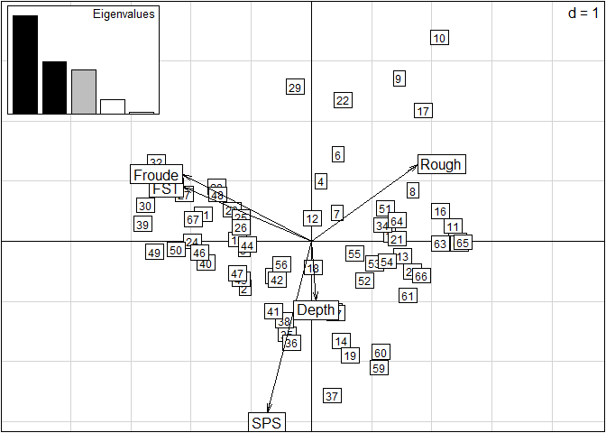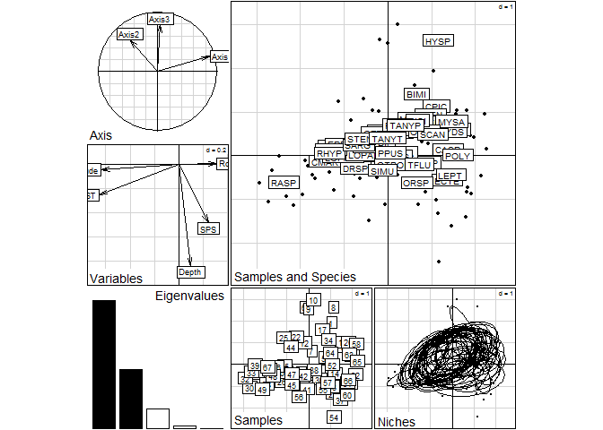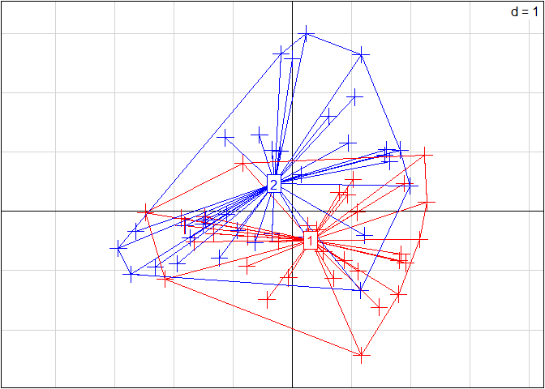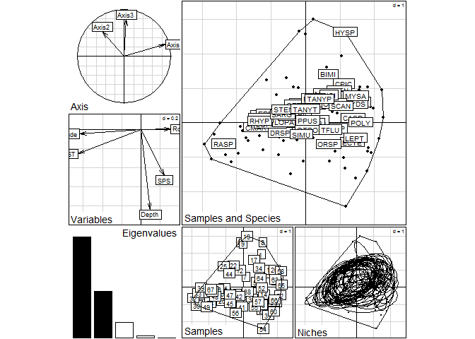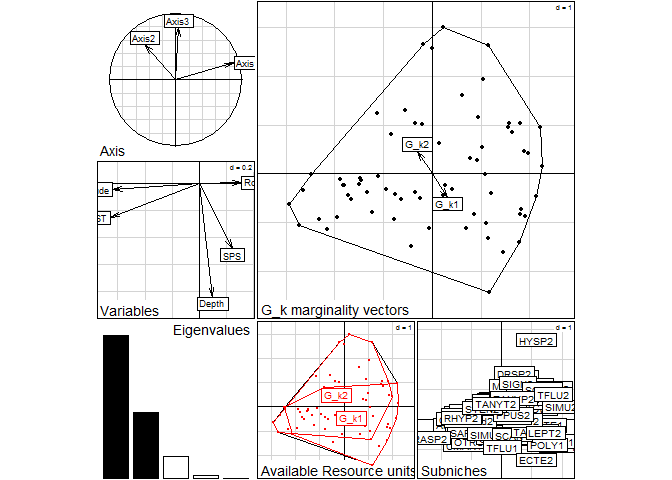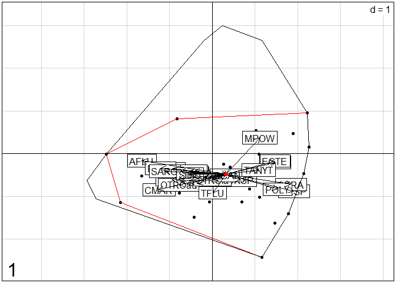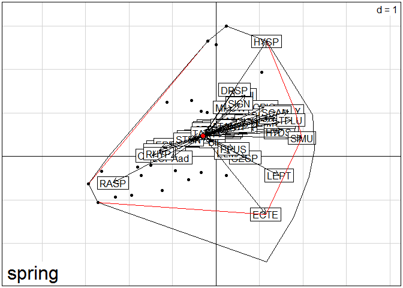

|        |   inertia|        OMI|        Tol|       Rtol|    omi|   tol|  rtol|
|--------|---------:|----------:|----------:|----------:|------:|-----:|-----:|
| AFLU   |  5.538347|  1.6300864|  1.1574213|  2.7508396|   29.4|  20.9|  49.7|
| ANTO   |  6.261168|  2.8559783|  0.4809695|  2.9242199|   45.6|   7.7|  46.7|
| ATSP   |  5.261425|  0.7738686|  1.9442760|  2.5432800|   14.7|  37.0|  48.3|
| BASP   |  4.951897|  0.1540045|  0.9205257|  3.8773669|    3.1|  18.6|  78.3|
| BIMI   |  6.440541|  2.6656032|  1.2165765|  2.5583616|   41.4|  18.9|  39.7|
| BFAS   |  5.522998|  1.6334715|  0.8316546|  3.0578719|   29.6|  15.1|  55.4|
| CASP   |  4.752588|  2.0915508|  0.6997262|  1.9613111|   44.0|  14.7|  41.3|
| CESP   |  5.991585|  1.3620235|  1.7438590|  2.8857024|   22.7|  29.1|  48.2|
| CERA   |  5.243130|  0.4385214|  1.5649566|  3.2396515|    8.4|  29.8|  61.8|
| CLEP   |  5.031965|  0.4363223|  1.3835927|  3.2120500|    8.7|  27.5|  63.8|
| CMAR   |  5.296909|  2.0940725|  1.1020999|  2.1007368|   39.5|  20.8|  39.7|
| CHIR   |  4.439955|  0.4947663|  1.5231051|  2.4220840|   11.1|  34.3|  54.6|
| CPIC   |  5.506342|  2.8291243|  0.5206856|  2.1565322|   51.4|   9.5|  39.2|
| DRSP   |  4.496590|  1.0682956|  1.9036269|  1.5246673|   23.8|  42.3|  33.9|
| DUSP   |  5.329099|  0.1398475|  1.7382410|  3.4510110|    2.6|  32.6|  64.8|
| ECSP   |  5.350165|  0.3283927|  1.4704735|  3.5512986|    6.1|  27.5|  66.4|
| ECTE   |  5.455395|  3.0887228|  0.1196580|  2.2470143|   56.6|   2.2|  41.2|
| ELMA   |  3.176472|  0.7910221|  0.0376397|  2.3478099|   24.9|   1.2|  73.9|
| EPEO   |  5.682921|  1.2701977|  0.7480074|  3.6647159|   22.4|  13.2|  64.5|
| EVIR   |  5.302216|  0.3443063|  1.2761101|  3.6817993|    6.5|  24.1|  69.4|
| EPAR   |  3.932729|  0.1404872|  0.7954177|  2.9968238|    3.6|  20.2|  76.2|
| ESSP   |  4.773562|  0.1428212|  1.0243322|  3.6064087|    3.0|  21.5|  75.5|
| EPYG   |  4.864853|  0.1428271|  0.8576808|  3.8643452|    2.9|  17.6|  79.4|
| EGEN   |  5.046325|  1.9052672|  0.8579907|  2.2830675|   37.8|  17.0|  45.2|
| GASP   |  5.691912|  0.3561383|  1.1723435|  4.1634306|    6.3|  20.6|  73.1|
| HYSP   |  8.352748|  8.3527477|  0.0000000|  0.0000000|  100.0|   0.0|   0.0|
| HEXO   |  5.243021|  0.3580747|  1.1967967|  3.6881491|    6.8|  22.8|  70.3|
| HPEL   |  3.568855|  1.4801591|  0.4150086|  1.6736876|   41.5|  11.6|  46.9|
| HYDR   |  5.424177|  0.3446764|  1.0092149|  4.0702859|    6.4|  18.6|  75.0|
| HYDS   |  6.176471|  2.7519145|  0.8340139|  2.5905427|   44.6|  13.5|  41.9|
| LEPT   |  5.337927|  2.7371006|  0.4678790|  2.1329476|   51.3|   8.8|  40.0|
| LESP   |  4.424214|  0.3139611|  0.8986846|  3.2115689|    7.1|  20.3|  72.6|
| LOPAad |  4.965245|  1.2010608|  1.9737829|  1.7904015|   24.2|  39.8|  36.1|
| LOPAla |  4.572070|  0.4750266|  1.2483663|  2.8486766|   10.4|  27.3|  62.3|
| MPOW   |  5.765380|  1.2113295|  2.0688707|  2.4851794|   21.0|  35.9|  43.1|
| MYSA   |  4.199512|  3.3382344|  0.2800060|  0.5812719|   79.5|   6.7|  13.8|
| ORHE   |  5.578876|  1.7719543|  0.8907733|  2.9161486|   31.8|  16.0|  52.3|
| ONSP   |  5.183675|  1.1029607|  1.7398668|  2.3408479|   21.3|  33.6|  45.2|
| ORTH   |  5.122163|  0.2310466|  1.2565769|  3.6345398|    4.5|  24.5|  71.0|
| ORSP   |  6.830422|  1.3221938|  2.3259105|  3.1823176|   19.4|  34.1|  46.6|
| OTROad |  5.323551|  0.3196624|  0.7949867|  4.2089018|    6.0|  14.9|  79.1|
| OTROla |  5.520143|  0.2338567|  1.2078521|  4.0784347|    4.2|  21.9|  73.9|
| PISI   |  6.092811|  1.1586152|  2.0241946|  2.9100014|   19.0|  33.2|  47.8|
| POLY   |  6.946072|  3.4561798|  0.5871372|  2.9027547|   49.8|   8.5|  41.8|
| PBIF   |  5.230149|  0.1404078|  0.9126282|  4.1771134|    2.7|  17.4|  79.9|
| PPUS   |  4.760375|  0.1258586|  0.8095743|  3.8249417|    2.6|  17.0|  80.3|
| RASP   |  6.912935|  6.1246587|  0.5175577|  0.2707183|   88.6|   7.5|   3.9|
| RHYP   |  5.925556|  1.9250904|  1.1395839|  2.8608814|   32.5|  19.2|  48.3|
| RHIP   |  5.509859|  0.5317665|  1.7133248|  3.2647681|    9.7|  31.1|  59.3|
| SIGN   |  5.690358|  0.2369562|  1.2683164|  4.1850853|    4.2|  22.3|  73.5|
| SARG   |  5.338509|  0.5093751|  1.2407905|  3.5883437|    9.5|  23.2|  67.2|
| SIMU   |  4.429029|  0.3726825|  1.1175113|  2.9388347|    8.4|  25.2|  66.4|
| STEN   |  6.268569|  0.5701184|  1.5868239|  4.1116266|    9.1|  25.3|  65.6|
| SCAN   |  6.356376|  1.3990981|  1.3987842|  3.5584937|   22.0|  22.0|  56.0|
| TANYP  |  4.883393|  0.7337598|  1.6914515|  2.4581815|   15.0|  34.6|  50.3|
| TANYT  |  5.335505|  0.1691889|  1.3199566|  3.8463591|    3.2|  24.7|  72.1|
| TFLU   |  6.940545|  2.0277114|  1.5558618|  3.3569723|   29.2|  22.4|  48.4|

    ## class: krandtest lightkrandtest 
    ## Monte-Carlo tests
    ## Call: as.krandtest(sim = t(sim), obs = obs)
    ## 
    ## Number of tests:   58 
    ## 
    ## Adjustment method for multiple comparisons:   none 
    ## Permutation number:   100 
    ##        Test       Obs    Std.Obs   Alter     Pvalue
    ## 1      AFLU 1.6300864  1.7253541 greater 0.08910891
    ## 2      ANTO 2.8559783  3.3678147 greater 0.02970297
    ## 3      ATSP 0.7738686  1.9292439 greater 0.04950495
    ## 4      BASP 0.1540045  4.5751519 greater 0.00990099
    ## 5      BIMI 2.6656032  1.9070044 greater 0.05940594
    ## 6      BFAS 1.6334715 11.7370567 greater 0.00990099
    ## 7      CASP 2.0915508 14.4059836 greater 0.00990099
    ## 8      CESP 1.3620235  1.2553447 greater 0.11881188
    ## 9      CERA 0.4385214  1.7755189 greater 0.05940594
    ## 10     CLEP 0.4363223  8.2682846 greater 0.00990099
    ## 11     CMAR 2.0940725 14.8806714 greater 0.00990099
    ## 12     CHIR 0.4947663  1.2367689 greater 0.10891089
    ## 13     CPIC 2.8291243  7.0460467 greater 0.00990099
    ## 14     DRSP 1.0682956  2.7308803 greater 0.02970297
    ## 15     DUSP 0.1398475  2.0311775 greater 0.04950495
    ## 16     ECSP 0.3283927  3.8656990 greater 0.01980198
    ## 17     ECTE 3.0887228  1.5055852 greater 0.11881188
    ## 18     ELMA 0.7910221 -0.9326867 greater 0.83168317
    ## 19     EPEO 1.2701977  0.5411500 greater 0.20792079
    ## 20     EVIR 0.3443063  2.0042738 greater 0.06930693
    ## 21     EPAR 0.1404872  0.2023392 greater 0.31683168
    ## 22     ESSP 0.1428212  1.9794915 greater 0.05940594
    ## 23     EPYG 0.1428271  5.0843127 greater 0.00990099
    ## 24     EGEN 1.9052672  4.0699261 greater 0.01980198
    ## 25     GASP 0.3561383  2.2299864 greater 0.02970297
    ## 26     HYSP 8.3527477  0.9782508 greater 0.17821782
    ## 27     HEXO 0.3580747  4.4458230 greater 0.01980198
    ## 28     HPEL 1.4801591  2.2740531 greater 0.03960396
    ## 29     HYDR 0.3446764  5.4555549 greater 0.00990099
    ## 30     HYDS 2.7519145  2.8138801 greater 0.02970297
    ## 31     LEPT 2.7371006  0.9106221 greater 0.13861386
    ## 32     LESP 0.3139611  1.9692738 greater 0.05940594
    ## 33   LOPAad 1.2010608  3.5963104 greater 0.01980198
    ## 34   LOPAla 0.4750266  5.7482753 greater 0.00990099
    ## 35     MPOW 1.2113295  0.4274899 greater 0.23762376
    ## 36     MYSA 3.3382344  0.5204062 greater 0.24752475
    ## 37     ORHE 1.7719543 12.0081382 greater 0.00990099
    ## 38     ONSP 1.1029607  1.5271297 greater 0.09900990
    ## 39     ORTH 0.2310466 11.2649694 greater 0.00990099
    ## 40     ORSP 1.3221938  1.5224705 greater 0.08910891
    ## 41   OTROad 0.3196624  4.3031837 greater 0.00990099
    ## 42   OTROla 0.2338567  1.9429847 greater 0.04950495
    ## 43     PISI 1.1586152  1.3013958 greater 0.10891089
    ## 44     POLY 3.4561798  3.4885975 greater 0.00990099
    ## 45     PBIF 0.1404078  1.0713244 greater 0.10891089
    ## 46     PPUS 0.1258586 -1.2344247 greater 0.96039604
    ## 47     RASP 6.1246587  3.2833229 greater 0.01980198
    ## 48     RHYP 1.9250904  6.4752391 greater 0.00990099
    ## 49     RHIP 0.5317665  5.4734818 greater 0.00990099
    ## 50     SIGN 0.2369562  2.9948880 greater 0.03960396
    ## 51     SARG 0.5093751 10.0000653 greater 0.00990099
    ## 52     SIMU 0.3726825 -0.8452247 greater 0.80198020
    ## 53     STEN 0.5701184  0.1009888 greater 0.33663366
    ## 54     SCAN 1.3990981  2.2577607 greater 0.03960396
    ## 55    TANYP 0.7337598  2.8492499 greater 0.01980198
    ## 56    TANYT 0.1691889  2.1522444 greater 0.06930693
    ## 57     TFLU 2.0277114  1.0036981 greater 0.19801980
    ## 58 OMI.mean 1.3369324  8.6489846 greater 0.00990099

|              |   inertia|    WitOMIG|        Tol|       Rtol|  witomig|   tol|  rtol|
|--------------|---------:|----------:|----------:|----------:|--------:|-----:|-----:|
| AFLUautumn   |  5.047993|  4.9912783|  0.0398153|  0.0168989|     98.9|   0.8|   0.3|
| ANTOautumn   |       NaN|        NaN|        NaN|        NaN|      NaN|   NaN|   NaN|
| ATSPautumn   |  5.322417|  1.3233915|  1.6872135|  2.3118117|     24.9|  31.7|  43.4|
| BASPautumn   |  4.016310|  0.9472722|  0.8623746|  2.2066629|     23.6|  21.5|  54.9|
| BIMIautumn   |       NaN|        NaN|        NaN|        NaN|      NaN|   NaN|   NaN|
| BFASautumn   |       NaN|        NaN|        NaN|        NaN|      NaN|   NaN|   NaN|
| CASPautumn   |  5.169176|  2.4639684|  0.7484637|  1.9567438|     47.7|  14.5|  37.9|
| CESPautumn   |  6.887544|  6.8875440|  0.0000000|  0.0000000|    100.0|   0.0|   0.0|
| CERAautumn   |  4.970323|  4.9703232|  0.0000000|  0.0000000|    100.0|   0.0|   0.0|
| CLEPautumn   |  4.994338|  1.7047381|  1.3970321|  1.8925682|     34.1|  28.0|  37.9|
| CMARautumn   |  4.965081|  3.4695335|  0.5973335|  0.8982140|     69.9|  12.0|  18.1|
| CHIRautumn   |       NaN|        NaN|        NaN|        NaN|      NaN|   NaN|   NaN|
| CPICautumn   |       NaN|        NaN|        NaN|        NaN|      NaN|   NaN|   NaN|
| DRSPautumn   |  3.752796|  2.1145534|  0.7093201|  0.9289223|     56.3|  18.9|  24.8|
| DUSPautumn   |  4.780569|  1.0076983|  1.7193447|  2.0535264|     21.1|  36.0|  43.0|
| ECSPautumn   |  5.492605|  0.5709870|  1.2247275|  3.6968904|     10.4|  22.3|  67.3|
| ECTEautumn   |  4.842414|  3.2464421|  0.3220876|  1.2738847|     67.0|   6.7|  26.3|
| ELMAautumn   |       NaN|        NaN|        NaN|        NaN|      NaN|   NaN|   NaN|
| EPEOautumn   |       NaN|        NaN|        NaN|        NaN|      NaN|   NaN|   NaN|
| EVIRautumn   |       NaN|        NaN|        NaN|        NaN|      NaN|   NaN|   NaN|
| EPARautumn   |  4.005941|  0.5643963|  0.6642875|  2.7772567|     14.1|  16.6|  69.3|
| ESSPautumn   |  4.768717|  0.4737399|  0.5447734|  3.7502039|      9.9|  11.4|  78.6|
| EPYGautumn   |  4.737186|  0.4865543|  0.4658465|  3.7847857|     10.3|   9.8|  79.9|
| EGENautumn   |       NaN|        NaN|        NaN|        NaN|      NaN|   NaN|   NaN|
| GASPautumn   |  2.580370|  0.6172684|  0.3452494|  1.6178520|     23.9|  13.4|  62.7|
| HYSPautumn   |       NaN|        NaN|        NaN|        NaN|      NaN|   NaN|   NaN|
| HEXOautumn   |  4.456510|  2.3703453|  0.3042154|  1.7819496|     53.2|   6.8|  40.0|
| HPELautumn   |       NaN|        NaN|        NaN|        NaN|      NaN|   NaN|   NaN|
| HYDRautumn   |  5.115527|  0.7610947|  1.3776055|  2.9768267|     14.9|  26.9|  58.2|
| HYDSautumn   |       NaN|        NaN|        NaN|        NaN|      NaN|   NaN|   NaN|
| LEPTautumn   |       NaN|        NaN|        NaN|        NaN|      NaN|   NaN|   NaN|
| LESPautumn   |  2.629375|  1.2380197|  0.2587213|  1.1326343|     47.1|   9.8|  43.1|
| LOPAadautumn |       NaN|        NaN|        NaN|        NaN|      NaN|   NaN|   NaN|
| LOPAlaautumn |  3.718404|  1.9067401|  0.3147357|  1.4969284|     51.3|   8.5|  40.3|
| MPOWautumn   |  7.192349|  2.0009281|  2.7526841|  2.4387369|     27.8|  38.3|  33.9|
| MYSAautumn   |       NaN|        NaN|        NaN|        NaN|      NaN|   NaN|   NaN|
| ORHEautumn   |       NaN|        NaN|        NaN|        NaN|      NaN|   NaN|   NaN|
| ONSPautumn   |  3.998315|  1.1210944|  0.9542170|  1.9230038|     28.0|  23.9|  48.1|
| ORTHautumn   |  4.351143|  0.8960762|  1.5707221|  1.8843446|     20.6|  36.1|  43.3|
| ORSPautumn   |  6.830422|  1.3221938|  2.3259105|  3.1823176|     19.4|  34.1|  46.6|
| OTROadautumn |  6.230148|  2.5941353|  0.9993173|  2.6366950|     41.6|  16.0|  42.3|
| OTROlaautumn |  5.142497|  0.6819671|  0.5516613|  3.9088689|     13.3|  10.7|  76.0|
| PISIautumn   |       NaN|        NaN|        NaN|        NaN|      NaN|   NaN|   NaN|
| POLYautumn   |  5.874718|  3.7305124|  0.7851956|  1.3590103|     63.5|  13.4|  23.1|
| PBIFautumn   |  4.147923|  2.1961661|  0.5297757|  1.4219813|     52.9|  12.8|  34.3|
| PPUSautumn   |  3.999069|  2.8780882|  0.7630461|  0.3579344|     72.0|  19.1|   9.0|
| RASPautumn   |       NaN|        NaN|        NaN|        NaN|      NaN|   NaN|   NaN|
| RHYPautumn   |       NaN|        NaN|        NaN|        NaN|      NaN|   NaN|   NaN|
| RHIPautumn   |       NaN|        NaN|        NaN|        NaN|      NaN|   NaN|   NaN|
| SIGNautumn   |  5.241407|  0.8293657|  2.0007788|  2.4112627|     15.8|  38.2|  46.0|
| SARGautumn   |  4.379817|  2.4492822|  0.8672941|  1.0632409|     55.9|  19.8|  24.3|
| SIMUautumn   |  4.103898|  1.0638770|  1.3530498|  1.6869710|     25.9|  33.0|  41.1|
| STENautumn   |       NaN|        NaN|        NaN|        NaN|      NaN|   NaN|   NaN|
| SCANautumn   |  6.471128|  0.9813382|  0.6184927|  4.8712967|     15.2|   9.6|  75.3|
| TANYPautumn  |       NaN|        NaN|        NaN|        NaN|      NaN|   NaN|   NaN|
| TANYTautumn  |  4.459319|  1.4061285|  0.7890246|  2.2641654|     31.5|  17.7|  50.8|
| TFLUautumn   |  5.678182|  2.2777933|  0.4658585|  2.9345304|     40.1|   8.2|  51.7|
| AFLUspring   |  5.593913|  2.4605247|  0.5429197|  2.5904682|     44.0|   9.7|  46.3|
| ANTOspring   |  6.261168|  2.8559783|  0.4809695|  2.9242199|     45.6|   7.7|  46.7|
| ATSPspring   |  4.959373|  0.9321612|  2.4084852|  1.6187263|     18.8|  48.6|  32.6|
| BASPspring   |  5.216445|  0.3663442|  1.2783080|  3.5717924|      7.0|  24.5|  68.5|
| BIMIspring   |  6.440541|  2.6656032|  1.2165765|  2.5583616|     41.4|  18.9|  39.7|
| BFASspring   |  5.522998|  1.6334715|  0.8316546|  3.0578719|     29.6|  15.1|  55.4|
| CASPspring   |  3.820359|  2.2812516|  0.4450021|  1.0941047|     59.7|  11.6|  28.6|
| CESPspring   |  5.832151|  1.5201320|  1.7183686|  2.5936503|     26.1|  29.5|  44.5|
| CERAspring   |  5.248000|  0.4657628|  1.4545148|  3.3277225|      8.9|  27.7|  63.4|
| CLEPspring   |  5.039830|  0.4812193|  0.9568038|  3.6018068|      9.5|  19.0|  71.5|
| CMARspring   |  5.364636|  2.1665091|  0.9555239|  2.2426034|     40.4|  17.8|  41.8|
| CHIRspring   |  4.439955|  0.4947663|  1.5231051|  2.4220840|     11.1|  34.3|  54.6|
| CPICspring   |  5.506342|  2.8291243|  0.5206856|  2.1565322|     51.4|   9.5|  39.2|
| DRSPspring   |  8.570756|  3.3680622|  2.2610122|  2.9416821|     39.3|  26.4|  34.3|
| DUSPspring   |  5.850675|  0.5912963|  1.6446603|  3.6147179|     10.1|  28.1|  61.8|
| ECSPspring   |  5.331930|  0.5271468|  1.4828117|  3.3219716|      9.9|  27.8|  62.3|
| ECTEspring   |  6.681357|  6.6813566|  0.0000000|  0.0000000|    100.0|   0.0|   0.0|
| ELMAspring   |  3.176472|  0.7910221|  0.0376397|  2.3478099|     24.9|   1.2|  73.9|
| EPEOspring   |  5.682921|  1.2701977|  0.7480074|  3.6647159|     22.4|  13.2|  64.5|
| EVIRspring   |  5.302216|  0.3443063|  1.2761101|  3.6817993|      6.5|  24.1|  69.4|
| EPARspring   |  3.917797|  0.2686018|  0.5560763|  3.0931191|      6.9|  14.2|  79.0|
| ESSPspring   |  4.774797|  0.3230870|  0.5041956|  3.9475140|      6.8|  10.6|  82.7|
| EPYGspring   |  5.037744|  0.6458358|  1.4545934|  2.9373151|     12.8|  28.9|  58.3|
| EGENspring   |  5.046325|  1.9052672|  0.8579907|  2.2830675|     37.8|  17.0|  45.2|
| GASPspring   |  5.867186|  0.4291003|  1.0866893|  4.3513962|      7.3|  18.5|  74.2|
| HYSPspring   |  8.352748|  8.3527477|  0.0000000|  0.0000000|    100.0|   0.0|   0.0|
| HEXOspring   |  5.323090|  0.4469288|  0.9911319|  3.8850296|      8.4|  18.6|  73.0|
| HPELspring   |  3.568855|  1.4801591|  0.4150086|  1.6736876|     41.5|  11.6|  46.9|
| HYDRspring   |  5.442886|  0.4174195|  0.9798750|  4.0455915|      7.7|  18.0|  74.3|
| HYDSspring   |  6.176471|  2.7519145|  0.8340139|  2.5905427|     44.6|  13.5|  41.9|
| LEPTspring   |  5.337927|  2.7371006|  0.4678790|  2.1329476|     51.3|   8.8|  40.0|
| LESPspring   |  4.612694|  0.4520373|  1.0916182|  3.0690387|      9.8|  23.7|  66.5|
| LOPAadspring |  4.965245|  1.2010608|  1.9737829|  1.7904015|     24.2|  39.8|  36.1|
| LOPAlaspring |  5.113748|  0.3732577|  0.4726950|  4.2677952|      7.3|   9.2|  83.5|
| MPOWspring   |  4.927375|  2.1214892|  1.6490874|  1.1567981|     43.1|  33.5|  23.5|
| MYSAspring   |  4.199512|  3.3382344|  0.2800060|  0.5812719|     79.5|   6.7|  13.8|
| ORHEspring   |  5.578876|  1.7719543|  0.8907733|  2.9161486|     31.8|  16.0|  52.3|
| ONSPspring   |  5.582926|  2.8517365|  0.3795820|  2.3516074|     51.1|   6.8|  42.1|
| ORTHspring   |  5.389232|  0.3900032|  0.9052110|  4.0940178|      7.2|  16.8|  76.0|
| ORSPspring   |       NaN|        NaN|        NaN|        NaN|      NaN|   NaN|   NaN|
| OTROadspring |  5.254247|  0.4060305|  0.9786089|  3.8696076|      7.7|  18.6|  73.6|
| OTROlaspring |  6.321554|  0.7368166|  1.8764679|  3.7082700|     11.7|  29.7|  58.7|
| PISIspring   |  6.092811|  1.1586152|  2.0241946|  2.9100014|     19.0|  33.2|  47.8|
| POLYspring   |  8.244171|  7.1591537|  0.3273256|  0.7576920|     86.8|   4.0|   9.2|
| PBIFspring   |  5.286846|  0.1779238|  1.0255683|  4.0833537|      3.4|  19.4|  77.2|
| PPUSspring   |  4.955463|  0.4637935|  3.2353458|  1.2563236|      9.4|  65.3|  25.4|
| RASPspring   |  6.912935|  6.1246587|  0.5175577|  0.2707183|     88.6|   7.5|   3.9|
| RHYPspring   |  5.925556|  1.9250904|  1.1395839|  2.8608814|     32.5|  19.2|  48.3|
| RHIPspring   |  5.509859|  0.5317665|  1.7133248|  3.2647681|      9.7|  31.1|  59.3|
| SIGNspring   |  6.115133|  2.0334064|  1.6570358|  2.4246905|     33.3|  27.1|  39.7|
| SARGspring   |  5.630294|  0.5753024|  0.9397895|  4.1152018|     10.2|  16.7|  73.1|
| SIMUspring   |  6.133137|  6.1331366|  0.0000000|  0.0000000|    100.0|   0.0|   0.0|
| STENspring   |  6.268569|  0.5701184|  1.5868239|  4.1116266|      9.1|  25.3|  65.6|
| SCANspring   |  6.295929|  3.0027724|  0.4501125|  2.8430438|     47.7|   7.1|  45.2|
| TANYPspring  |  4.883393|  0.7337598|  1.6914515|  2.4581815|     15.0|  34.6|  50.3|
| TANYTspring  |  5.481883|  0.3222465|  0.9109765|  4.2486596|      5.9|  16.6|  77.5|
| TFLUspring   |  8.759160|  5.3988068|  0.8297366|  2.5306165|     61.6|   9.5|  28.9|

    ## $autumn
    ## $autumn$Subsettest
    ## class: subkrandtest 
    ## Monte-Carlo tests
    ## Call: subkrandtest(sim = t(Xsim), obs = Xwobs, alter = "two-sided")
    ## 
    ## Number of tests:   5 
    ## 
    ## Adjustment method for multiple comparisons:   none 
    ## Permutation number:   100 
    ##     Test          Obs     Std.Obs     Alter     Pvalue
    ## 1    FST -0.095707902 -0.93792273 two-sided 0.39603960
    ## 2  Depth  0.330509141  2.39455007 two-sided 0.00990099
    ## 3    SPS  0.495802058  4.28536734 two-sided 0.00990099
    ## 4 Froude -0.155231548 -1.19848456 two-sided 0.21782178
    ## 5  Rough  0.002382221 -0.09980932 two-sided 0.89108911
    ## Subsets Pvalue: 7.535608e-06 
    ## other elements: subpvalue call 
    ## 
    ## $autumn$witomigtest
    ## class: subnikrandtest 
    ## Monte-Carlo tests
    ## Call: subnikrandtest(sim = t(sim), obs = obs, subpvalue = Xtest$subpvalue)
    ## 
    ## Number of tests:   58 
    ## 
    ## Adjustment method for multiple comparisons:   none 
    ##        Test       Obs     Std.Obs   Alter N.perm     Pvalue  SubniPvalue
    ## 1      AFLU 4.9912783  3.10875366 greater    100 0.02970297 2.238299e-07
    ## 2      ANTO       NaN         NaN greater     98         NA           NA
    ## 3      ATSP 1.3233915  0.26054005 greater    100 0.29702970 2.238299e-06
    ## 4      BASP 0.9472722  4.12709607 greater    100 0.00990099 7.460998e-08
    ## 5      BIMI       NaN         NaN greater     93         NA           NA
    ## 6      BFAS       NaN         NaN greater    100         NA           NA
    ## 7      CASP 2.4639684  3.86835956 greater    100 0.00990099 7.460998e-08
    ## 8      CESP 6.8875440  2.51998997 greater    100 0.04950495 3.730499e-07
    ## 9      CERA 4.9703232 11.07073398 greater    100 0.00990099 7.460998e-08
    ## 10     CLEP 1.7047381  7.46805126 greater    100 0.00990099 7.460998e-08
    ## 11     CMAR 3.4695335  7.27334162 greater    100 0.00990099 7.460998e-08
    ## 12     CHIR       NaN         NaN greater    100         NA           NA
    ## 13     CPIC       NaN         NaN greater    100         NA           NA
    ## 14     DRSP 2.1145534  1.83765489 greater    100 0.06930693 5.222699e-07
    ## 15     DUSP 1.0076983  4.49581672 greater    100 0.00990099 7.460998e-08
    ## 16     ECSP 0.5709870  0.27475974 greater    100 0.34653465 2.611349e-06
    ## 17     ECTE 3.2464421  0.17446519 greater     88 0.29213483 2.201414e-06
    ## 18     ELMA       NaN         NaN greater     75         NA           NA
    ## 19     EPEO       NaN         NaN greater     99         NA           NA
    ## 20     EVIR       NaN         NaN greater    100         NA           NA
    ## 21     EPAR 0.5643963  0.09594693 greater    100 0.35643564 2.685959e-06
    ## 22     ESSP 0.4737399 -0.07754896 greater    100 0.56435644 4.252769e-06
    ## 23     EPYG 0.4865543  0.48034280 greater    100 0.20792079 1.566810e-06
    ## 24     EGEN       NaN         NaN greater    100         NA           NA
    ## 25     GASP 0.6172684 -0.03832010 greater    100 0.45544554 3.432059e-06
    ## 26     HYSP       NaN         NaN greater     38         NA           NA
    ## 27     HEXO 2.3703453  9.57245416 greater    100 0.00990099 7.460998e-08
    ## 28     HPEL       NaN         NaN greater    100         NA           NA
    ## 29     HYDR 0.7610947  1.32560003 greater    100 0.12871287 9.699298e-07
    ## 30     HYDS       NaN         NaN greater     98         NA           NA
    ## 31     LEPT       NaN         NaN greater     89         NA           NA
    ## 32     LESP 1.2380197  2.51568053 greater    100 0.03960396 2.984399e-07
    ## 33   LOPAad       NaN         NaN greater    100         NA           NA
    ## 34   LOPAla 1.9067401  6.41542785 greater    100 0.00990099 7.460998e-08
    ## 35     MPOW 2.0009281  0.10850304 greater    100 0.38613861 2.909789e-06
    ## 36     MYSA       NaN         NaN greater     76         NA           NA
    ## 37     ORHE       NaN         NaN greater    100         NA           NA
    ## 38     ONSP 1.1210944 -0.19260730 greater    100 0.50495050 3.805109e-06
    ## 39     ORTH 0.8960762  4.37355835 greater    100 0.00990099 7.460998e-08
    ## 40     ORSP 1.3221938 -0.21300412 greater     99 0.49000000 3.692448e-06
    ## 41   OTROad 2.5941353  8.32955073 greater    100 0.00990099 7.460998e-08
    ## 42   OTROla 0.6819671  0.55088726 greater    100 0.22772277 1.716030e-06
    ## 43     PISI       NaN         NaN greater    100         NA           NA
    ## 44     POLY 3.7305124  1.03807592 greater    100 0.13861386 1.044540e-06
    ## 45     PBIF 2.1961661  8.13800603 greater    100 0.00990099 7.460998e-08
    ## 46     PPUS 2.8780882  0.63911223 greater    100 0.17821782 1.342980e-06
    ## 47     RASP       NaN         NaN greater     83         NA           NA
    ## 48     RHYP       NaN         NaN greater    100         NA           NA
    ## 49     RHIP       NaN         NaN greater    100         NA           NA
    ## 50     SIGN 0.8293657  1.50009635 greater    100 0.09900990 7.460998e-07
    ## 51     SARG 2.4492822 12.21785529 greater    100 0.00990099 7.460998e-08
    ## 52     SIMU 1.0638770 -0.58139916 greater    100 0.69306931 5.222699e-06
    ## 53     STEN       NaN         NaN greater     99         NA           NA
    ## 54     SCAN 0.9813382 -0.40391275 greater    100 0.55445545 4.178159e-06
    ## 55    TANYP       NaN         NaN greater    100         NA           NA
    ## 56    TANYT 1.4061285  5.30804758 greater    100 0.00990099 7.460998e-08
    ## 57     TFLU 2.2777933 -0.14701472 greater     97 0.43877551 3.306440e-06
    ## 58 OMI.mean 1.9584239  4.90557362 greater    100 0.00990099 7.460998e-08
    ## 
    ## other elements: adj.method sub.pvalue subni.pvalue call 
    ## 
    ## 
    ## $spring
    ## $spring$Subsettest
    ## class: subkrandtest 
    ## Monte-Carlo tests
    ## Call: subkrandtest(sim = t(Xsim), obs = Xwobs, alter = "two-sided")
    ## 
    ## Number of tests:   5 
    ## 
    ## Adjustment method for multiple comparisons:   none 
    ## Permutation number:   100 
    ##     Test          Obs    Std.Obs     Alter     Pvalue
    ## 1    FST  0.092892964  1.0049170 two-sided 0.31683168
    ## 2  Depth -0.320788284 -3.0814553 two-sided 0.00990099
    ## 3    SPS -0.481219645 -3.6328831 two-sided 0.00990099
    ## 4 Froude  0.150665914  1.4666792 two-sided 0.14851485
    ## 5  Rough -0.002312156 -0.1493797 two-sided 0.89108911
    ## Subsets Pvalue: 4.110332e-06 
    ## other elements: subpvalue call 
    ## 
    ## $spring$witomigtest
    ## class: subnikrandtest 
    ## Monte-Carlo tests
    ## Call: subnikrandtest(sim = t(sim), obs = obs, subpvalue = Xtest$subpvalue)
    ## 
    ## Number of tests:   58 
    ## 
    ## Adjustment method for multiple comparisons:   none 
    ##        Test       Obs     Std.Obs   Alter N.perm     Pvalue  SubniPvalue
    ## 1      AFLU 2.4605247  0.43855286 greater    100 0.23762376 9.767125e-07
    ## 2      ANTO 2.8559783  0.16875948 greater    100 0.31683168 1.302283e-06
    ## 3      ATSP 0.9321612 -0.17932166 greater    100 0.46534653 1.912729e-06
    ## 4      BASP 0.3663442 -0.32426024 greater    100 0.53465347 2.197603e-06
    ## 5      BIMI 2.6656032 -0.14068152 greater     92 0.41935484 1.723688e-06
    ## 6      BFAS 1.6334715  1.63368764 greater    100 0.04950495 2.034818e-07
    ## 7      CASP 2.2812516  2.69515862 greater    100 0.02970297 1.220891e-07
    ## 8      CESP 1.5201320 -0.24455525 greater     98 0.49494949 2.034407e-06
    ## 9      CERA 0.4657628 -0.76409501 greater    100 0.79207921 3.255708e-06
    ## 10     CLEP 0.4812193  0.04242279 greater    100 0.46534653 1.912729e-06
    ## 11     CMAR 2.1665091  4.21557418 greater    100 0.00990099 4.069635e-08
    ## 12     CHIR 0.4947663 -0.65386801 greater    100 0.74257426 3.052227e-06
    ## 13     CPIC 2.8291243  1.18137131 greater    100 0.12871287 5.290526e-07
    ## 14     DRSP 3.3680622  2.96896593 greater    100 0.01980198 8.139271e-08
    ## 15     DUSP 0.5912963  0.62148959 greater    100 0.22772277 9.360161e-07
    ## 16     ECSP 0.5271468  0.01120943 greater    100 0.41584158 1.709247e-06
    ## 17     ECTE 6.6813566  1.17774092 greater     85 0.10465116 4.301510e-07
    ## 18     ELMA 0.7910221 -1.14000003 greater     72 0.90410959 3.716190e-06
    ## 19     EPEO 1.2701977 -0.65639153 greater     97 0.76530612 3.145662e-06
    ## 20     EVIR 0.3443063 -0.68719153 greater    100 0.67326733 2.767352e-06
    ## 21     EPAR 0.2686018 -1.02865659 greater    100 0.85148515 3.499886e-06
    ## 22     ESSP 0.3230870 -0.79606867 greater    100 0.80198020 3.296405e-06
    ## 23     EPYG 0.6458358  2.17534645 greater    100 0.03960396 1.627854e-07
    ## 24     EGEN 1.9052672  1.03728742 greater    100 0.10891089 4.476599e-07
    ## 25     GASP 0.4291003 -0.70741489 greater    100 0.71287129 2.930137e-06
    ## 26     HYSP 8.3527477  0.89265789 greater     47 0.25000000 1.027583e-06
    ## 27     HEXO 0.4469288 -0.33768309 greater    100 0.58415842 2.401085e-06
    ## 28     HPEL 1.4801591 -0.06972933 greater    100 0.41584158 1.709247e-06
    ## 29     HYDR 0.4174195 -0.42750824 greater    100 0.65346535 2.685959e-06
    ## 30     HYDS 2.7519145  0.15504324 greater     99 0.32000000 1.315306e-06
    ## 31     LEPT 2.7371006 -0.37433813 greater     85 0.50000000 2.055166e-06
    ## 32     LESP 0.4520373 -0.36408430 greater    100 0.61386139 2.523174e-06
    ## 33   LOPAad 1.2010608  0.11065675 greater    100 0.37623762 1.546461e-06
    ## 34   LOPAla 0.3732577 -0.71705119 greater    100 0.72277228 2.970834e-06
    ## 35     MPOW 2.1214892 -0.11364171 greater     99 0.39000000 1.603029e-06
    ## 36     MYSA 3.3382344 -0.44156444 greater     76 0.59740260 2.455523e-06
    ## 37     ORHE 1.7719543  2.12491130 greater    100 0.04950495 2.034818e-07
    ## 38     ONSP 2.8517365  1.35172557 greater    100 0.09900990 4.069635e-07
    ## 39     ORTH 0.3900032 -0.20137012 greater    100 0.55445545 2.278996e-06
    ## 40     ORSP       NaN         NaN greater    100         NA           NA
    ## 41   OTROad 0.4060305 -0.54304267 greater    100 0.72277228 2.970834e-06
    ## 42   OTROla 0.7368166  0.46514677 greater    100 0.26732673 1.098802e-06
    ## 43     PISI 1.1586152 -0.23324070 greater    100 0.54455446 2.238299e-06
    ## 44     POLY 7.1591537  1.80153881 greater     99 0.07000000 2.877232e-07
    ## 45     PBIF 0.1779238 -1.25703929 greater    100 0.94059406 3.866154e-06
    ## 46     PPUS 0.4637935 -0.99129897 greater     99 0.93000000 3.822609e-06
    ## 47     RASP 6.1246587  0.81132685 greater     90 0.23076923 9.485381e-07
    ## 48     RHYP 1.9250904  1.78499822 greater    100 0.05940594 2.441781e-07
    ## 49     RHIP 0.5317665 -0.28848663 greater    100 0.56435644 2.319692e-06
    ## 50     SIGN 2.0334064  7.29772288 greater    100 0.00990099 4.069635e-08
    ## 51     SARG 0.5753024  0.52721047 greater    100 0.29702970 1.220891e-06
    ## 52     SIMU 6.1331366  3.62535573 greater    100 0.01980198 8.139271e-08
    ## 53     STEN 0.5701184 -0.70139134 greater     99 0.81000000 3.329369e-06
    ## 54     SCAN 3.0027724  1.41007250 greater    100 0.12871287 5.290526e-07
    ## 55    TANYP 0.7337598 -0.05306232 greater    100 0.42574257 1.749943e-06
    ## 56    TANYT 0.3222465 -0.76219532 greater    100 0.78217822 3.215012e-06
    ## 57     TFLU 5.3988068  0.84120522 greater     99 0.17000000 6.987564e-07
    ## 58 OMI.mean 1.8649566  2.07409190 greater    100 0.02970297 1.220891e-07
    ## 
    ## other elements: adj.method sub.pvalue subni.pvalue call

|         |   inertia|  WitOMIG\_k|        Tol|       Rtol|  witomig\_k|   tol|  rtol|
|---------|---------:|-----------:|----------:|----------:|-----------:|-----:|-----:|
| AFLU1   |  5.620936|   5.5642217|  0.0360651|  0.0206490|        99.0|   0.6|   0.4|
| ANTO1   |       NaN|         NaN|        NaN|        NaN|         NaN|   NaN|   NaN|
| ATSP1   |  5.175405|   1.1763795|  2.3858548|  1.6131705|        22.7|  46.1|  31.2|
| BASP1   |  3.884823|   0.8157855|  1.6171870|  1.4518505|        21.0|  41.6|  37.4|
| BIMI1   |       NaN|         NaN|        NaN|        NaN|         NaN|   NaN|   NaN|
| BFAS1   |       NaN|         NaN|        NaN|        NaN|         NaN|   NaN|   NaN|
| CASP1   |  4.659261|   1.9540531|  0.8433682|  1.8618393|        41.9|  18.1|  40.0|
| CESP1   |  4.984683|   4.9846831|  0.0000000|  0.0000000|       100.0|   0.0|   0.0|
| CERA1   |  3.987971|   3.9879708|  0.0000000|  0.0000000|       100.0|   0.0|   0.0|
| CLEP1   |  4.909637|   1.6200372|  2.0090550|  1.2805453|        33.0|  40.9|  26.1|
| CMAR1   |  4.803559|   3.3080114|  0.8245203|  0.6710272|        68.9|  17.2|  14.0|
| CHIR1   |       NaN|         NaN|        NaN|        NaN|         NaN|   NaN|   NaN|
| CPIC1   |       NaN|         NaN|        NaN|        NaN|         NaN|   NaN|   NaN|
| DRSP1   |  3.714868|   2.0766254|  0.9507084|  0.6875340|        55.9|  25.6|  18.5|
| DUSP1   |  4.669630|   0.8967591|  2.6173587|  1.1555125|        19.2|  56.1|  24.7|
| ECSP1   |  5.223511|   0.3018932|  2.4656636|  2.4559543|         5.8|  47.2|  47.0|
| ECTE1   |  4.282558|   2.6865859|  0.0458742|  1.5500981|        62.7|   1.1|  36.2|
| ELMA1   |       NaN|         NaN|        NaN|        NaN|         NaN|   NaN|   NaN|
| EPEO1   |       NaN|         NaN|        NaN|        NaN|         NaN|   NaN|   NaN|
| EVIR1   |       NaN|         NaN|        NaN|        NaN|         NaN|   NaN|   NaN|
| EPAR1   |  3.552155|   0.1106110|  1.4819049|  1.9596393|         3.1|  41.7|  55.2|
| ESSP1   |  4.419685|   0.1247073|  2.0704114|  2.2245660|         2.8|  46.8|  50.3|
| EPYG1   |  4.322019|   0.0713870|  2.4834894|  1.7671428|         1.7|  57.5|  40.9|
| EGEN1   |       NaN|         NaN|        NaN|        NaN|         NaN|   NaN|   NaN|
| GASP1   |  2.505812|   0.5427110|  0.4469468|  1.5161545|        21.7|  17.8|  60.5|
| HYSP1   |       NaN|         NaN|        NaN|        NaN|         NaN|   NaN|   NaN|
| HEXO1   |  3.947786|   1.8616211|  0.6252779|  1.4608870|        47.2|  15.8|  37.0|
| HPEL1   |       NaN|         NaN|        NaN|        NaN|         NaN|   NaN|   NaN|
| HYDR1   |  4.883217|   0.5287849|  2.1845547|  2.1698775|        10.8|  44.7|  44.4|
| HYDS1   |       NaN|         NaN|        NaN|        NaN|         NaN|   NaN|   NaN|
| LEPT1   |       NaN|         NaN|        NaN|        NaN|         NaN|   NaN|   NaN|
| LESP1   |  2.415512|   1.0241563|  0.5868012|  0.8045543|        42.4|  24.3|  33.3|
| LOPAad1 |       NaN|         NaN|        NaN|        NaN|         NaN|   NaN|   NaN|
| LOPAla1 |  3.483575|   1.6719107|  0.6582340|  1.1534301|        48.0|  18.9|  33.1|
| MPOW1   |  7.279741|   2.0883204|  2.2426765|  2.9487445|        28.7|  30.8|  40.5|
| MYSA1   |       NaN|         NaN|        NaN|        NaN|         NaN|   NaN|   NaN|
| ORHE1   |       NaN|         NaN|        NaN|        NaN|         NaN|   NaN|   NaN|
| ONSP1   |  4.234140|   1.3569194|  1.5778631|  1.2993576|        32.0|  37.3|  30.7|
| ORTH1   |  4.365602|   0.9105355|  2.1991369|  1.2559299|        20.9|  50.4|  28.8|
| ORSP1   |  6.422186|   0.9139582|  2.3678119|  3.1404162|        14.2|  36.9|  48.9|
| OTROad1 |  5.847957|   2.2119449|  1.8459240|  1.7900883|        37.8|  31.6|  30.6|
| OTROla1 |  4.677074|   0.2165436|  2.2520955|  2.2084347|         4.6|  48.2|  47.2|
| PISI1   |       NaN|         NaN|        NaN|        NaN|         NaN|   NaN|   NaN|
| POLY1   |  4.504666|   2.3604599|  0.7878648|  1.3563411|        52.4|  17.5|  30.1|
| PBIF1   |  4.272253|   2.3204958|  0.8146753|  1.1370817|        54.3|  19.1|  26.6|
| PPUS1   |  4.280653|   3.1596723|  0.8806195|  0.2403611|        73.8|  20.6|   5.6|
| RASP1   |       NaN|         NaN|        NaN|        NaN|         NaN|   NaN|   NaN|
| RHYP1   |       NaN|         NaN|        NaN|        NaN|         NaN|   NaN|   NaN|
| RHIP1   |       NaN|         NaN|        NaN|        NaN|         NaN|   NaN|   NaN|
| SIGN1   |  5.201174|   0.7891329|  3.0374197|  1.3746218|        15.2|  58.4|  26.4|
| SARG1   |  4.591782|   2.6612472|  1.0885512|  0.8419839|        58.0|  23.7|  18.3|
| SIMU1   |  3.996263|   0.9562425|  2.4510003|  0.5890204|        23.9|  61.3|  14.7|
| STEN1   |       NaN|         NaN|        NaN|        NaN|         NaN|   NaN|   NaN|
| SCAN1   |  5.786297|   0.2965078|  0.4136070|  5.0761824|         5.1|   7.1|  87.7|
| TANYP1  |       NaN|         NaN|        NaN|        NaN|         NaN|   NaN|   NaN|
| TANYT1  |  3.906339|   0.8531489|  0.9303935|  2.1227966|        21.8|  23.8|  54.3|
| TFLU1   |  4.652959|   1.2525696|  0.0278353|  3.3725536|        26.9|   0.6|  72.5|
| AFLU2   |  5.889237|   2.7558493|  0.7029799|  2.4304079|        46.8|  11.9|  41.3|
| ANTO2   |  7.083839|   3.6786494|  0.4050870|  3.0001024|        51.9|   5.7|  42.4|
| ATSP2   |  4.891195|   0.8639830|  1.4160532|  2.6111583|        17.7|  29.0|  53.4|
| BASP2   |  4.890760|   0.0406599|  2.1106210|  2.7394794|         0.8|  43.2|  56.0|
| BIMI2   |  5.673801|   1.8988628|  0.4534084|  3.3215297|        33.5|   8.0|  58.5|
| BFAS2   |  4.857406|   0.9678796|  1.6202229|  2.2693036|        19.9|  33.4|  46.7|
| CASP2   |  3.980211|   2.4411040|  0.4639540|  1.0751528|        61.3|  11.7|  27.0|
| CESP2   |  6.177622|   1.8656031|  1.8455125|  2.4665064|        30.2|  29.9|  39.9|
| CERA2   |  5.361050|   0.5788122|  1.8880373|  2.8942000|        10.8|  35.2|  54.0|
| CLEP2   |  4.682735|   0.1241242|  2.2629018|  2.2957089|         2.7|  48.3|  49.0|
| CMAR2   |  4.800920|   1.6027928|  1.5454976|  1.6526296|        33.4|  32.2|  34.4|
| CHIR2   |  4.322612|   0.3774233|  1.0898553|  2.8553338|         8.7|  25.2|  66.1|
| CPIC2   |  5.717512|   3.0402945|  0.5568210|  2.1203968|        53.2|   9.7|  37.1|
| DRSP2   |  7.419486|   2.2167917|  2.1269874|  3.0757068|        29.9|  28.7|  41.5|
| DUSP2   |  5.375101|   0.1157230|  3.0826266|  2.1767516|         2.2|  57.4|  40.5|
| ECSP2   |  4.862670|   0.0578862|  2.5673879|  2.2373955|         1.2|  52.8|  46.0|
| ECTE2   |  8.151691|   8.1516905|  0.0000000|  0.0000000|       100.0|   0.0|   0.0|
| ELMA2   |  4.029052|   1.6436023|  0.0110160|  2.3744336|        40.8|   0.3|  58.9|
| EPEO2   |  5.036529|   0.6238052|  1.5791415|  2.8335819|        12.4|  31.4|  56.3|
| EVIR2   |  5.198365|   0.2404560|  2.0712503|  2.8866591|         4.6|  39.8|  55.5|
| EPAR2   |  3.753191|   0.1039955|  0.9788830|  2.6703124|         2.8|  26.1|  71.1|
| ESSP2   |  4.539844|   0.0881344|  1.0956259|  3.3560837|         1.9|  24.1|  73.9|
| EPYG2   |  4.998468|   0.6065596|  1.5793650|  2.8125435|        12.1|  31.6|  56.3|
| EGEN2   |  5.010104|   1.8690463|  0.9064748|  2.2345834|        37.3|  18.1|  44.6|
| GASP2   |  5.509508|   0.0714224|  2.1874052|  3.2506803|         1.3|  39.7|  59.0|
| HYSP2   |  6.946494|   6.9464943|  0.0000000|  0.0000000|       100.0|   0.0|   0.0|
| HEXO2   |  4.934166|   0.0580045|  2.5800676|  2.2960939|         1.2|  52.3|  46.5|
| HPEL2   |  3.736686|   1.6479900|  0.4430363|  1.6456599|        44.1|  11.9|  44.0|
| HYDR2   |  5.032585|   0.0071187|  1.8487522|  3.1767142|         0.1|  36.7|  63.1|
| HYDS2   |  7.159464|   3.7349069|  0.7539792|  2.6705774|        52.2|  10.5|  37.3|
| LEPT2   |  6.712646|   4.1118194|  0.2087109|  2.3921156|        61.3|   3.1|  35.6|
| LESP2   |  4.398537|   0.2378806|  1.3146253|  2.8460317|         5.4|  29.9|  64.7|
| LOPAad2 |  4.865602|   1.1014180|  2.0359307|  1.7282537|        22.6|  41.8|  35.5|
| LOPAla2 |  4.881240|   0.1407503|  1.2113913|  3.5290988|         2.9|  24.8|  72.3|
| MPOW2   |  4.573233|   1.7673471|  1.3401219|  1.4657636|        38.6|  29.3|  32.1|
| MYSA2   |  4.421343|   3.5600647|  0.3999980|  0.4612800|        80.5|   9.0|  10.4|
| ORHE2   |  4.925288|   1.1183665|  1.7257631|  2.0811588|        22.7|  35.0|  42.3|
| ONSP2   |  5.752368|   3.0211784|  0.3593429|  2.3718465|        52.5|   6.2|  41.2|
| ORTH2   |  5.008129|   0.0088998|  2.5004187|  2.4988101|         0.2|  49.9|  49.9|
| ORSP2   |       NaN|         NaN|        NaN|        NaN|         NaN|   NaN|   NaN|
| OTROad2 |  5.012399|   0.1641826|  1.6013576|  3.2468588|         3.3|  31.9|  64.8|
| OTROla2 |  6.399000|   0.8142621|  2.5716818|  3.0130560|        12.7|  40.2|  47.1|
| PISI2   |  6.174527|   1.2403312|  2.0185171|  2.9156789|        20.1|  32.7|  47.2|
| POLY2   |  9.477574|   8.3925566|  0.3483423|  0.7366753|        88.6|   3.7|   7.8|
| PBIF2   |  5.172676|   0.0637543|  1.3545450|  3.7543770|         1.2|  26.2|  72.6|
| PPUS2   |  5.253758|   0.7620889|  2.5991370|  1.8925324|        14.5|  49.5|  36.0|
| RASP2   |  6.358315|   5.5700388|  0.5376887|  0.2505873|        87.6|   8.5|   3.9|
| RHYP2   |  5.278459|   1.2779932|  1.6076088|  2.3928564|        24.2|  30.5|  45.3|
| RHIP2   |  5.297488|   0.3193947|  2.0800676|  2.8980253|         6.0|  39.3|  54.7|
| SIGN2   |  5.443125|   1.3613993|  1.3428192|  2.7389070|        25.0|  24.7|  50.3|
| SARG2   |  5.112210|   0.0572188|  1.8163081|  3.2386832|         1.1|  35.5|  63.4|
| SIMU2   |  6.807988|   6.8079877|  0.0000000|  0.0000000|       100.0|   0.0|   0.0|
| STEN2   |  5.869217|   0.1707668|  3.1871376|  2.5113129|         2.9|  54.3|  42.8|
| SCAN2   |  6.542266|   3.2491099|  0.5550257|  2.7381305|        49.7|   8.5|  41.9|
| TANYP2  |  4.953800|   0.8041675|  1.9167004|  2.2329326|        16.2|  38.7|  45.1|
| TANYT2  |  5.221442|   0.0618055|  1.5156228|  3.6440133|         1.2|  29.0|  69.8|
| TFLU2   |  9.985720|   6.6253669|  0.8064942|  2.5538589|        66.3|   8.1|  25.6|

    ## $autumn
    ## $autumn$Subsettest
    ## class: subkrandtest 
    ## Monte-Carlo tests
    ## Call: subkrandtest(sim = t(Xsim), obs = Xwobs, alter = "two-sided")
    ## 
    ## Number of tests:   5 
    ## 
    ## Adjustment method for multiple comparisons:   none 
    ## Permutation number:   100 
    ##     Test          Obs    Std.Obs     Alter     Pvalue
    ## 1    FST -0.095707902 -0.8500764 two-sided 0.38613861
    ## 2  Depth  0.330509141  2.6502707 two-sided 0.01980198
    ## 3    SPS  0.495802058  3.8951903 two-sided 0.00990099
    ## 4 Froude -0.155231548 -1.1984950 two-sided 0.25742574
    ## 5  Rough  0.002382221  0.1115240 two-sided 0.94059406
    ## Subsets Pvalue: 1.833094e-05 
    ## other elements: subpvalue call 
    ## 
    ## $autumn$witomig_ktest
    ## class: subnikrandtest 
    ## Monte-Carlo tests
    ## Call: subnikrandtest(sim = t(sim), obs = obs, subpvalue = Xtest$subpvalue)
    ## 
    ## Number of tests:   58 
    ## 
    ## Adjustment method for multiple comparisons:   none 
    ##        Test        Obs    Std.Obs   Alter N.perm     Pvalue  SubniPvalue
    ## 1      AFLU 5.56422172  4.7157933 greater    100 0.00990099 1.814944e-07
    ## 2      ANTO        NaN        NaN greater     99         NA           NA
    ## 3      ATSP 1.17637948  0.9608107 greater    100 0.14851485 2.722417e-06
    ## 4      BASP 0.81578553 11.2081232 greater    100 0.00990099 1.814944e-07
    ## 5      BIMI        NaN        NaN greater     96         NA           NA
    ## 6      BFAS        NaN        NaN greater    100         NA           NA
    ## 7      CASP 1.95405306  5.4880781 greater    100 0.00990099 1.814944e-07
    ## 8      CESP 4.98468314  2.4878749 greater    100 0.04950495 9.074722e-07
    ## 9      CERA 3.98797079  9.2265229 greater    100 0.00990099 1.814944e-07
    ## 10     CLEP 1.62003719 15.0262330 greater    100 0.00990099 1.814944e-07
    ## 11     CMAR 3.30801135 11.2586970 greater    100 0.00990099 1.814944e-07
    ## 12     CHIR        NaN        NaN greater    100         NA           NA
    ## 13     CPIC        NaN        NaN greater    100         NA           NA
    ## 14     DRSP 2.07662540  1.9105845 greater    100 0.06930693 1.270461e-06
    ## 15     DUSP 0.89675913 10.3692312 greater    100 0.00990099 1.814944e-07
    ## 16     ECSP 0.30189321  1.0987540 greater    100 0.09900990 1.814944e-06
    ## 17     ECTE 2.68658590 -0.1771901 greater     94 0.48421053 8.876033e-06
    ## 18     ELMA        NaN        NaN greater     81         NA           NA
    ## 19     EPEO        NaN        NaN greater    100         NA           NA
    ## 20     EVIR        NaN        NaN greater    100         NA           NA
    ## 21     EPAR 0.11061095 -0.3249294 greater    100 0.47524752 8.711733e-06
    ## 22     ESSP 0.12470729  0.8467007 greater    100 0.23762376 4.355866e-06
    ## 23     EPYG 0.07138701  0.7113649 greater    100 0.18811881 3.448394e-06
    ## 24     EGEN        NaN        NaN greater    100         NA           NA
    ## 25     GASP 0.54271103  1.0390179 greater    100 0.14851485 2.722417e-06
    ## 26     HYSP        NaN        NaN greater     57         NA           NA
    ## 27     HEXO 1.86162108 12.5078562 greater    100 0.00990099 1.814944e-07
    ## 28     HPEL        NaN        NaN greater    100         NA           NA
    ## 29     HYDR 0.52878494  4.5671524 greater    100 0.00990099 1.814944e-07
    ## 30     HYDS        NaN        NaN greater     98         NA           NA
    ## 31     LEPT        NaN        NaN greater     93         NA           NA
    ## 32     LESP 1.02415632  3.9051372 greater    100 0.01980198 3.629889e-07
    ## 33   LOPAad        NaN        NaN greater    100         NA           NA
    ## 34   LOPAla 1.67191072 11.1164571 greater    100 0.00990099 1.814944e-07
    ## 35     MPOW 2.08832037  0.1901046 greater     99 0.27000000 4.949353e-06
    ## 36     MYSA        NaN        NaN greater     64         NA           NA
    ## 37     ORHE        NaN        NaN greater    100         NA           NA
    ## 38     ONSP 1.35691944  0.7957905 greater    100 0.17821782 3.266900e-06
    ## 39     ORTH 0.91053552 18.9386921 greater    100 0.00990099 1.814944e-07
    ## 40     ORSP 0.91395817 -0.2212642 greater    100 0.39603960 7.259777e-06
    ## 41   OTROad 2.21194486 12.4787089 greater    100 0.00990099 1.814944e-07
    ## 42   OTROla 0.21654356  0.5536612 greater    100 0.25742574 4.718855e-06
    ## 43     PISI        NaN        NaN greater    100         NA           NA
    ## 44     POLY 2.36045987  0.8460642 greater    100 0.18811881 3.448394e-06
    ## 45     PBIF 2.32049577 15.5261977 greater    100 0.00990099 1.814944e-07
    ## 46     PPUS 3.15967229  1.1302462 greater    100 0.09900990 1.814944e-06
    ## 47     RASP        NaN        NaN greater     86         NA           NA
    ## 48     RHYP        NaN        NaN greater    100         NA           NA
    ## 49     RHIP        NaN        NaN greater    100         NA           NA
    ## 50     SIGN 0.78913290  5.9368163 greater    100 0.00990099 1.814944e-07
    ## 51     SARG 2.66124718 28.4580286 greater    100 0.00990099 1.814944e-07
    ## 52     SIMU 0.95624252 -0.3365549 greater    100 0.49504950 9.074722e-06
    ## 53     STEN        NaN        NaN greater     99         NA           NA
    ## 54     SCAN 0.29650781 -0.6823962 greater    100 0.80198020 1.470105e-05
    ## 55    TANYP        NaN        NaN greater    100         NA           NA
    ## 56    TANYT 0.85314894  8.5087049 greater    100 0.00990099 1.814944e-07
    ## 57     TFLU 1.25256959 -0.3526573 greater     98 0.50505051 9.258049e-06
    ## 58 OMI.mean 1.64733126  4.6319226 greater    100 0.00990099 1.814944e-07
    ## 
    ## other elements: adj.method sub.pvalue subni.pvalue call 
    ## 
    ## 
    ## $spring
    ## $spring$Subsettest
    ## class: subkrandtest 
    ## Monte-Carlo tests
    ## Call: subkrandtest(sim = t(Xsim), obs = Xwobs, alter = "two-sided")
    ## 
    ## Number of tests:   5 
    ## 
    ## Adjustment method for multiple comparisons:   none 
    ## Permutation number:   100 
    ##     Test          Obs     Std.Obs     Alter     Pvalue
    ## 1    FST  0.092892964  0.67535719 two-sided 0.53465347
    ## 2  Depth -0.320788284 -2.68914880 two-sided 0.01980198
    ## 3    SPS -0.481219645 -3.96215890 two-sided 0.00990099
    ## 4 Froude  0.150665914  1.23714387 two-sided 0.21782178
    ## 5  Rough -0.002312156 -0.06131542 two-sided 0.94059406
    ## Subsets Pvalue: 2.147648e-05 
    ## other elements: subpvalue call 
    ## 
    ## $spring$witomig_ktest
    ## class: subnikrandtest 
    ## Monte-Carlo tests
    ## Call: subnikrandtest(sim = t(sim), obs = obs, subpvalue = Xtest$subpvalue)
    ## 
    ## Number of tests:   58 
    ## 
    ## Adjustment method for multiple comparisons:   none 
    ##        Test         Obs     Std.Obs   Alter N.perm     Pvalue  SubniPvalue
    ## 1      AFLU 2.755849341  1.20570963 greater    100 0.10891089 2.339023e-06
    ## 2      ANTO 3.678649417  1.46558307 greater    100 0.07920792 1.701108e-06
    ## 3      ATSP 0.863982951  0.09537015 greater    100 0.35643564 7.654984e-06
    ## 4      BASP 0.040659929 -0.37989530 greater    100 0.56435644 1.212039e-05
    ## 5      BIMI 1.898862829 -0.43393861 greater     93 0.56382979 1.210908e-05
    ## 6      BFAS 0.967879551  1.90272607 greater    100 0.07920792 1.701108e-06
    ## 7      CASP 2.441104022  7.04244690 greater    100 0.00990099 2.126385e-07
    ## 8      CESP 1.865603098  0.16288540 greater    100 0.29702970 6.379154e-06
    ## 9      CERA 0.578812207  0.52437558 greater    100 0.26732673 5.741238e-06
    ## 10     CLEP 0.124124205  0.16089053 greater    100 0.32673267 7.017069e-06
    ## 11     CMAR 1.602792826  3.58960345 greater    100 0.01980198 4.252769e-07
    ## 12     CHIR 0.377423333 -0.18105066 greater    100 0.44554455 9.568730e-06
    ## 13     CPIC 3.040294484  2.94285045 greater    100 0.02970297 6.379154e-07
    ## 14     DRSP 2.216791717  2.10771008 greater    100 0.04950495 1.063192e-06
    ## 15     DUSP 0.115722951 -0.06800970 greater    100 0.30693069 6.591792e-06
    ## 16     ECSP 0.057886165 -0.79469324 greater    100 0.72277228 1.552261e-05
    ## 17     ECTE 8.151690494  1.77994072 greater     87 0.07954545 1.708357e-06
    ## 18     ELMA 1.643602322 -0.74415282 greater     75 0.69736842 1.497702e-05
    ## 19     EPEO 0.623805205 -0.71711064 greater     98 0.78787879 1.692087e-05
    ## 20     EVIR 0.240456014 -0.01533892 greater    100 0.41584158 8.930815e-06
    ## 21     EPAR 0.103995528 -0.52099100 greater    100 0.63366337 1.360886e-05
    ## 22     ESSP 0.088134358 -0.43667510 greater    100 0.57425743 1.233303e-05
    ## 23     EPYG 0.606559568 12.92843248 greater    100 0.00990099 2.126385e-07
    ## 24     EGEN 1.869046253  1.28397197 greater    100 0.13861386 2.976938e-06
    ## 25     GASP 0.071422352 -0.81941175 greater    100 0.81188119 1.743635e-05
    ## 26     HYSP 6.946494324  0.90807772 greater     61 0.19354839 4.156739e-06
    ## 27     HEXO 0.058004536 -0.83718353 greater    100 0.79207921 1.701108e-05
    ## 28     HPEL 1.647990021  0.33726257 greater    100 0.23762376 5.103323e-06
    ## 29     HYDR 0.007118745 -1.35842322 greater    100 1.00000000 2.147648e-05
    ## 30     HYDS 3.734906945  0.96068519 greater     99 0.11000000 2.362413e-06
    ## 31     LEPT 4.111819413  0.26272930 greater     90 0.29670330 6.372143e-06
    ## 32     LESP 0.237880602 -0.11221807 greater    100 0.46534653 9.994007e-06
    ## 33   LOPAad 1.101418022  0.67061086 greater    100 0.19801980 4.252769e-06
    ## 34   LOPAla 0.140750264 -0.19717236 greater    100 0.44554455 9.568730e-06
    ## 35     MPOW 1.767347058  0.02092202 greater    100 0.38613861 8.292900e-06
    ## 36     MYSA 3.560064717 -0.16860859 greater     76 0.49350649 1.059878e-05
    ## 37     ORHE 1.118366495  2.31644155 greater    100 0.05940594 1.275831e-06
    ## 38     ONSP 3.021178449  1.64655564 greater    100 0.09900990 2.126385e-06
    ## 39     ORTH 0.008899823 -1.03551132 greater    100 0.94059406 2.020065e-05
    ## 40     ORSP         NaN         NaN greater    100         NA           NA
    ## 41   OTROad 0.164182633 -0.27654657 greater    100 0.55445545 1.190775e-05
    ## 42   OTROla 0.814262062  3.80193284 greater    100 0.01980198 4.252769e-07
    ## 43     PISI 1.240331162  0.47585817 greater    100 0.25742574 5.528600e-06
    ## 44     POLY 8.392556643  4.14318650 greater     99 0.01000000 2.147648e-07
    ## 45     PBIF 0.063754284 -0.65858405 greater    100 0.70297030 1.509733e-05
    ## 46     PPUS 0.762088874 -0.76183201 greater     99 0.78000000 1.675166e-05
    ## 47     RASP 5.570038758  0.67463118 greater     91 0.26086957 5.602561e-06
    ## 48     RHYP 1.277993230  1.57061290 greater    100 0.07920792 1.701108e-06
    ## 49     RHIP 0.319394665  0.64628842 greater    100 0.18811881 4.040131e-06
    ## 50     SIGN 1.361399251  8.94619480 greater    100 0.00990099 2.126385e-07
    ## 51     SARG 0.057218796 -0.43512833 greater    100 0.63366337 1.360886e-05
    ## 52     SIMU 6.807987747  3.90914932 greater    100 0.00990099 2.126385e-07
    ## 53     STEN 0.170766804 -0.86762968 greater    100 0.99009901 2.126385e-05
    ## 54     SCAN 3.249109937  2.18882501 greater    100 0.05940594 1.275831e-06
    ## 55    TANYP 0.804167503  1.47653777 greater    100 0.05940594 1.275831e-06
    ## 56    TANYT 0.061805460 -0.59478883 greater    100 0.70297030 1.509733e-05
    ## 57     TFLU 6.625366853  1.32603512 greater     95 0.10416667 2.237134e-06
    ## 58 OMI.mean 1.807675271  4.15780127 greater    100 0.00990099 2.126385e-07
    ## 
    ## other elements: adj.method sub.pvalue subni.pvalue call

Reference
---------

Dolédec, S., Chessel, D., Gimaret-Carpentier, C., 2000. Niche separation in community analysis: A new method. Ecology 81, 2914. doi:[doi:10.1890/0012-9658(2000)081\[2914:NSICAA\]2.0.CO;2](https://doi.org/doi:10.1890/0012-9658(2000)081[2914:NSICAA]2.0.CO;2)

Dray, S., Dufour, A., 2007. The ade4 package: Implementing the duality diagram for ecologists. Journal of Statistical Software 22, 1–20.

Karasiewicz, S., 2017. Subniche: Within outlying mean indexes: Refining the omi analysis. doi:[https://zenodo.org/badge/DOI/10.5281/zenodo.438723.svg](https://doi.org/https://zenodo.org/badge/DOI/10.5281/zenodo.438723.svg)

Karasiewicz, S., Dolédec, S., Lefebvre, S., 2017. Within outlying mean indexes: Refining the omi analysis for the realized niche decomposition. PeerJ Preprints. doi:[https://doi.org/10.7287/peerj.preprints.2810v1](https://doi.org/https://doi.org/10.7287/peerj.preprints.2810v1)
