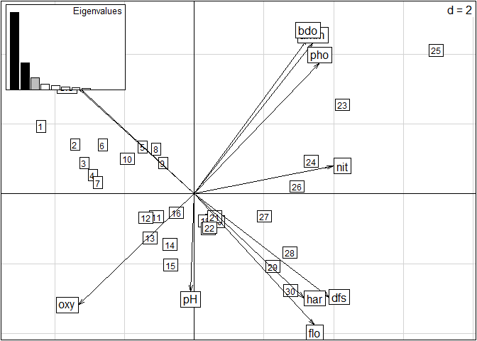

Subniche Documentation for the Within Outlying Mean Indexes calculations (WitOMI)
================

[subniche](https://cran.r-project.org/web/packages/subniche/index.html) is an open-source R (R Core Team, 2017) package that implements functions useful for the calculation of the Within Outlying Mean Indexes (WitOMI) and their respective statistical tests (Karasiewicz, 2017; Karasiewicz et al., 2017). It consists of complementary calculations to the Outlying Mean Index analysis (OMI) (Dolédec et al., 2000). OMI analysis can be implemented with the `niche` function from the [ade4](https://cran.r-project.org/web/packages/ade4/index.html) package (Dray and Dufour, 2007). WitOMI analysis enables to explore niche shift in a community and environmental constraints within an Euclidean space, with graphical displays. The method allows to divide the realized niche, estimated from the `niche` function into subniches defined by a factor (time, space), which creates the subsets of habitat conditions.

How to get started
------------------

Install and load the R package from [CRAN](https://cran.r-project.org/) using the following commands on the R console:

``` r
install.packages("subniche")
library(subniche)
```

    ## Loading required package: ade4

    ## Loading required package: ade4

\` To install the most recent version from GitHub:

``` r
install.packages("devtools")
devtools::install_github("KarasiewiczStephane/WitOMI")
library(subniche)
install.packages("knitr")
library(knitr)
```

Generate the data required to run this example
----------------------------------------------

Get the data set “drome” from the [subniche](https://cran.r-project.org/web/packages/subniche/index.html) package (Karasiewicz et al., 2017). This data set includes, fish species occurence along with environmental variables.

``` r
data(drome)
```

Performing the OMI analysis
---------------------------

The first step consists of performing a PCA on the environmental table.

``` r
dudi1 <- dudi.pca(drome$env[,-1], scale = TRUE, scan = FALSE, nf = 3)
scatter(dudi1)
```



The graph display the correlation between the different environmental variables. Next the OMI analysis uses the standardized environmental table from the PCA in combination with the faunistic data to performed the OMI analysis. The standardized environmental table can be extracted from the `dudi1` with `$tab` as follow:

``` r
dudi1$tab
```

    ##       Altitude         DSou        slope      width          Lmin
    ## 1   0.17528066 -0.417166407 -0.057373200 -0.1082431  0.1345315776
    ## 2  -0.12790751 -0.007677909  0.260386063 -0.1082431  0.9474367827
    ## 3  -0.68375249  1.056992186 -0.463398926  1.2112919  2.1667945905
    ## 4  -0.83534658  1.466480684 -0.887077943  1.2112919  2.9119576952
    ## 5  -1.03747203  1.712173782 -0.887077943 -0.1082431  3.3184102978
    ## 6  -0.02684479 -0.908552605 -0.004413323 -1.0978944 -0.4751473263
    ## 7  -0.20370455 -0.662859506  0.260386063 -0.4381269  0.1345315776
    ## 8  -0.22897023 -0.580961807  0.260386063 -0.4381269  0.1345315776
    ## 9  -0.30476728 -0.499064107 -0.286866002  0.2216407  0.1345315776
    ## 10 -0.43109568 -0.253371008  0.101506431  0.2216407  0.3716289291
    ## 11 -0.50689273 -0.171473309 -0.057373200 -0.4381269  0.3716289291
    ## 12 -0.58268977 -0.007677909 -0.445745633 -0.4381269  1.3877604355
    ## 13 -0.88587794  0.647503688 -0.569318680  0.8814082  2.1667945905
    ## 14 -0.91114362  0.811299087 -0.834118066  1.5411757  2.4377629922
    ## 15 -0.98694067  1.056992186 -1.116570745  2.5308270  2.4377629922
    ## 16  3.15663103 -1.318041103 -0.357479171 -0.7680106 -0.4751473263
    ## 17  2.95450558 -1.072348004 -0.357479171 -0.1082431 -1.0848262302
    ## 18  1.53962744 -0.335268708 -0.004413323  2.5308270  0.4732420797
    ## 19 -0.40583000  0.238015189  0.242732771  2.8607107  1.2184051845
    ## 20  0.37740611 -1.399938803  1.443156654 -1.7576619 -1.0780520201
    ## 21  0.02368658 -1.236143403  1.354890192 -1.4277781 -0.8815999289
    ## 22 -0.22897023 -0.990450305  1.019477636 -0.7680106 -0.8815999289
    ## 23 -0.88587794 -0.335268708 -0.127986370 -0.4381269 -0.2041789246
    ## 24 -1.11326907  0.238015189 -1.293103669  0.2216407 -0.2041789246
    ## 25 -1.18906612  0.565605988 -1.328410254  0.8814082  0.2700157784
    ## 26 -1.26486316  0.852247937 -1.487289885 -0.7680106  0.2700157784
    ## 27  2.04494106 -1.236143403  0.472225572 -0.7680106 -0.8138578285
    ## 28  1.69122153 -0.826654905 -0.145639662 -1.0978944 -0.4074052259
    ## 29  1.48909608 -0.253371008 -1.293103669  0.2216407 -0.0009526233
    ## 30  1.28697063 -0.171473309 -1.328410254  0.2216407 -0.0009526233
    ## 31  0.93325110 -0.990450305  0.383959110 -1.0978944 -0.8815999289
    ## 32  0.73112565 -0.580961807  0.136813016 -0.7680106 -0.7799867782
    ## 33  0.42793747 -0.253371008 -0.057373200  0.2216407 -0.4751473263
    ## 34  0.02368658  0.238015189  0.225079478  0.8814082 -0.3057920752
    ## 35 -0.17843887  0.483708288  0.225079478  0.8814082 -0.2719210250
    ## 36  1.28697063 -1.645631901  3.473285281 -1.7576619 -1.0238583398
    ## 37  0.78165701 -1.195194554  1.955102134 -1.0978944 -0.9493420293
    ## 38  0.68059428 -1.154245704  1.955102134 -1.0978944 -0.9493420293
    ## 39  0.30160907 -0.662859506 -0.233906124 -0.4381269 -0.7461157280
    ## 40 -0.12790751 -0.007677909 -0.057373200 -0.1082431 -0.6106315272
    ## 41 -0.17843887  0.074219790 -0.392785756  0.2216407 -0.6106315272
    ## 42 -0.22897023  0.238015189 -0.392785756  0.5515244 -0.6106315272
    ## 43 -0.27950160  0.401810589 -0.710545019 -0.4381269 -0.3735341757
    ## 44 -0.53215841  0.893196786 -0.498705510 -0.7680106 -0.2719210250
    ## 45 -0.78481522  1.384582984 -0.463398926 -0.1082431 -0.0686947237
    ## 46 -1.08800339  2.203559980 -0.975344405  0.2216407  0.2700157784
    ## 47 -1.23959748  2.858741577 -1.187183914  1.2112919  0.2700157784
    ## 48  0.37740611 -1.481836502  3.226139187 -1.0978944 -0.9696646594
    ## 49 -0.22897023 -0.990450305  1.107744099 -0.7680106 -0.3396631254
    ## 50 -0.83534658 -0.335268708 -0.498705510 -0.7680106  0.1345315776
    ## 51 -1.23959748  0.811299087 -1.045957575  0.2216407 -0.2719210250
    ## 52  0.52900020 -1.072348004  1.443156654 -1.0978944 -0.2719210250
    ## 53  0.02368658 -0.335268708  0.154466309  0.2216407  0.0667894771
    ## 54 -0.30476728  0.074219790  0.154466309  0.2216407  0.2700157784
    ## 55 -0.88587794  0.975094486 -0.357479171  1.2112919 -0.8138578285
    ## 56 -0.93640931  1.138889885 -0.357479171 -0.7680106 -0.8138578285
    ## 57 -1.18906612  1.794071482 -1.010650990  1.2112919 -1.0780520201
    ## 58 -1.34066020  2.285457680 -1.063610868  0.8814082 -1.0780520201
    ## 59  1.59015880 -1.072348004  1.284277023 -1.0978944 -0.6783736276
    ## 60  1.18590791 -0.826654905  0.578145326  1.8710595 -0.6783736276
    ## 61  0.83218837 -0.417166407  0.383959110 -0.4381269 -0.2719210250
    ## 62  0.27634339  0.074219790  1.001824344 -0.4381269 -0.2041789246
    ## 63  0.09948362  0.156117490  0.207426186  0.2216407  0.0667894771
    ## 64 -0.38056432  0.975094486 -0.675238435  0.2216407  0.5409841802
    ##       Dicharge
    ## 1  -0.93543237
    ## 2  -0.47175525
    ## 3   0.15420887
    ## 4   0.54833442
    ## 5   0.78017298
    ## 6  -1.22523057
    ## 7  -0.88906466
    ## 8  -0.88906466
    ## 9  -0.88906466
    ## 10 -0.78473731
    ## 11 -0.78473731
    ## 12 -0.25150861
    ## 13  0.17739272
    ## 14  0.30490393
    ## 15  0.30490393
    ## 16 -0.86588080
    ## 17 -0.49493910
    ## 18  0.35127165
    ## 19  1.22066625
    ## 20 -1.44547721
    ## 21 -1.22523057
    ## 22 -1.22523057
    ## 23 -0.19354897
    ## 24 -0.19354897
    ## 25  0.54833442
    ## 26  0.78017298
    ## 27 -0.66881803
    ## 28  0.25853622
    ## 29  1.40613710
    ## 30  1.40613710
    ## 31 -0.91224852
    ## 32 -0.63404224
    ## 33  0.35127165
    ## 34  0.82654070
    ## 35  0.93086805
    ## 36 -1.35737855
    ## 37 -1.14408708
    ## 38 -1.14408708
    ## 39 -0.56449067
    ## 40 -0.10081355
    ## 41 -0.10081355
    ## 42 -0.10081355
    ## 43  0.58311021
    ## 44  0.87290841
    ## 45  1.35976939
    ## 46  2.51896220
    ## 47  2.86672004
    ## 48 -1.43388528
    ## 49 -0.86588080
    ## 50 -0.43697946
    ## 51  0.22376044
    ## 52 -0.78473731
    ## 53 -0.49493910
    ## 54 -0.29787633
    ## 55  0.10784116
    ## 56  0.10784116
    ## 57  1.70752723
    ## 58  2.75080076
    ## 59 -0.81951309
    ## 60 -0.81951309
    ## 61 -0.05444584
    ## 62  0.04988152
    ## 63  0.58311021
    ## 64  1.41772903

The next step is to perform the OMI analysis from Dolédec et al. (2000) by implementing the function `niche` from the [ade4](https://cran.r-project.org/web/packages/ade4/index.html) package (Dray and Dufour, 2007).

``` r
nic1 <- niche(dudi1, drome$fish, scann = FALSE)
nic1
```

    ## Niche analysis
    ## call: niche(dudiX = dudi1, Y = drome$fish, scannf = FALSE)
    ## class: niche dudi 
    ## 
    ## $rank (rank)     : 6
    ## $nf (axis saved) : 2
    ## $RV (RV coeff)   :
    ## 
    ## eigen values: 1.001 0.05759 0.01671 0.004818 0.001209 ...
    ## 
    ##   vector length mode    content                    
    ## 1 $eig   6      numeric eigen values               
    ## 2 $lw    13     numeric row weigths (crossed array)
    ## 3 $cw    6      numeric col weigths (crossed array)
    ## 
    ##   data.frame nrow ncol content                                
    ## 1 $tab       13   6    crossed array (averaging species/sites)
    ## 2 $li        13   2    species coordinates                    
    ## 3 $l1        13   2    species normed scores                  
    ## 4 $co        6    2    variables coordinates                  
    ## 5 $c1        6    2    variables normed scores                
    ## 6 $ls        64   2    sites coordinates                      
    ## 7 $as        3    2    axis upon niche axis

``` r
plot(nic1)
```


The graph display the results of the OMI analysis within a two-dimensional Euclidean space. Its display the species niche position (labels in Samples and Species, top-right) and breadth (ellipses in Niches, bottom-right graph), within the environmental gradients (summarized by Variables). The species niche parameter (Inertia, OMI, Tol and Rtol) are calculated with the `niche.parameter` function from the [ade4](https://cran.r-project.org/web/packages/ade4/index.html) package (Dray and Dufour, 2007). More details on the niche parameters calculation in Dolédec et al. (2000).

``` r
kable(niche.param(nic1))
```

|     |    inertia|         OMI|        Tol|       Rtol|   omi|   tol|  rtol|
|-----|----------:|-----------:|----------:|----------:|-----:|-----:|-----:|
| SCU |   5.503685|   2.1488218|  1.5045397|  1.8503234|  39.0|  27.3|  33.6|
| OTR |   5.714861|   0.0777737|  2.4253953|  3.2116918|   1.4|  42.4|  56.2|
| YTR |   5.765225|   0.2630852|  1.6882102|  3.8139292|   4.6|  29.3|  66.2|
| MIN |   5.318492|   0.4460395|  2.5225244|  2.3499277|   8.4|  47.4|  44.2|
| STO |   5.908881|   0.7656741|  2.4125454|  2.7306619|  13.0|  40.8|  46.2|
| BLA |   4.989501|   0.4550558|  2.2738372|  2.2606074|   9.1|  45.6|  45.3|
| SOB |   3.714084|   0.0710025|  0.5129189|  3.1301626|   1.9|  13.8|  84.3|
| SON |   6.384992|   4.8872633|  0.7488491|  0.7488797|  76.5|  11.7|  11.7|
| NAS |  12.598843|  10.1993126|  1.6200685|  0.7794621|  81.0|  12.9|   6.2|
| GUD |   8.427877|   4.3080073|  0.9543342|  3.1655359|  51.1|  11.3|  37.6|
| CHU |   5.584996|   1.5776519|  1.6933570|  2.3139866|  28.2|  30.3|  41.4|
| STR |   9.917999|   5.2753874|  1.1855758|  3.4570355|  53.2|  12.0|  34.9|
| BAR |   8.344112|   3.8305122|  1.3016577|  3.2119418|  45.9|  15.6|  38.5|

The test for statistical significance can now be implemented, which correspond to the comparison between the observe species' marginality and the simulated values, hereafter 100 random permutations, under the null hypothesis that the species is indifferent to its environment (Dolédec et al., 2000).

``` r
rtest(nic1,100)
```

    ## class: krandtest lightkrandtest 
    ## Monte-Carlo tests
    ## Call: as.krandtest(sim = t(sim), obs = obs)
    ## 
    ## Number of tests:   14 
    ## 
    ## Adjustment method for multiple comparisons:   none 
    ## Permutation number:   100 
    ##        Test         Obs    Std.Obs   Alter     Pvalue
    ## 1       SCU  2.14882183  1.8756032 greater 0.07920792
    ## 2       OTR  0.07777369  5.2854842 greater 0.00990099
    ## 3       YTR  0.26308521 12.1873477 greater 0.00990099
    ## 4       MIN  0.44603947  8.3288801 greater 0.00990099
    ## 5       STO  0.76567408 12.2895882 greater 0.00990099
    ## 6       BLA  0.45505584 10.0017393 greater 0.00990099
    ## 7       SOB  0.07100247 -0.6205989 greater 0.65346535
    ## 8       SON  4.88726327  1.9313695 greater 0.06930693
    ## 9       NAS 10.19931259  5.1430004 greater 0.00990099
    ## 10      GUD  4.30800731 17.6373031 greater 0.00990099
    ## 11      CHU  1.57765192 24.6778580 greater 0.00990099
    ## 12      STR  5.27538741  7.7148156 greater 0.00990099
    ## 13      BAR  3.83051220 12.3484349 greater 0.00990099
    ## 14 OMI.mean  2.63889133 10.8010431 greater 0.00990099

Subsets creation
----------------

Herein, for the sake of the example, we will create two subsets. A `factor` needs to be made, in order to divide the data in two subsets. We used the functions [cutree](https://stat.ethz.ch/R-manual/R-devel/library/stats/html/cutree.html) and [hclust](https://stat.ethz.ch/R-manual/R-devel/library/stats/html/hclust.html) to create a cluster, `k=2`, following the `ward.D` method. The function create the subsets based on a dissimilarity matrix created by [dist](https://stat.ethz.ch/R-manual/R-devel/library/stats/html/dist.html), with the SUs of `nic1`. It divided the sampling domain into two subset along the first OMI axis. Blue corresponds to downstream habitat conditions, and the red to the upstream conditions.

``` r
# Creation of the factor
fact <- factor(cutree(hclust(dist(nic1$ls, "euclidean"), "ward.D"),k=2))
# plotting the two subsets
s.class(nic1$ls, fact, col=c("red", "blue"),cellipse=0, cpoint=2, pch=3)
s.chull(nic1$ls, fact, col=c("red", "blue"),optchull = 1, add.plot = T)
```


Now that we have the factor for dividing the niche, the [subniche](https://cran.r-project.org/web/packages/subniche/index.html) function can be implemented as follow:

``` r
subnic1 <- subniche(nic1, fact)
subnic1
```

    ## WitOMI calculation
    ## call: niche(dudiX = dudi1, Y = drome$fish, scannf = FALSE)
    ## class: subniche dudi 
    ## 
    ## $rank (rank)     : 6
    ## $nf (axis saved) : 2
    ## $RV (RV coeff)   :
    ## 
    ## eigen values: 1.001 0.05759 0.01671 0.004818 0.001209 ...
    ## 
    ##   vector  length mode    content                         
    ## 1 $eig    6      numeric eigen values                    
    ## 2 $lw     13     numeric row weigths (crossed array)     
    ## 3 $cw     6      numeric col weigths (crossed array)     
    ## 4 $factor 64     numeric factor used for creating subsets
    ## 
    ##   data.frame nrow ncol content                                
    ## 1 $tab       13   6    crossed array (averaging species/sites)
    ## 2 $li        13   2    species coordinates                    
    ## 3 $l1        13   2    species normed scores                  
    ## 4 $co        6    2    variables coordinates                  
    ## 5 $c1        6    2    variables normed scores                
    ## 6 $ls        64   2    sites coordinates                      
    ## 7 $as        3    2    axis upon niche axis                   
    ## 8 $G_k       2    2    G_k coordinates                        
    ## 9 $sub       26   2    species coordinates within each subset

The [subniche](https://cran.r-project.org/web/packages/subniche/index.html) function only adds `items`to the `niche` list, which are `$factor`, `$G_k` and `$sub`. The function does not change the previous results obtained with the OMI analysis from the `niche` function. The following functions, `plot`, `refparam` and `rtest`, are used to display the same results as in the `ade4` package:

``` r
plot(subnic1)
```


The niche parameters from the OMI analysis can still be extracted with its respective significant test with `refparam`. The test for significance can also be applied, with `rtest` function.

``` r
kable(refparam(subnic1))
```

|     |    inertia|         OMI|        Tol|       Rtol|   omi|   tol|  rtol|
|-----|----------:|-----------:|----------:|----------:|-----:|-----:|-----:|
| SCU |   5.503685|   2.1488218|  1.5045397|  1.8503234|  39.0|  27.3|  33.6|
| OTR |   5.714861|   0.0777737|  2.4253953|  3.2116918|   1.4|  42.4|  56.2|
| YTR |   5.765225|   0.2630852|  1.6882102|  3.8139292|   4.6|  29.3|  66.2|
| MIN |   5.318492|   0.4460395|  2.5225244|  2.3499277|   8.4|  47.4|  44.2|
| STO |   5.908881|   0.7656741|  2.4125454|  2.7306619|  13.0|  40.8|  46.2|
| BLA |   4.989501|   0.4550558|  2.2738372|  2.2606074|   9.1|  45.6|  45.3|
| SOB |   3.714084|   0.0710025|  0.5129189|  3.1301626|   1.9|  13.8|  84.3|
| SON |   6.384992|   4.8872633|  0.7488491|  0.7488797|  76.5|  11.7|  11.7|
| NAS |  12.598843|  10.1993126|  1.6200685|  0.7794621|  81.0|  12.9|   6.2|
| GUD |   8.427877|   4.3080073|  0.9543342|  3.1655359|  51.1|  11.3|  37.6|
| CHU |   5.584996|   1.5776519|  1.6933570|  2.3139866|  28.2|  30.3|  41.4|
| STR |   9.917999|   5.2753874|  1.1855758|  3.4570355|  53.2|  12.0|  34.9|
| BAR |   8.344112|   3.8305122|  1.3016577|  3.2119418|  45.9|  15.6|  38.5|

``` r
rtest(subnic1)
```

    ## class: krandtest lightkrandtest 
    ## Monte-Carlo tests
    ## Call: as.krandtest(sim = t(sim), obs = obs)
    ## 
    ## Number of tests:   14 
    ## 
    ## Adjustment method for multiple comparisons:   none 
    ## Permutation number:   99 
    ##        Test         Obs    Std.Obs   Alter Pvalue
    ## 1       SCU  2.14882183  2.0329340 greater   0.04
    ## 2       OTR  0.07777369  6.7526565 greater   0.01
    ## 3       YTR  0.26308521  9.1068372 greater   0.01
    ## 4       MIN  0.44603947  8.7492709 greater   0.01
    ## 5       STO  0.76567408 18.3045730 greater   0.01
    ## 6       BLA  0.45505584 13.8160234 greater   0.01
    ## 7       SOB  0.07100247 -0.7347925 greater   0.75
    ## 8       SON  4.88726327  2.2500651 greater   0.07
    ## 9       NAS 10.19931259  3.9745520 greater   0.03
    ## 10      GUD  4.30800731 19.2229444 greater   0.01
    ## 11      CHU  1.57765192 21.6894289 greater   0.01
    ## 12      STR  5.27538741  8.6015841 greater   0.01
    ## 13      BAR  3.83051220 15.2046975 greater   0.01
    ## 14 OMI.mean  2.63889133  9.5113376 greater   0.01

Calculation of the WitOMI (Spatial example)
-------------------------------------------

 The result of the test on marginality from the OMI analysis are important for the relevance of the WitOMI calculation. The following functions will still calculate the WitOMI even if the OMI are not significant. For the WitOMI to be use for interpretation, the OMI should first be significant. Then, the probability for the WitOMI to be significant within the subset *G<sub>K</sub>* correspond to the `$witomigtest$SubniPvalue` wihtin the `rtestrefor` function for WitOMI*G*. And the equivalent for the WitOMI*G<sub>K</sub>* is `$witomig_ktest$SubniPvalue` in the `rtestsubor`.

`margvect`displays the marginality vector of the suborigins,*G<sub>K</sub>* ,within the overall available habitat conditions (black polygon), the available resource under each subset habitat condition (red polygons), and the species subniche (species label).

``` r
margvect(subnic1)
```


`subplot` displays the subset's constraint of habitat conditions (red polygons), found within the overall available habitat condition (black polygons), and the corresponding species subniche positions. The arrows representing the marginality vectors from the sub-orgins *G<sub>K</sub>* (red dots), corresponds to the graphical representation of the WitOMI*G<sub>K</sub>*.

``` r
subplot(subnic1)
```


`subparam.refor` calculates the species marginality (WitOMI*G*), tolerance (Tol) and residual tolerance (Rtol) to the average habitat condition (*G*). For details on the parameters calculation see Karasiewicz et al. (2017).

``` r
kable(subparam.refor(subnic1))
```

|      |    inertia|     WitOMIG|        Tol|       Rtol|  witomig|   tol|  rtol|
|------|----------:|-----------:|----------:|----------:|--------:|-----:|-----:|
| SCU1 |   3.399535|   0.8822018|  1.3160556|  1.2012780|     26.0|  38.7|  35.3|
| OTR1 |   4.743091|   1.1205164|  1.6167368|  2.0058378|     23.6|  34.1|  42.3|
| YTR1 |   4.915133|   1.1479897|  1.6704008|  2.0967423|     23.4|  34.0|  42.7|
| MIN1 |   2.824565|   0.3293892|  0.9591758|  1.5360003|     11.7|  34.0|  54.4|
| STO1 |   2.855969|   0.1982016|  0.6736997|  1.9840678|      6.9|  23.6|  69.5|
| BLA1 |   2.308870|   0.2007444|  0.7128120|  1.3953135|      8.7|  30.9|  60.4|
| SOB1 |   2.051601|   0.5881637|  0.6693959|  0.7940418|     28.7|  32.6|  38.7|
| SON1 |        NaN|         NaN|        NaN|        NaN|      NaN|   NaN|   NaN|
| NAS1 |        NaN|         NaN|        NaN|        NaN|      NaN|   NaN|   NaN|
| GUD1 |   1.164352|   0.2547094|  0.4719874|  0.4376555|     21.9|  40.5|  37.6|
| CHU1 |   1.265915|   0.0259759|  0.1325920|  1.1073474|      2.1|  10.5|  87.5|
| STR1 |   1.857806|   1.8578063|  0.0000000|  0.0000000|    100.0|   0.0|   0.0|
| BAR1 |   1.658331|   0.5157807|  0.0683361|  1.0742143|     31.1|   4.1|  64.8|
| SCU2 |   9.711984|   8.2109981|  0.0907551|  1.4102305|     84.5|   0.9|  14.5|
| OTR2 |   8.435816|   4.1418643|  1.0867398|  3.2072121|     49.1|  12.9|  38.0|
| YTR2 |   9.165592|   5.5840648|  1.5929660|  1.9885608|     60.9|  17.4|  21.7|
| MIN2 |   8.505175|   4.6131522|  0.8145921|  3.0774309|     54.2|   9.6|  36.2|
| STO2 |   9.283153|   4.9264247|  0.8757168|  3.4810114|     53.1|   9.4|  37.5|
| BLA2 |   8.608352|   4.5345833|  0.8829193|  3.1908492|     52.7|  10.3|  37.1|
| SOB2 |   6.831239|   3.0898598|  1.0683130|  2.6730658|     45.2|  15.6|  39.1|
| SON2 |   6.384992|   4.8872633|  0.7488491|  0.7488797|     76.5|  11.7|  11.7|
| NAS2 |  12.598843|  10.1993126|  1.6200685|  0.7794621|     81.0|  12.9|   6.2|
| GUD2 |   9.465524|   5.5154381|  0.5116158|  3.4384699|     58.3|   5.4|  36.3|
| CHU2 |   8.608352|   4.5345833|  0.8829193|  3.1908492|     52.7|  10.3|  37.1|
| STR2 |  11.069455|   6.8646154|  0.5809199|  3.6239195|     62.0|   5.2|  32.7|
| BAR2 |   9.458409|   5.2563916|  0.5836204|  3.6183965|     55.6|   6.2|  38.3|

`rtestrefor` calculates the subniches' parameters from *G* with the respective significant test. The output of the `rtestrefor` function is an object of class `list`, which includes the results of the WitOMI*G* significant test, under each subset defined by the `$factor`.

``` r
refor <- rtestrefor(subnic1,100)
```

First,for each of the two subsets, the subset statictical significance is tested with the following null hypothesis that *G<sub>K</sub>* is not different from the overall average habitat conditions, represented by *G*. The subsets *P* value is equal to the product of equiprobabilities to find the same mean value for each variables (Karasiewicz et al., 2017).

``` r
refor[[1]]$Subsettest
```

    ## class: subkrandtest 
    ## Monte-Carlo tests
    ## Call: subkrandtest(sim = t(Xsim), obs = Xwobs, alter = "two-sided")
    ## 
    ## Number of tests:   6 
    ## 
    ## Adjustment method for multiple comparisons:   none 
    ## Permutation number:   100 
    ##       Test        Obs   Std.Obs     Alter     Pvalue
    ## 1 Altitude  0.4467398  4.561166 two-sided 0.00990099
    ## 2     DSou -0.5666773 -6.610183 two-sided 0.00990099
    ## 3    slope  0.3946332  4.095656 two-sided 0.00990099
    ## 4    width -0.3153794 -3.821662 two-sided 0.00990099
    ## 5     Lmin -0.3094155 -3.710646 two-sided 0.00990099
    ## 6 Dicharge -0.4451747 -4.925012 two-sided 0.00990099
    ## Subsets Pvalue: 9.420452e-13 
    ## other elements: subpvalue call

``` r
refor[[2]]$Subsettest
```

    ## class: subkrandtest 
    ## Monte-Carlo tests
    ## Call: subkrandtest(sim = t(Xsim), obs = Xwobs, alter = "two-sided")
    ## 
    ## Number of tests:   6 
    ## 
    ## Adjustment method for multiple comparisons:   none 
    ## Permutation number:   100 
    ##       Test        Obs   Std.Obs     Alter     Pvalue
    ## 1 Altitude -0.9147530 -4.762134 two-sided 0.00990099
    ## 2     DSou  1.1603393  7.396704 two-sided 0.00990099
    ## 3    slope -0.8080584 -4.672785 two-sided 0.00990099
    ## 4    width  0.6457769  3.111138 two-sided 0.00990099
    ## 5     Lmin  0.6335651  4.071788 two-sided 0.00990099
    ## 6 Dicharge  0.9115482  4.924871 two-sided 0.00990099
    ## Subsets Pvalue: 9.420452e-13 
    ## other elements: subpvalue call

Second the species marginality is tested for statistical significance following the null hypothesis that the species within each of the subsets is uninfluenced by its overall average habitat conditions (ubiquitous), for WitOMI*G* (Karasiewicz et al., 2017).

``` r
refor[[1]]$witomigtest
```

    ## class: subnikrandtest 
    ## Monte-Carlo tests
    ## Call: subnikrandtest(sim = t(sim), obs = obs, subpvalue = Xtest$subpvalue)
    ## 
    ## Number of tests:   14 
    ## 
    ## Adjustment method for multiple comparisons:   none 
    ##        Test        Obs    Std.Obs   Alter N.perm    Pvalue  SubniPvalue
    ## 1       SCU 0.88220184 -0.7381452 greater    100 0.7227723 6.808842e-13
    ## 2       OTR 1.12051638  0.1925625 greater    100 0.4356436 4.103959e-13
    ## 3       YTR 1.14798971  0.3600097 greater    100 0.3267327 3.077970e-13
    ## 4       MIN 0.32938916 -2.6151033 greater    100 1.0000000 9.420452e-13
    ## 5       STO 0.19820159 -2.7466182 greater    100 1.0000000 9.420452e-13
    ## 6       BLA 0.20074436 -3.8395604 greater    100 1.0000000 9.420452e-13
    ## 7       SOB 0.58816373 -1.0344457 greater    100 0.9108911 8.581006e-13
    ## 8       SON        NaN        NaN greater     99        NA           NA
    ## 9       NAS        NaN        NaN greater     96        NA           NA
    ## 10      GUD 0.25470940 -1.5120310 greater    100 1.0000000 9.420452e-13
    ## 11      CHU 0.02597593 -2.7292261 greater    100 1.0000000 9.420452e-13
    ## 12      STR 1.85780633  0.1154908 greater    100 0.3663366 3.451057e-13
    ## 13      BAR 0.51578065 -1.0738825 greater    100 0.8910891 8.394462e-13
    ## 14 OMI.mean 0.64740719 -2.4690974 greater    100 1.0000000 9.420452e-13
    ## 
    ## other elements: adj.method sub.pvalue subni.pvalue call

``` r
refor[[2]]$witomigtest
```

    ## class: subnikrandtest 
    ## Monte-Carlo tests
    ## Call: subnikrandtest(sim = t(sim), obs = obs, subpvalue = Xtest$subpvalue)
    ## 
    ## Number of tests:   14 
    ## 
    ## Adjustment method for multiple comparisons:   none 
    ##        Test       Obs      Std.Obs   Alter N.perm     Pvalue  SubniPvalue
    ## 1       SCU  8.210998  0.311185604 greater     95 0.26041667 2.453243e-13
    ## 2       OTR  4.141864 -0.995580678 greater    100 0.85148515 8.021375e-13
    ## 3       YTR  5.584065  2.139096083 greater    100 0.02970297 2.798154e-14
    ## 4       MIN  4.613152  0.076893295 greater    100 0.44554455 4.197231e-13
    ## 5       STO  4.926425  0.384593722 greater    100 0.36633663 3.451057e-13
    ## 6       BLA  4.534583  0.002431639 greater    100 0.49504950 4.663590e-13
    ## 7       SOB  3.089860 -1.287303495 greater    100 0.97029703 9.140637e-13
    ## 8       SON  4.887263 -0.548598559 greater     78 0.59493671 5.604573e-13
    ## 9       NAS 10.199313  0.756844158 greater     66 0.25373134 2.390264e-13
    ## 10      GUD  5.515438 -0.016940748 greater    100 0.40594059 3.824144e-13
    ## 11      CHU  4.534583 -0.176373480 greater    100 0.53465347 5.036677e-13
    ## 12      STR  6.864615  0.041669082 greater     97 0.39795918 3.748956e-13
    ## 13      BAR  5.256392  0.077447788 greater    100 0.42574257 4.010688e-13
    ## 14 OMI.mean  5.566042  0.266730298 greater    100 0.37623762 3.544329e-13
    ## 
    ## other elements: adj.method sub.pvalue subni.pvalue call

`subparam.subor` calculates the species marginality (WitOMI*G<sub>K</sub>*), tolerance (Tol) and residual tolerance (Rtol) to the subset average habitat condition (*G<sub>K</sub>*). For details on the parameters calculation see Karasiewicz et al. (2017).

``` r
kable(subparam.subor(subnic1))
```

|      |   inertia|  WitOMIG\_k|        Tol|       Rtol|  witomig\_k|   tol|  rtol|
|------|---------:|-----------:|----------:|----------:|-----------:|-----:|-----:|
| SCU1 |  4.667445|   2.1501116|  0.8416367|  1.6756969|        46.1|  18.0|  35.9|
| OTR1 |  3.623817|   0.0012426|  0.9635811|  2.6589935|         0.0|  26.6|  73.4|
| YTR1 |  3.769511|   0.0023683|  0.7471943|  3.0199488|         0.1|  19.8|  80.1|
| MIN1 |  2.794045|   0.2988690|  1.0122406|  1.4829355|        10.7|  36.2|  53.1|
| STO1 |  3.170025|   0.5122576|  0.7835477|  1.8742197|        16.2|  24.7|  59.1|
| BLA1 |  2.509801|   0.4016752|  0.7324293|  1.3756961|        16.0|  29.2|  54.8|
| SOB1 |  1.604047|   0.1406096|  0.4103152|  1.0531224|         8.8|  25.6|  65.7|
| SON1 |       NaN|         NaN|        NaN|        NaN|         NaN|   NaN|   NaN|
| NAS1 |       NaN|         NaN|        NaN|        NaN|         NaN|   NaN|   NaN|
| GUD1 |  2.531369|   1.6217256|  0.0206516|  0.8889913|        64.1|   0.8|  35.1|
| CHU1 |  2.339495|   1.0995556|  0.2824601|  0.9574793|        47.0|  12.1|  40.9|
| STR1 |  2.897381|   2.8973807|  0.0000000|  0.0000000|       100.0|   0.0|   0.0|
| BAR1 |  2.595143|   1.4525929|  0.8751351|  0.2674153|        56.0|  33.7|  10.3|
| SCU2 |  5.492183|   3.9911970|  0.2671504|  1.2338352|        72.7|   4.9|  22.5|
| OTR2 |  4.471315|   0.1773629|  1.6893396|  2.6046123|         4.0|  37.8|  58.3|
| YTR2 |  4.976729|   1.3952018|  1.2150300|  2.3664967|        28.0|  24.4|  47.6|
| MIN2 |  3.927070|   0.0350466|  0.8819288|  3.0100942|         0.9|  22.5|  76.6|
| STO2 |  4.384113|   0.0273849|  1.2423933|  3.1143349|         0.6|  28.3|  71.0|
| BLA2 |  4.092662|   0.0188934|  0.6783537|  3.3954149|         0.5|  16.6|  83.0|
| SOB2 |  4.175797|   0.4344183|  0.2156571|  3.5257216|        10.4|   5.2|  84.4|
| SON2 |  2.804111|   1.3063827|  0.1263895|  1.3713393|        46.6|   4.5|  48.9|
| NAS2 |  4.402483|   2.0029526|  1.3323835|  1.0671471|        45.5|  30.3|  24.2|
| GUD2 |  4.036922|   0.0868360|  0.9774591|  2.9726266|         2.2|  24.2|  73.6|
| CHU2 |  4.092662|   0.0188934|  0.6783537|  3.3954149|         0.5|  16.6|  83.0|
| STR2 |  4.632032|   0.4271921|  0.8373510|  3.3674884|         9.2|  18.1|  72.7|
| BAR2 |  4.275254|   0.0732369|  0.6000366|  3.6019803|         1.7|  14.0|  84.3|

In a similar fashion, `rtestsubor` calculates the subniches' parameters from *G<sub>K</sub>* with the respective significance test. The output of the `rtestsubor` function is an object of class `list`, which includes the results of the WitOMI*G<sub>K</sub>* significance test, under each of the two subsets defined by the `$factor`.

``` r
subor <- rtestsubor(subnic1,100)
```

As previously, the subsets are tested.

``` r
subor[[1]]$Subsettest
```

    ## class: subkrandtest 
    ## Monte-Carlo tests
    ## Call: subkrandtest(sim = t(Xsim), obs = Xwobs, alter = "two-sided")
    ## 
    ## Number of tests:   6 
    ## 
    ## Adjustment method for multiple comparisons:   none 
    ## Permutation number:   100 
    ##       Test        Obs   Std.Obs     Alter     Pvalue
    ## 1 Altitude  0.4467398  5.301077 two-sided 0.00990099
    ## 2     DSou -0.5666773 -5.899404 two-sided 0.00990099
    ## 3    slope  0.3946332  4.202075 two-sided 0.00990099
    ## 4    width -0.3153794 -3.793962 two-sided 0.00990099
    ## 5     Lmin -0.3094155 -3.300383 two-sided 0.00990099
    ## 6 Dicharge -0.4451747 -4.672193 two-sided 0.00990099
    ## Subsets Pvalue: 9.420452e-13 
    ## other elements: subpvalue call

``` r
subor[[2]]$Subsettest
```

    ## class: subkrandtest 
    ## Monte-Carlo tests
    ## Call: subkrandtest(sim = t(Xsim), obs = Xwobs, alter = "two-sided")
    ## 
    ## Number of tests:   6 
    ## 
    ## Adjustment method for multiple comparisons:   none 
    ## Permutation number:   100 
    ##       Test        Obs   Std.Obs     Alter     Pvalue
    ## 1 Altitude -0.9147530 -5.114493 two-sided 0.00990099
    ## 2     DSou  1.1603393  6.173273 two-sided 0.00990099
    ## 3    slope -0.8080584 -4.169395 two-sided 0.00990099
    ## 4    width  0.6457769  3.487275 two-sided 0.00990099
    ## 5     Lmin  0.6335651  3.354204 two-sided 0.00990099
    ## 6 Dicharge  0.9115482  4.840335 two-sided 0.00990099
    ## Subsets Pvalue: 9.420452e-13 
    ## other elements: subpvalue call

Second the species marginality is tested for significance following the null hypothesis that the species within a subset is uninfluenced by its subset average habitat conditions (ubiquitous), for WitOMI*G<sub>K</sub>* (Karasiewicz et al., 2017).

``` r
subor[[1]]$witomig_ktest
```

    ## class: subnikrandtest 
    ## Monte-Carlo tests
    ## Call: subnikrandtest(sim = t(sim), obs = obs, subpvalue = Xtest$subpvalue)
    ## 
    ## Number of tests:   14 
    ## 
    ## Adjustment method for multiple comparisons:   none 
    ##        Test         Obs    Std.Obs   Alter N.perm     Pvalue  SubniPvalue
    ## 1       SCU 2.150111587  1.1839419 greater    100 0.06930693 6.529026e-14
    ## 2       OTR 0.001242635 -0.9802122 greater    100 0.98019802 9.233909e-13
    ## 3       YTR 0.002368323 -1.1519061 greater    100 0.98019802 9.233909e-13
    ## 4       MIN 0.298869015  7.6779043 greater    100 0.00990099 9.327181e-15
    ## 5       STO 0.512257590 10.1652694 greater    100 0.00990099 9.327181e-15
    ## 6       BLA 0.401675209 14.6246462 greater    100 0.00990099 9.327181e-15
    ## 7       SOB 0.140609585 -0.1304698 greater    100 0.41584158 3.917416e-13
    ## 8       SON         NaN        NaN greater     97         NA           NA
    ## 9       NAS         NaN        NaN greater     96         NA           NA
    ## 10      GUD 1.621725637  7.8554344 greater    100 0.00990099 9.327181e-15
    ## 11      CHU 1.099555585 15.2261561 greater    100 0.00990099 9.327181e-15
    ## 12      STR 2.897380749  4.1541911 greater    100 0.00990099 9.327181e-15
    ## 13      BAR 1.452592931  4.7486355 greater    100 0.00990099 9.327181e-15
    ## 14 OMI.mean 0.961671713  2.4500159 greater    100 0.03960396 3.730872e-14
    ## 
    ## other elements: adj.method sub.pvalue subni.pvalue call

``` r
subor[[2]]$witomig_ktest
```

    ## class: subnikrandtest 
    ## Monte-Carlo tests
    ## Call: subnikrandtest(sim = t(sim), obs = obs, subpvalue = Xtest$subpvalue)
    ## 
    ## Number of tests:   14 
    ## 
    ## Adjustment method for multiple comparisons:   none 
    ##        Test        Obs     Std.Obs   Alter N.perm     Pvalue  SubniPvalue
    ## 1       SCU 3.99119702  0.82183527 greater     95 0.19791667 1.864465e-13
    ## 2       OTR 0.17736291  6.69806592 greater    100 0.00990099 9.327181e-15
    ## 3       YTR 1.39520177 26.63455881 greater    100 0.00990099 9.327181e-15
    ## 4       MIN 0.03504661 -0.82572752 greater    100 0.87128713 8.207919e-13
    ## 5       STO 0.02738489 -1.07708429 greater    100 0.90099010 8.487734e-13
    ## 6       BLA 0.01889343 -0.92092603 greater    100 0.89108911 8.394462e-13
    ## 7       SOB 0.43441828  0.06651679 greater    100 0.34653465 3.264513e-13
    ## 8       SON 1.30638269 -1.08764543 greater     80 0.82716049 7.792226e-13
    ## 9       NAS 2.00295261 -0.65090527 greater     70 0.66197183 6.236074e-13
    ## 10      GUD 0.08683603 -0.97999246 greater    100 0.98019802 9.233909e-13
    ## 11      CHU 0.01889343 -0.91370055 greater    100 0.98019802 9.233909e-13
    ## 12      STR 0.42719213 -0.70253049 greater     98 0.87878788 8.278579e-13
    ## 13      BAR 0.07323689 -0.92368582 greater     99 0.98000000 9.232043e-13
    ## 14 OMI.mean 0.76884605 -0.52253923 greater    100 0.71287129 6.715570e-13
    ## 
    ## other elements: adj.method sub.pvalue subni.pvalue call

Exercise (temporal example)
===========================

Now, try to the same work but the data `ardecheinv`. Herein, the invertebrates abundances data was log(x+1) transform and look the `$env` data to find the seasons. Replace spring and autumn by numbers for the `subniche` function to work work correctly. After OMI analysis, and WitOMI calculations, you should find the following:


|        |   inertia|        OMI|        Tol|       Rtol|    omi|   tol|  rtol|
|--------|---------:|----------:|----------:|----------:|------:|-----:|-----:|
| AFLU   |  5.538347|  1.6300864|  1.1574213|  2.7508396|   29.4|  20.9|  49.7|
| ANTO   |  6.261168|  2.8559783|  0.4809695|  2.9242199|   45.6|   7.7|  46.7|
| ATSP   |  5.261425|  0.7738686|  1.9442760|  2.5432800|   14.7|  37.0|  48.3|
| BASP   |  4.951897|  0.1540045|  0.9205257|  3.8773669|    3.1|  18.6|  78.3|
| BIMI   |  6.440541|  2.6656032|  1.2165765|  2.5583616|   41.4|  18.9|  39.7|
| BFAS   |  5.522998|  1.6334715|  0.8316546|  3.0578719|   29.6|  15.1|  55.4|
| CASP   |  4.752588|  2.0915508|  0.6997262|  1.9613111|   44.0|  14.7|  41.3|
| CESP   |  5.991585|  1.3620235|  1.7438590|  2.8857024|   22.7|  29.1|  48.2|
| CERA   |  5.243130|  0.4385214|  1.5649566|  3.2396515|    8.4|  29.8|  61.8|
| CLEP   |  5.031965|  0.4363223|  1.3835927|  3.2120500|    8.7|  27.5|  63.8|
| CMAR   |  5.296909|  2.0940725|  1.1020999|  2.1007368|   39.5|  20.8|  39.7|
| CHIR   |  4.439955|  0.4947663|  1.5231051|  2.4220840|   11.1|  34.3|  54.6|
| CPIC   |  5.506342|  2.8291243|  0.5206856|  2.1565322|   51.4|   9.5|  39.2|
| DRSP   |  4.496590|  1.0682956|  1.9036269|  1.5246673|   23.8|  42.3|  33.9|
| DUSP   |  5.329099|  0.1398475|  1.7382410|  3.4510110|    2.6|  32.6|  64.8|
| ECSP   |  5.350165|  0.3283927|  1.4704735|  3.5512986|    6.1|  27.5|  66.4|
| ECTE   |  5.455395|  3.0887228|  0.1196580|  2.2470143|   56.6|   2.2|  41.2|
| ELMA   |  3.176472|  0.7910221|  0.0376397|  2.3478099|   24.9|   1.2|  73.9|
| EPEO   |  5.682921|  1.2701977|  0.7480074|  3.6647159|   22.4|  13.2|  64.5|
| EVIR   |  5.302216|  0.3443063|  1.2761101|  3.6817993|    6.5|  24.1|  69.4|
| EPAR   |  3.932729|  0.1404872|  0.7954177|  2.9968238|    3.6|  20.2|  76.2|
| ESSP   |  4.773562|  0.1428212|  1.0243322|  3.6064087|    3.0|  21.5|  75.5|
| EPYG   |  4.864853|  0.1428271|  0.8576808|  3.8643452|    2.9|  17.6|  79.4|
| EGEN   |  5.046325|  1.9052672|  0.8579907|  2.2830675|   37.8|  17.0|  45.2|
| GASP   |  5.691912|  0.3561383|  1.1723435|  4.1634306|    6.3|  20.6|  73.1|
| HYSP   |  8.352748|  8.3527477|  0.0000000|  0.0000000|  100.0|   0.0|   0.0|
| HEXO   |  5.243021|  0.3580747|  1.1967967|  3.6881491|    6.8|  22.8|  70.3|
| HPEL   |  3.568855|  1.4801591|  0.4150086|  1.6736876|   41.5|  11.6|  46.9|
| HYDR   |  5.424177|  0.3446764|  1.0092149|  4.0702859|    6.4|  18.6|  75.0|
| HYDS   |  6.176471|  2.7519145|  0.8340139|  2.5905427|   44.6|  13.5|  41.9|
| LEPT   |  5.337927|  2.7371006|  0.4678790|  2.1329476|   51.3|   8.8|  40.0|
| LESP   |  4.424214|  0.3139611|  0.8986846|  3.2115689|    7.1|  20.3|  72.6|
| LOPAad |  4.965245|  1.2010608|  1.9737829|  1.7904015|   24.2|  39.8|  36.1|
| LOPAla |  4.572070|  0.4750266|  1.2483663|  2.8486766|   10.4|  27.3|  62.3|
| MPOW   |  5.765380|  1.2113295|  2.0688707|  2.4851794|   21.0|  35.9|  43.1|
| MYSA   |  4.199512|  3.3382344|  0.2800060|  0.5812719|   79.5|   6.7|  13.8|
| ORHE   |  5.578876|  1.7719543|  0.8907733|  2.9161486|   31.8|  16.0|  52.3|
| ONSP   |  5.183675|  1.1029607|  1.7398668|  2.3408479|   21.3|  33.6|  45.2|
| ORTH   |  5.122163|  0.2310466|  1.2565769|  3.6345398|    4.5|  24.5|  71.0|
| ORSP   |  6.830422|  1.3221938|  2.3259105|  3.1823176|   19.4|  34.1|  46.6|
| OTROad |  5.323551|  0.3196624|  0.7949867|  4.2089018|    6.0|  14.9|  79.1|
| OTROla |  5.520143|  0.2338567|  1.2078521|  4.0784347|    4.2|  21.9|  73.9|
| PISI   |  6.092811|  1.1586152|  2.0241946|  2.9100014|   19.0|  33.2|  47.8|
| POLY   |  6.946072|  3.4561798|  0.5871372|  2.9027547|   49.8|   8.5|  41.8|
| PBIF   |  5.230149|  0.1404078|  0.9126282|  4.1771134|    2.7|  17.4|  79.9|
| PPUS   |  4.760375|  0.1258586|  0.8095743|  3.8249417|    2.6|  17.0|  80.3|
| RASP   |  6.912935|  6.1246587|  0.5175577|  0.2707183|   88.6|   7.5|   3.9|
| RHYP   |  5.925556|  1.9250904|  1.1395839|  2.8608814|   32.5|  19.2|  48.3|
| RHIP   |  5.509859|  0.5317665|  1.7133248|  3.2647681|    9.7|  31.1|  59.3|
| SIGN   |  5.690358|  0.2369562|  1.2683164|  4.1850853|    4.2|  22.3|  73.5|
| SARG   |  5.338509|  0.5093751|  1.2407905|  3.5883437|    9.5|  23.2|  67.2|
| SIMU   |  4.429029|  0.3726825|  1.1175113|  2.9388347|    8.4|  25.2|  66.4|
| STEN   |  6.268569|  0.5701184|  1.5868239|  4.1116266|    9.1|  25.3|  65.6|
| SCAN   |  6.356376|  1.3990981|  1.3987842|  3.5584937|   22.0|  22.0|  56.0|
| TANYP  |  4.883393|  0.7337598|  1.6914515|  2.4581815|   15.0|  34.6|  50.3|
| TANYT  |  5.335505|  0.1691889|  1.3199566|  3.8463591|    3.2|  24.7|  72.1|
| TFLU   |  6.940545|  2.0277114|  1.5558618|  3.3569723|   29.2|  22.4|  48.4|

|         |   inertia|    WitOMIG|        Tol|       Rtol|  witomig|   tol|  rtol|
|---------|---------:|----------:|----------:|----------:|--------:|-----:|-----:|
| AFLU1   |  5.047993|  4.9912783|  0.0398153|  0.0168989|     98.9|   0.8|   0.3|
| ANTO1   |       NaN|        NaN|        NaN|        NaN|      NaN|   NaN|   NaN|
| ATSP1   |  5.322417|  1.3233915|  1.6872135|  2.3118117|     24.9|  31.7|  43.4|
| BASP1   |  4.016310|  0.9472722|  0.8623746|  2.2066629|     23.6|  21.5|  54.9|
| BIMI1   |       NaN|        NaN|        NaN|        NaN|      NaN|   NaN|   NaN|
| BFAS1   |       NaN|        NaN|        NaN|        NaN|      NaN|   NaN|   NaN|
| CASP1   |  5.169176|  2.4639684|  0.7484637|  1.9567438|     47.7|  14.5|  37.9|
| CESP1   |  6.887544|  6.8875440|  0.0000000|  0.0000000|    100.0|   0.0|   0.0|
| CERA1   |  4.970323|  4.9703232|  0.0000000|  0.0000000|    100.0|   0.0|   0.0|
| CLEP1   |  4.994338|  1.7047381|  1.3970321|  1.8925682|     34.1|  28.0|  37.9|
| CMAR1   |  4.965081|  3.4695335|  0.5973335|  0.8982140|     69.9|  12.0|  18.1|
| CHIR1   |       NaN|        NaN|        NaN|        NaN|      NaN|   NaN|   NaN|
| CPIC1   |       NaN|        NaN|        NaN|        NaN|      NaN|   NaN|   NaN|
| DRSP1   |  3.752796|  2.1145534|  0.7093201|  0.9289223|     56.3|  18.9|  24.8|
| DUSP1   |  4.780569|  1.0076983|  1.7193447|  2.0535264|     21.1|  36.0|  43.0|
| ECSP1   |  5.492605|  0.5709870|  1.2247275|  3.6968904|     10.4|  22.3|  67.3|
| ECTE1   |  4.842414|  3.2464421|  0.3220876|  1.2738847|     67.0|   6.7|  26.3|
| ELMA1   |       NaN|        NaN|        NaN|        NaN|      NaN|   NaN|   NaN|
| EPEO1   |       NaN|        NaN|        NaN|        NaN|      NaN|   NaN|   NaN|
| EVIR1   |       NaN|        NaN|        NaN|        NaN|      NaN|   NaN|   NaN|
| EPAR1   |  4.005941|  0.5643963|  0.6642875|  2.7772567|     14.1|  16.6|  69.3|
| ESSP1   |  4.768717|  0.4737399|  0.5447734|  3.7502039|      9.9|  11.4|  78.6|
| EPYG1   |  4.737186|  0.4865543|  0.4658465|  3.7847857|     10.3|   9.8|  79.9|
| EGEN1   |       NaN|        NaN|        NaN|        NaN|      NaN|   NaN|   NaN|
| GASP1   |  2.580370|  0.6172684|  0.3452494|  1.6178520|     23.9|  13.4|  62.7|
| HYSP1   |       NaN|        NaN|        NaN|        NaN|      NaN|   NaN|   NaN|
| HEXO1   |  4.456510|  2.3703453|  0.3042154|  1.7819496|     53.2|   6.8|  40.0|
| HPEL1   |       NaN|        NaN|        NaN|        NaN|      NaN|   NaN|   NaN|
| HYDR1   |  5.115527|  0.7610947|  1.3776055|  2.9768267|     14.9|  26.9|  58.2|
| HYDS1   |       NaN|        NaN|        NaN|        NaN|      NaN|   NaN|   NaN|
| LEPT1   |       NaN|        NaN|        NaN|        NaN|      NaN|   NaN|   NaN|
| LESP1   |  2.629375|  1.2380197|  0.2587213|  1.1326343|     47.1|   9.8|  43.1|
| LOPAad1 |       NaN|        NaN|        NaN|        NaN|      NaN|   NaN|   NaN|
| LOPAla1 |  3.718404|  1.9067401|  0.3147357|  1.4969284|     51.3|   8.5|  40.3|
| MPOW1   |  7.192349|  2.0009281|  2.7526841|  2.4387369|     27.8|  38.3|  33.9|
| MYSA1   |       NaN|        NaN|        NaN|        NaN|      NaN|   NaN|   NaN|
| ORHE1   |       NaN|        NaN|        NaN|        NaN|      NaN|   NaN|   NaN|
| ONSP1   |  3.998315|  1.1210944|  0.9542170|  1.9230038|     28.0|  23.9|  48.1|
| ORTH1   |  4.351143|  0.8960762|  1.5707221|  1.8843446|     20.6|  36.1|  43.3|
| ORSP1   |  6.830422|  1.3221938|  2.3259105|  3.1823176|     19.4|  34.1|  46.6|
| OTROad1 |  6.230148|  2.5941353|  0.9993173|  2.6366950|     41.6|  16.0|  42.3|
| OTROla1 |  5.142497|  0.6819671|  0.5516613|  3.9088689|     13.3|  10.7|  76.0|
| PISI1   |       NaN|        NaN|        NaN|        NaN|      NaN|   NaN|   NaN|
| POLY1   |  5.874718|  3.7305124|  0.7851956|  1.3590103|     63.5|  13.4|  23.1|
| PBIF1   |  4.147923|  2.1961661|  0.5297757|  1.4219813|     52.9|  12.8|  34.3|
| PPUS1   |  3.999069|  2.8780882|  0.7630461|  0.3579344|     72.0|  19.1|   9.0|
| RASP1   |       NaN|        NaN|        NaN|        NaN|      NaN|   NaN|   NaN|
| RHYP1   |       NaN|        NaN|        NaN|        NaN|      NaN|   NaN|   NaN|
| RHIP1   |       NaN|        NaN|        NaN|        NaN|      NaN|   NaN|   NaN|
| SIGN1   |  5.241407|  0.8293657|  2.0007788|  2.4112627|     15.8|  38.2|  46.0|
| SARG1   |  4.379817|  2.4492822|  0.8672941|  1.0632409|     55.9|  19.8|  24.3|
| SIMU1   |  4.103898|  1.0638770|  1.3530498|  1.6869710|     25.9|  33.0|  41.1|
| STEN1   |       NaN|        NaN|        NaN|        NaN|      NaN|   NaN|   NaN|
| SCAN1   |  6.471128|  0.9813382|  0.6184927|  4.8712967|     15.2|   9.6|  75.3|
| TANYP1  |       NaN|        NaN|        NaN|        NaN|      NaN|   NaN|   NaN|
| TANYT1  |  4.459319|  1.4061285|  0.7890246|  2.2641654|     31.5|  17.7|  50.8|
| TFLU1   |  5.678182|  2.2777933|  0.4658585|  2.9345304|     40.1|   8.2|  51.7|
| AFLU2   |  5.593913|  2.4605247|  0.5429197|  2.5904682|     44.0|   9.7|  46.3|
| ANTO2   |  6.261168|  2.8559783|  0.4809695|  2.9242199|     45.6|   7.7|  46.7|
| ATSP2   |  4.959373|  0.9321612|  2.4084852|  1.6187263|     18.8|  48.6|  32.6|
| BASP2   |  5.216445|  0.3663442|  1.2783080|  3.5717924|      7.0|  24.5|  68.5|
| BIMI2   |  6.440541|  2.6656032|  1.2165765|  2.5583616|     41.4|  18.9|  39.7|
| BFAS2   |  5.522998|  1.6334715|  0.8316546|  3.0578719|     29.6|  15.1|  55.4|
| CASP2   |  3.820359|  2.2812516|  0.4450021|  1.0941047|     59.7|  11.6|  28.6|
| CESP2   |  5.832151|  1.5201320|  1.7183686|  2.5936503|     26.1|  29.5|  44.5|
| CERA2   |  5.248000|  0.4657628|  1.4545148|  3.3277225|      8.9|  27.7|  63.4|
| CLEP2   |  5.039830|  0.4812193|  0.9568038|  3.6018068|      9.5|  19.0|  71.5|
| CMAR2   |  5.364636|  2.1665091|  0.9555239|  2.2426034|     40.4|  17.8|  41.8|
| CHIR2   |  4.439955|  0.4947663|  1.5231051|  2.4220840|     11.1|  34.3|  54.6|
| CPIC2   |  5.506342|  2.8291243|  0.5206856|  2.1565322|     51.4|   9.5|  39.2|
| DRSP2   |  8.570756|  3.3680622|  2.2610122|  2.9416821|     39.3|  26.4|  34.3|
| DUSP2   |  5.850675|  0.5912963|  1.6446603|  3.6147179|     10.1|  28.1|  61.8|
| ECSP2   |  5.331930|  0.5271468|  1.4828117|  3.3219716|      9.9|  27.8|  62.3|
| ECTE2   |  6.681357|  6.6813566|  0.0000000|  0.0000000|    100.0|   0.0|   0.0|
| ELMA2   |  3.176472|  0.7910221|  0.0376397|  2.3478099|     24.9|   1.2|  73.9|
| EPEO2   |  5.682921|  1.2701977|  0.7480074|  3.6647159|     22.4|  13.2|  64.5|
| EVIR2   |  5.302216|  0.3443063|  1.2761101|  3.6817993|      6.5|  24.1|  69.4|
| EPAR2   |  3.917797|  0.2686018|  0.5560763|  3.0931191|      6.9|  14.2|  79.0|
| ESSP2   |  4.774797|  0.3230870|  0.5041956|  3.9475140|      6.8|  10.6|  82.7|
| EPYG2   |  5.037744|  0.6458358|  1.4545934|  2.9373151|     12.8|  28.9|  58.3|
| EGEN2   |  5.046325|  1.9052672|  0.8579907|  2.2830675|     37.8|  17.0|  45.2|
| GASP2   |  5.867186|  0.4291003|  1.0866893|  4.3513962|      7.3|  18.5|  74.2|
| HYSP2   |  8.352748|  8.3527477|  0.0000000|  0.0000000|    100.0|   0.0|   0.0|
| HEXO2   |  5.323090|  0.4469288|  0.9911319|  3.8850296|      8.4|  18.6|  73.0|
| HPEL2   |  3.568855|  1.4801591|  0.4150086|  1.6736876|     41.5|  11.6|  46.9|
| HYDR2   |  5.442886|  0.4174195|  0.9798750|  4.0455915|      7.7|  18.0|  74.3|
| HYDS2   |  6.176471|  2.7519145|  0.8340139|  2.5905427|     44.6|  13.5|  41.9|
| LEPT2   |  5.337927|  2.7371006|  0.4678790|  2.1329476|     51.3|   8.8|  40.0|
| LESP2   |  4.612694|  0.4520373|  1.0916182|  3.0690387|      9.8|  23.7|  66.5|
| LOPAad2 |  4.965245|  1.2010608|  1.9737829|  1.7904015|     24.2|  39.8|  36.1|
| LOPAla2 |  5.113748|  0.3732577|  0.4726950|  4.2677952|      7.3|   9.2|  83.5|
| MPOW2   |  4.927375|  2.1214892|  1.6490874|  1.1567981|     43.1|  33.5|  23.5|
| MYSA2   |  4.199512|  3.3382344|  0.2800060|  0.5812719|     79.5|   6.7|  13.8|
| ORHE2   |  5.578876|  1.7719543|  0.8907733|  2.9161486|     31.8|  16.0|  52.3|
| ONSP2   |  5.582926|  2.8517365|  0.3795820|  2.3516074|     51.1|   6.8|  42.1|
| ORTH2   |  5.389232|  0.3900032|  0.9052110|  4.0940178|      7.2|  16.8|  76.0|
| ORSP2   |       NaN|        NaN|        NaN|        NaN|      NaN|   NaN|   NaN|
| OTROad2 |  5.254247|  0.4060305|  0.9786089|  3.8696076|      7.7|  18.6|  73.6|
| OTROla2 |  6.321554|  0.7368166|  1.8764679|  3.7082700|     11.7|  29.7|  58.7|
| PISI2   |  6.092811|  1.1586152|  2.0241946|  2.9100014|     19.0|  33.2|  47.8|
| POLY2   |  8.244171|  7.1591537|  0.3273256|  0.7576920|     86.8|   4.0|   9.2|
| PBIF2   |  5.286846|  0.1779238|  1.0255683|  4.0833537|      3.4|  19.4|  77.2|
| PPUS2   |  4.955463|  0.4637935|  3.2353458|  1.2563236|      9.4|  65.3|  25.4|
| RASP2   |  6.912935|  6.1246587|  0.5175577|  0.2707183|     88.6|   7.5|   3.9|
| RHYP2   |  5.925556|  1.9250904|  1.1395839|  2.8608814|     32.5|  19.2|  48.3|
| RHIP2   |  5.509859|  0.5317665|  1.7133248|  3.2647681|      9.7|  31.1|  59.3|
| SIGN2   |  6.115133|  2.0334064|  1.6570358|  2.4246905|     33.3|  27.1|  39.7|
| SARG2   |  5.630294|  0.5753024|  0.9397895|  4.1152018|     10.2|  16.7|  73.1|
| SIMU2   |  6.133137|  6.1331366|  0.0000000|  0.0000000|    100.0|   0.0|   0.0|
| STEN2   |  6.268569|  0.5701184|  1.5868239|  4.1116266|      9.1|  25.3|  65.6|
| SCAN2   |  6.295929|  3.0027724|  0.4501125|  2.8430438|     47.7|   7.1|  45.2|
| TANYP2  |  4.883393|  0.7337598|  1.6914515|  2.4581815|     15.0|  34.6|  50.3|
| TANYT2  |  5.481883|  0.3222465|  0.9109765|  4.2486596|      5.9|  16.6|  77.5|
| TFLU2   |  8.759160|  5.3988068|  0.8297366|  2.5306165|     61.6|   9.5|  28.9|

    ## class: krandtest lightkrandtest 
    ## Monte-Carlo tests
    ## Call: as.krandtest(sim = t(sim), obs = obs)
    ## 
    ## Number of tests:   58 
    ## 
    ## Adjustment method for multiple comparisons:   none 
    ## Permutation number:   100 
    ##        Test       Obs     Std.Obs   Alter     Pvalue
    ## 1      AFLU 1.6300864  2.06163427 greater 0.05940594
    ## 2      ANTO 2.8559783  4.01068422 greater 0.00990099
    ## 3      ATSP 0.7738686  1.41758338 greater 0.11881188
    ## 4      BASP 0.1540045  4.20170790 greater 0.00990099
    ## 5      BIMI 2.6656032  1.55716871 greater 0.09900990
    ## 6      BFAS 1.6334715  9.80563971 greater 0.00990099
    ## 7      CASP 2.0915508 14.62079223 greater 0.00990099
    ## 8      CESP 1.3620235  1.32444261 greater 0.09900990
    ## 9      CERA 0.4385214  1.32783614 greater 0.13861386
    ## 10     CLEP 0.4363223  9.88182610 greater 0.00990099
    ## 11     CMAR 2.0940725 13.24316536 greater 0.00990099
    ## 12     CHIR 0.4947663  1.10447768 greater 0.13861386
    ## 13     CPIC 2.8291243  9.73283537 greater 0.00990099
    ## 14     DRSP 1.0682956  2.56723351 greater 0.03960396
    ## 15     DUSP 0.1398475  2.15823797 greater 0.07920792
    ## 16     ECSP 0.3283927  3.51855011 greater 0.00990099
    ## 17     ECTE 3.0887228  1.31453861 greater 0.10891089
    ## 18     ELMA 0.7910221 -1.10414061 greater 0.89108911
    ## 19     EPEO 1.2701977  0.40740363 greater 0.25742574
    ## 20     EVIR 0.3443063  2.76051066 greater 0.03960396
    ## 21     EPAR 0.1404872  0.30730044 greater 0.28712871
    ## 22     ESSP 0.1428212  2.26884417 greater 0.03960396
    ## 23     EPYG 0.1428271  4.45531103 greater 0.01980198
    ## 24     EGEN 1.9052672  4.75279999 greater 0.01980198
    ## 25     GASP 0.3561383  1.84971450 greater 0.06930693
    ## 26     HYSP 8.3527477  1.15157836 greater 0.12871287
    ## 27     HEXO 0.3580747  5.95479413 greater 0.00990099
    ## 28     HPEL 1.4801591  2.66606846 greater 0.01980198
    ## 29     HYDR 0.3446764  4.89236335 greater 0.00990099
    ## 30     HYDS 2.7519145  2.26837352 greater 0.03960396
    ## 31     LEPT 2.7371006  0.94499396 greater 0.15841584
    ## 32     LESP 0.3139611  2.27542111 greater 0.03960396
    ## 33   LOPAad 1.2010608  2.69958164 greater 0.03960396
    ## 34   LOPAla 0.4750266  5.12739204 greater 0.00990099
    ## 35     MPOW 1.2113295  0.64485201 greater 0.25742574
    ## 36     MYSA 3.3382344  0.54719839 greater 0.21782178
    ## 37     ORHE 1.7719543 12.07606173 greater 0.00990099
    ## 38     ONSP 1.1029607  1.47365496 greater 0.08910891
    ## 39     ORTH 0.2310466 14.48897012 greater 0.00990099
    ## 40     ORSP 1.3221938  1.88948921 greater 0.05940594
    ## 41   OTROad 0.3196624  3.18830344 greater 0.00990099
    ## 42   OTROla 0.2338567  1.45620743 greater 0.08910891
    ## 43     PISI 1.1586152  1.66374840 greater 0.07920792
    ## 44     POLY 3.4561798  3.92796394 greater 0.00990099
    ## 45     PBIF 0.1404078  0.92526443 greater 0.16831683
    ## 46     PPUS 0.1258586 -1.26067116 greater 1.00000000
    ## 47     RASP 6.1246587  3.90111562 greater 0.01980198
    ## 48     RHYP 1.9250904  8.57873333 greater 0.00990099
    ## 49     RHIP 0.5317665  4.88936599 greater 0.00990099
    ## 50     SIGN 0.2369562  2.50155231 greater 0.03960396
    ## 51     SARG 0.5093751 13.46202426 greater 0.00990099
    ## 52     SIMU 0.3726825 -0.77361264 greater 0.75247525
    ## 53     STEN 0.5701184  0.09620334 greater 0.37623762
    ## 54     SCAN 1.3990981  2.52766789 greater 0.02970297
    ## 55    TANYP 0.7337598  3.61638633 greater 0.01980198
    ## 56    TANYT 0.1691889  2.47207267 greater 0.02970297
    ## 57     TFLU 2.0277114  0.97304375 greater 0.19801980
    ## 58 OMI.mean 1.3369324  8.45294628 greater 0.00990099

|         |   inertia|    WitOMIG|        Tol|       Rtol|  witomig|   tol|  rtol|
|---------|---------:|----------:|----------:|----------:|--------:|-----:|-----:|
| AFLU1   |  5.047993|  4.9912783|  0.0398153|  0.0168989|     98.9|   0.8|   0.3|
| ANTO1   |       NaN|        NaN|        NaN|        NaN|      NaN|   NaN|   NaN|
| ATSP1   |  5.322417|  1.3233915|  1.6872135|  2.3118117|     24.9|  31.7|  43.4|
| BASP1   |  4.016310|  0.9472722|  0.8623746|  2.2066629|     23.6|  21.5|  54.9|
| BIMI1   |       NaN|        NaN|        NaN|        NaN|      NaN|   NaN|   NaN|
| BFAS1   |       NaN|        NaN|        NaN|        NaN|      NaN|   NaN|   NaN|
| CASP1   |  5.169176|  2.4639684|  0.7484637|  1.9567438|     47.7|  14.5|  37.9|
| CESP1   |  6.887544|  6.8875440|  0.0000000|  0.0000000|    100.0|   0.0|   0.0|
| CERA1   |  4.970323|  4.9703232|  0.0000000|  0.0000000|    100.0|   0.0|   0.0|
| CLEP1   |  4.994338|  1.7047381|  1.3970321|  1.8925682|     34.1|  28.0|  37.9|
| CMAR1   |  4.965081|  3.4695335|  0.5973335|  0.8982140|     69.9|  12.0|  18.1|
| CHIR1   |       NaN|        NaN|        NaN|        NaN|      NaN|   NaN|   NaN|
| CPIC1   |       NaN|        NaN|        NaN|        NaN|      NaN|   NaN|   NaN|
| DRSP1   |  3.752796|  2.1145534|  0.7093201|  0.9289223|     56.3|  18.9|  24.8|
| DUSP1   |  4.780569|  1.0076983|  1.7193447|  2.0535264|     21.1|  36.0|  43.0|
| ECSP1   |  5.492605|  0.5709870|  1.2247275|  3.6968904|     10.4|  22.3|  67.3|
| ECTE1   |  4.842414|  3.2464421|  0.3220876|  1.2738847|     67.0|   6.7|  26.3|
| ELMA1   |       NaN|        NaN|        NaN|        NaN|      NaN|   NaN|   NaN|
| EPEO1   |       NaN|        NaN|        NaN|        NaN|      NaN|   NaN|   NaN|
| EVIR1   |       NaN|        NaN|        NaN|        NaN|      NaN|   NaN|   NaN|
| EPAR1   |  4.005941|  0.5643963|  0.6642875|  2.7772567|     14.1|  16.6|  69.3|
| ESSP1   |  4.768717|  0.4737399|  0.5447734|  3.7502039|      9.9|  11.4|  78.6|
| EPYG1   |  4.737186|  0.4865543|  0.4658465|  3.7847857|     10.3|   9.8|  79.9|
| EGEN1   |       NaN|        NaN|        NaN|        NaN|      NaN|   NaN|   NaN|
| GASP1   |  2.580370|  0.6172684|  0.3452494|  1.6178520|     23.9|  13.4|  62.7|
| HYSP1   |       NaN|        NaN|        NaN|        NaN|      NaN|   NaN|   NaN|
| HEXO1   |  4.456510|  2.3703453|  0.3042154|  1.7819496|     53.2|   6.8|  40.0|
| HPEL1   |       NaN|        NaN|        NaN|        NaN|      NaN|   NaN|   NaN|
| HYDR1   |  5.115527|  0.7610947|  1.3776055|  2.9768267|     14.9|  26.9|  58.2|
| HYDS1   |       NaN|        NaN|        NaN|        NaN|      NaN|   NaN|   NaN|
| LEPT1   |       NaN|        NaN|        NaN|        NaN|      NaN|   NaN|   NaN|
| LESP1   |  2.629375|  1.2380197|  0.2587213|  1.1326343|     47.1|   9.8|  43.1|
| LOPAad1 |       NaN|        NaN|        NaN|        NaN|      NaN|   NaN|   NaN|
| LOPAla1 |  3.718404|  1.9067401|  0.3147357|  1.4969284|     51.3|   8.5|  40.3|
| MPOW1   |  7.192349|  2.0009281|  2.7526841|  2.4387369|     27.8|  38.3|  33.9|
| MYSA1   |       NaN|        NaN|        NaN|        NaN|      NaN|   NaN|   NaN|
| ORHE1   |       NaN|        NaN|        NaN|        NaN|      NaN|   NaN|   NaN|
| ONSP1   |  3.998315|  1.1210944|  0.9542170|  1.9230038|     28.0|  23.9|  48.1|
| ORTH1   |  4.351143|  0.8960762|  1.5707221|  1.8843446|     20.6|  36.1|  43.3|
| ORSP1   |  6.830422|  1.3221938|  2.3259105|  3.1823176|     19.4|  34.1|  46.6|
| OTROad1 |  6.230148|  2.5941353|  0.9993173|  2.6366950|     41.6|  16.0|  42.3|
| OTROla1 |  5.142497|  0.6819671|  0.5516613|  3.9088689|     13.3|  10.7|  76.0|
| PISI1   |       NaN|        NaN|        NaN|        NaN|      NaN|   NaN|   NaN|
| POLY1   |  5.874718|  3.7305124|  0.7851956|  1.3590103|     63.5|  13.4|  23.1|
| PBIF1   |  4.147923|  2.1961661|  0.5297757|  1.4219813|     52.9|  12.8|  34.3|
| PPUS1   |  3.999069|  2.8780882|  0.7630461|  0.3579344|     72.0|  19.1|   9.0|
| RASP1   |       NaN|        NaN|        NaN|        NaN|      NaN|   NaN|   NaN|
| RHYP1   |       NaN|        NaN|        NaN|        NaN|      NaN|   NaN|   NaN|
| RHIP1   |       NaN|        NaN|        NaN|        NaN|      NaN|   NaN|   NaN|
| SIGN1   |  5.241407|  0.8293657|  2.0007788|  2.4112627|     15.8|  38.2|  46.0|
| SARG1   |  4.379817|  2.4492822|  0.8672941|  1.0632409|     55.9|  19.8|  24.3|
| SIMU1   |  4.103898|  1.0638770|  1.3530498|  1.6869710|     25.9|  33.0|  41.1|
| STEN1   |       NaN|        NaN|        NaN|        NaN|      NaN|   NaN|   NaN|
| SCAN1   |  6.471128|  0.9813382|  0.6184927|  4.8712967|     15.2|   9.6|  75.3|
| TANYP1  |       NaN|        NaN|        NaN|        NaN|      NaN|   NaN|   NaN|
| TANYT1  |  4.459319|  1.4061285|  0.7890246|  2.2641654|     31.5|  17.7|  50.8|
| TFLU1   |  5.678182|  2.2777933|  0.4658585|  2.9345304|     40.1|   8.2|  51.7|
| AFLU2   |  5.593913|  2.4605247|  0.5429197|  2.5904682|     44.0|   9.7|  46.3|
| ANTO2   |  6.261168|  2.8559783|  0.4809695|  2.9242199|     45.6|   7.7|  46.7|
| ATSP2   |  4.959373|  0.9321612|  2.4084852|  1.6187263|     18.8|  48.6|  32.6|
| BASP2   |  5.216445|  0.3663442|  1.2783080|  3.5717924|      7.0|  24.5|  68.5|
| BIMI2   |  6.440541|  2.6656032|  1.2165765|  2.5583616|     41.4|  18.9|  39.7|
| BFAS2   |  5.522998|  1.6334715|  0.8316546|  3.0578719|     29.6|  15.1|  55.4|
| CASP2   |  3.820359|  2.2812516|  0.4450021|  1.0941047|     59.7|  11.6|  28.6|
| CESP2   |  5.832151|  1.5201320|  1.7183686|  2.5936503|     26.1|  29.5|  44.5|
| CERA2   |  5.248000|  0.4657628|  1.4545148|  3.3277225|      8.9|  27.7|  63.4|
| CLEP2   |  5.039830|  0.4812193|  0.9568038|  3.6018068|      9.5|  19.0|  71.5|
| CMAR2   |  5.364636|  2.1665091|  0.9555239|  2.2426034|     40.4|  17.8|  41.8|
| CHIR2   |  4.439955|  0.4947663|  1.5231051|  2.4220840|     11.1|  34.3|  54.6|
| CPIC2   |  5.506342|  2.8291243|  0.5206856|  2.1565322|     51.4|   9.5|  39.2|
| DRSP2   |  8.570756|  3.3680622|  2.2610122|  2.9416821|     39.3|  26.4|  34.3|
| DUSP2   |  5.850675|  0.5912963|  1.6446603|  3.6147179|     10.1|  28.1|  61.8|
| ECSP2   |  5.331930|  0.5271468|  1.4828117|  3.3219716|      9.9|  27.8|  62.3|
| ECTE2   |  6.681357|  6.6813566|  0.0000000|  0.0000000|    100.0|   0.0|   0.0|
| ELMA2   |  3.176472|  0.7910221|  0.0376397|  2.3478099|     24.9|   1.2|  73.9|
| EPEO2   |  5.682921|  1.2701977|  0.7480074|  3.6647159|     22.4|  13.2|  64.5|
| EVIR2   |  5.302216|  0.3443063|  1.2761101|  3.6817993|      6.5|  24.1|  69.4|
| EPAR2   |  3.917797|  0.2686018|  0.5560763|  3.0931191|      6.9|  14.2|  79.0|
| ESSP2   |  4.774797|  0.3230870|  0.5041956|  3.9475140|      6.8|  10.6|  82.7|
| EPYG2   |  5.037744|  0.6458358|  1.4545934|  2.9373151|     12.8|  28.9|  58.3|
| EGEN2   |  5.046325|  1.9052672|  0.8579907|  2.2830675|     37.8|  17.0|  45.2|
| GASP2   |  5.867186|  0.4291003|  1.0866893|  4.3513962|      7.3|  18.5|  74.2|
| HYSP2   |  8.352748|  8.3527477|  0.0000000|  0.0000000|    100.0|   0.0|   0.0|
| HEXO2   |  5.323090|  0.4469288|  0.9911319|  3.8850296|      8.4|  18.6|  73.0|
| HPEL2   |  3.568855|  1.4801591|  0.4150086|  1.6736876|     41.5|  11.6|  46.9|
| HYDR2   |  5.442886|  0.4174195|  0.9798750|  4.0455915|      7.7|  18.0|  74.3|
| HYDS2   |  6.176471|  2.7519145|  0.8340139|  2.5905427|     44.6|  13.5|  41.9|
| LEPT2   |  5.337927|  2.7371006|  0.4678790|  2.1329476|     51.3|   8.8|  40.0|
| LESP2   |  4.612694|  0.4520373|  1.0916182|  3.0690387|      9.8|  23.7|  66.5|
| LOPAad2 |  4.965245|  1.2010608|  1.9737829|  1.7904015|     24.2|  39.8|  36.1|
| LOPAla2 |  5.113748|  0.3732577|  0.4726950|  4.2677952|      7.3|   9.2|  83.5|
| MPOW2   |  4.927375|  2.1214892|  1.6490874|  1.1567981|     43.1|  33.5|  23.5|
| MYSA2   |  4.199512|  3.3382344|  0.2800060|  0.5812719|     79.5|   6.7|  13.8|
| ORHE2   |  5.578876|  1.7719543|  0.8907733|  2.9161486|     31.8|  16.0|  52.3|
| ONSP2   |  5.582926|  2.8517365|  0.3795820|  2.3516074|     51.1|   6.8|  42.1|
| ORTH2   |  5.389232|  0.3900032|  0.9052110|  4.0940178|      7.2|  16.8|  76.0|
| ORSP2   |       NaN|        NaN|        NaN|        NaN|      NaN|   NaN|   NaN|
| OTROad2 |  5.254247|  0.4060305|  0.9786089|  3.8696076|      7.7|  18.6|  73.6|
| OTROla2 |  6.321554|  0.7368166|  1.8764679|  3.7082700|     11.7|  29.7|  58.7|
| PISI2   |  6.092811|  1.1586152|  2.0241946|  2.9100014|     19.0|  33.2|  47.8|
| POLY2   |  8.244171|  7.1591537|  0.3273256|  0.7576920|     86.8|   4.0|   9.2|
| PBIF2   |  5.286846|  0.1779238|  1.0255683|  4.0833537|      3.4|  19.4|  77.2|
| PPUS2   |  4.955463|  0.4637935|  3.2353458|  1.2563236|      9.4|  65.3|  25.4|
| RASP2   |  6.912935|  6.1246587|  0.5175577|  0.2707183|     88.6|   7.5|   3.9|
| RHYP2   |  5.925556|  1.9250904|  1.1395839|  2.8608814|     32.5|  19.2|  48.3|
| RHIP2   |  5.509859|  0.5317665|  1.7133248|  3.2647681|      9.7|  31.1|  59.3|
| SIGN2   |  6.115133|  2.0334064|  1.6570358|  2.4246905|     33.3|  27.1|  39.7|
| SARG2   |  5.630294|  0.5753024|  0.9397895|  4.1152018|     10.2|  16.7|  73.1|
| SIMU2   |  6.133137|  6.1331366|  0.0000000|  0.0000000|    100.0|   0.0|   0.0|
| STEN2   |  6.268569|  0.5701184|  1.5868239|  4.1116266|      9.1|  25.3|  65.6|
| SCAN2   |  6.295929|  3.0027724|  0.4501125|  2.8430438|     47.7|   7.1|  45.2|
| TANYP2  |  4.883393|  0.7337598|  1.6914515|  2.4581815|     15.0|  34.6|  50.3|
| TANYT2  |  5.481883|  0.3222465|  0.9109765|  4.2486596|      5.9|  16.6|  77.5|
| TFLU2   |  8.759160|  5.3988068|  0.8297366|  2.5306165|     61.6|   9.5|  28.9|

    ## [[1]]
    ## [[1]]$Subsettest
    ## class: subkrandtest 
    ## Monte-Carlo tests
    ## Call: subkrandtest(sim = t(Xsim), obs = Xwobs, alter = "two-sided")
    ## 
    ## Number of tests:   5 
    ## 
    ## Adjustment method for multiple comparisons:   none 
    ## Permutation number:   100 
    ##     Test          Obs     Std.Obs     Alter     Pvalue
    ## 1    FST -0.095707902 -0.69683928 two-sided 0.51485149
    ## 2  Depth  0.330509141  2.55798577 two-sided 0.01980198
    ## 3    SPS  0.495802058  4.12355543 two-sided 0.00990099
    ## 4 Froude -0.155231548 -0.91695418 two-sided 0.39603960
    ## 5  Rough  0.002382221  0.09070866 two-sided 0.97029703
    ## Subsets Pvalue: 3.878935e-05 
    ## other elements: subpvalue call 
    ## 
    ## [[1]]$witomigtest
    ## class: subnikrandtest 
    ## Monte-Carlo tests
    ## Call: subnikrandtest(sim = t(sim), obs = obs, subpvalue = Xtest$subpvalue)
    ## 
    ## Number of tests:   58 
    ## 
    ## Adjustment method for multiple comparisons:   none 
    ##        Test       Obs     Std.Obs   Alter N.perm     Pvalue  SubniPvalue
    ## 1      AFLU 4.9912783  4.29057128 greater    100 0.01980198 7.681060e-07
    ## 2      ANTO       NaN         NaN greater     99         NA           NA
    ## 3      ATSP 1.3233915  0.55562750 greater    100 0.30693069 1.190564e-05
    ## 4      BASP 0.9472722  3.71869881 greater    100 0.01980198 7.681060e-07
    ## 5      BIMI       NaN         NaN greater     93         NA           NA
    ## 6      BFAS       NaN         NaN greater    100         NA           NA
    ## 7      CASP 2.4639684  4.20459677 greater    100 0.00990099 3.840530e-07
    ## 8      CESP 6.8875440  3.53191456 greater    100 0.01980198 7.681060e-07
    ## 9      CERA 4.9703232 10.91704101 greater    100 0.00990099 3.840530e-07
    ## 10     CLEP 1.7047381  7.72011165 greater    100 0.00990099 3.840530e-07
    ## 11     CMAR 3.4695335  7.95715957 greater    100 0.00990099 3.840530e-07
    ## 12     CHIR       NaN         NaN greater    100         NA           NA
    ## 13     CPIC       NaN         NaN greater    100         NA           NA
    ## 14     DRSP 2.1145534  1.97251685 greater    100 0.05940594 2.304318e-06
    ## 15     DUSP 1.0076983  3.23870799 greater    100 0.01980198 7.681060e-07
    ## 16     ECSP 0.5709870  0.15490367 greater    100 0.32673267 1.267375e-05
    ## 17     ECTE 3.2464421  0.14106210 greater     82 0.39759036 1.542227e-05
    ## 18     ELMA       NaN         NaN greater     80         NA           NA
    ## 19     EPEO       NaN         NaN greater     99         NA           NA
    ## 20     EVIR       NaN         NaN greater    100         NA           NA
    ## 21     EPAR 0.5643963 -0.08308993 greater    100 0.54455446 2.112292e-05
    ## 22     ESSP 0.4737399  0.26151343 greater    100 0.35643564 1.382591e-05
    ## 23     EPYG 0.4865543  0.75758588 greater    100 0.22772277 8.833219e-06
    ## 24     EGEN       NaN         NaN greater    100         NA           NA
    ## 25     GASP 0.6172684 -0.09527442 greater    100 0.43564356 1.689833e-05
    ## 26     HYSP       NaN         NaN greater     50         NA           NA
    ## 27     HEXO 2.3703453  7.51248945 greater    100 0.00990099 3.840530e-07
    ## 28     HPEL       NaN         NaN greater     99         NA           NA
    ## 29     HYDR 0.7610947  1.01239991 greater    100 0.15841584 6.144848e-06
    ## 30     HYDS       NaN         NaN greater     98         NA           NA
    ## 31     LEPT       NaN         NaN greater     93         NA           NA
    ## 32     LESP 1.2380197  2.73966759 greater    100 0.02970297 1.152159e-06
    ## 33   LOPAad       NaN         NaN greater    100         NA           NA
    ## 34   LOPAla 1.9067401  5.69747841 greater    100 0.00990099 3.840530e-07
    ## 35     MPOW 2.0009281  0.05865497 greater     98 0.38383838 1.488884e-05
    ## 36     MYSA       NaN         NaN greater     78         NA           NA
    ## 37     ORHE       NaN         NaN greater    100         NA           NA
    ## 38     ONSP 1.1210944 -0.23653726 greater    100 0.50495050 1.958670e-05
    ## 39     ORTH 0.8960762  4.95956505 greater    100 0.00990099 3.840530e-07
    ## 40     ORSP 1.3221938 -0.19773801 greater    100 0.44554455 1.728239e-05
    ## 41   OTROad 2.5941353  7.81335267 greater    100 0.00990099 3.840530e-07
    ## 42   OTROla 0.6819671  0.24480765 greater    100 0.33663366 1.305780e-05
    ## 43     PISI       NaN         NaN greater    100         NA           NA
    ## 44     POLY 3.7305124  0.92337896 greater     99 0.21000000 8.145764e-06
    ## 45     PBIF 2.1961661  7.80339229 greater    100 0.00990099 3.840530e-07
    ## 46     PPUS 2.8780882  0.50122056 greater    100 0.21782178 8.449166e-06
    ## 47     RASP       NaN         NaN greater     86         NA           NA
    ## 48     RHYP       NaN         NaN greater    100         NA           NA
    ## 49     RHIP       NaN         NaN greater    100         NA           NA
    ## 50     SIGN 0.8293657  1.45358646 greater    100 0.07920792 3.072424e-06
    ## 51     SARG 2.4492822 14.12382775 greater    100 0.00990099 3.840530e-07
    ## 52     SIMU 1.0638770 -0.48272917 greater    100 0.59405941 2.304318e-05
    ## 53     STEN       NaN         NaN greater    100         NA           NA
    ## 54     SCAN 0.9813382 -0.23232555 greater    100 0.44554455 1.728239e-05
    ## 55    TANYP       NaN         NaN greater    100         NA           NA
    ## 56    TANYT 1.4061285  4.93537637 greater    100 0.00990099 3.840530e-07
    ## 57     TFLU 2.2777933 -0.17891009 greater     95 0.46875000 1.818251e-05
    ## 58 OMI.mean 1.9584239  5.15713740 greater    100 0.00990099 3.840530e-07
    ## 
    ## other elements: adj.method sub.pvalue subni.pvalue call 
    ## 
    ## 
    ## [[2]]
    ## [[2]]$Subsettest
    ## class: subkrandtest 
    ## Monte-Carlo tests
    ## Call: subkrandtest(sim = t(Xsim), obs = Xwobs, alter = "two-sided")
    ## 
    ## Number of tests:   5 
    ## 
    ## Adjustment method for multiple comparisons:   none 
    ## Permutation number:   100 
    ##     Test          Obs    Std.Obs     Alter     Pvalue
    ## 1    FST  0.092892964  0.7988468 two-sided 0.43564356
    ## 2  Depth -0.320788284 -2.3899799 two-sided 0.01980198
    ## 3    SPS -0.481219645 -4.6570631 two-sided 0.00990099
    ## 4 Froude  0.150665914  1.2094595 two-sided 0.27722772
    ## 5  Rough -0.002312156 -0.1052965 two-sided 0.98019802
    ## Subsets Pvalue: 2.320967e-05 
    ## other elements: subpvalue call 
    ## 
    ## [[2]]$witomigtest
    ## class: subnikrandtest 
    ## Monte-Carlo tests
    ## Call: subnikrandtest(sim = t(sim), obs = obs, subpvalue = Xtest$subpvalue)
    ## 
    ## Number of tests:   58 
    ## 
    ## Adjustment method for multiple comparisons:   none 
    ##        Test       Obs      Std.Obs   Alter N.perm     Pvalue  SubniPvalue
    ## 1      AFLU 2.4605247  0.578893827 greater    100 0.26732673 6.204566e-06
    ## 2      ANTO 2.8559783  0.488213418 greater    100 0.21782178 5.055572e-06
    ## 3      ATSP 0.9321612 -0.397441432 greater    100 0.56435644 1.309853e-05
    ## 4      BASP 0.3663442 -0.395213145 greater    100 0.60396040 1.401772e-05
    ## 5      BIMI 2.6656032 -0.050351473 greater     95 0.37500000 8.703628e-06
    ## 6      BFAS 1.6334715  1.525400130 greater    100 0.05940594 1.378792e-06
    ## 7      CASP 2.2812516  3.572676445 greater    100 0.00990099 2.297987e-07
    ## 8      CESP 1.5201320 -0.299394481 greater     98 0.47474747 1.101873e-05
    ## 9      CERA 0.4657628 -0.711321373 greater    100 0.76237624 1.769450e-05
    ## 10     CLEP 0.4812193 -0.006146882 greater    100 0.47524752 1.103034e-05
    ## 11     CMAR 2.1665091  2.591710656 greater    100 0.03960396 9.191950e-07
    ## 12     CHIR 0.4947663 -0.651895604 greater    100 0.68316832 1.585611e-05
    ## 13     CPIC 2.8291243  1.431838859 greater    100 0.07920792 1.838390e-06
    ## 14     DRSP 3.3680622  3.072752168 greater    100 0.01980198 4.595975e-07
    ## 15     DUSP 0.5912963  0.690368882 greater    100 0.19801980 4.595975e-06
    ## 16     ECSP 0.5271468 -0.046597965 greater    100 0.45544554 1.057074e-05
    ## 17     ECTE 6.6813566  0.839359035 greater     89 0.23333333 5.415590e-06
    ## 18     ELMA 0.7910221 -1.098048522 greater     75 0.94736842 2.198811e-05
    ## 19     EPEO 1.2701977 -0.670689286 greater     95 0.73958333 1.716549e-05
    ## 20     EVIR 0.3443063 -0.926252213 greater    100 0.81188119 1.884350e-05
    ## 21     EPAR 0.2686018 -1.124066872 greater    100 0.89108911 2.068189e-05
    ## 22     ESSP 0.3230870 -0.874639776 greater    100 0.79207921 1.838390e-05
    ## 23     EPYG 0.6458358  2.107104709 greater    100 0.02970297 6.893962e-07
    ## 24     EGEN 1.9052672  0.836806754 greater    100 0.15841584 3.676780e-06
    ## 25     GASP 0.4291003 -0.526012271 greater    100 0.61386139 1.424752e-05
    ## 26     HYSP 8.3527477  0.778872181 greater     56 0.26315789 6.107809e-06
    ## 27     HEXO 0.4469288 -0.343046490 greater    100 0.58415842 1.355813e-05
    ## 28     HPEL 1.4801591 -0.070288092 greater    100 0.43564356 1.011114e-05
    ## 29     HYDR 0.4174195 -0.386107694 greater    100 0.58415842 1.355813e-05
    ## 30     HYDS 2.7519145  0.131752540 greater     98 0.33333333 7.736558e-06
    ## 31     LEPT 2.7371006 -0.289660255 greater     83 0.44047619 1.022331e-05
    ## 32     LESP 0.4520373 -0.556770129 greater    100 0.72277228 1.677531e-05
    ## 33   LOPAad 1.2010608  0.134237915 greater    100 0.27722772 6.434365e-06
    ## 34   LOPAla 0.3732577 -0.799357418 greater    100 0.77227723 1.792430e-05
    ## 35     MPOW 2.1214892 -0.177870786 greater     99 0.47000000 1.090855e-05
    ## 36     MYSA 3.3382344 -0.295465222 greater     74 0.50666667 1.175957e-05
    ## 37     ORHE 1.7719543  2.292534810 greater    100 0.03960396 9.191950e-07
    ## 38     ONSP 2.8517365  1.179161515 greater    100 0.11881188 2.757585e-06
    ## 39     ORTH 0.3900032 -0.439143871 greater    100 0.63366337 1.470712e-05
    ## 40     ORSP       NaN          NaN greater    100         NA           NA
    ## 41   OTROad 0.4060305 -0.428195651 greater    100 0.59405941 1.378792e-05
    ## 42   OTROla 0.7368166  0.337707289 greater    100 0.32673267 7.583359e-06
    ## 43     PISI 1.1586152 -0.143140669 greater    100 0.48514851 1.126014e-05
    ## 44     POLY 7.1591537  2.179372347 greater     99 0.05000000 1.160484e-06
    ## 45     PBIF 0.1779238 -1.511685306 greater    100 0.95049505 2.206068e-05
    ## 46     PPUS 0.4637935 -0.952760068 greater     99 0.90000000 2.088871e-05
    ## 47     RASP 6.1246587  0.751293602 greater     83 0.26190476 6.078724e-06
    ## 48     RHYP 1.9250904  1.944032654 greater    100 0.05940594 1.378792e-06
    ## 49     RHIP 0.5317665 -0.320520064 greater    100 0.55445545 1.286873e-05
    ## 50     SIGN 2.0334064  6.068464220 greater    100 0.00990099 2.297987e-07
    ## 51     SARG 0.5753024  0.707717610 greater    100 0.24752475 5.744969e-06
    ## 52     SIMU 6.1331366  2.581489614 greater    100 0.02970297 6.893962e-07
    ## 53     STEN 0.5701184 -0.858516339 greater    100 0.84158416 1.953289e-05
    ## 54     SCAN 3.0027724  1.759196095 greater    100 0.05940594 1.378792e-06
    ## 55    TANYP 0.7337598 -0.111683656 greater    100 0.40594059 9.421749e-06
    ## 56    TANYT 0.3222465 -0.912037761 greater    100 0.82178218 1.907330e-05
    ## 57     TFLU 5.3988068  1.067843415 greater     99 0.15000000 3.481451e-06
    ## 58 OMI.mean 1.8649566  2.436623533 greater    100 0.02970297 6.893962e-07
    ## 
    ## other elements: adj.method sub.pvalue subni.pvalue call

|         |   inertia|  WitOMIG\_k|        Tol|       Rtol|  witomig\_k|   tol|  rtol|
|---------|---------:|-----------:|----------:|----------:|-----------:|-----:|-----:|
| AFLU1   |  5.620936|   5.5642217|  0.0360651|  0.0206490|        99.0|   0.6|   0.4|
| ANTO1   |       NaN|         NaN|        NaN|        NaN|         NaN|   NaN|   NaN|
| ATSP1   |  5.175405|   1.1763795|  2.3858548|  1.6131705|        22.7|  46.1|  31.2|
| BASP1   |  3.884823|   0.8157855|  1.6171870|  1.4518505|        21.0|  41.6|  37.4|
| BIMI1   |       NaN|         NaN|        NaN|        NaN|         NaN|   NaN|   NaN|
| BFAS1   |       NaN|         NaN|        NaN|        NaN|         NaN|   NaN|   NaN|
| CASP1   |  4.659261|   1.9540531|  0.8433682|  1.8618393|        41.9|  18.1|  40.0|
| CESP1   |  4.984683|   4.9846831|  0.0000000|  0.0000000|       100.0|   0.0|   0.0|
| CERA1   |  3.987971|   3.9879708|  0.0000000|  0.0000000|       100.0|   0.0|   0.0|
| CLEP1   |  4.909637|   1.6200372|  2.0090550|  1.2805453|        33.0|  40.9|  26.1|
| CMAR1   |  4.803559|   3.3080114|  0.8245203|  0.6710272|        68.9|  17.2|  14.0|
| CHIR1   |       NaN|         NaN|        NaN|        NaN|         NaN|   NaN|   NaN|
| CPIC1   |       NaN|         NaN|        NaN|        NaN|         NaN|   NaN|   NaN|
| DRSP1   |  3.714868|   2.0766254|  0.9507084|  0.6875340|        55.9|  25.6|  18.5|
| DUSP1   |  4.669630|   0.8967591|  2.6173587|  1.1555125|        19.2|  56.1|  24.7|
| ECSP1   |  5.223511|   0.3018932|  2.4656636|  2.4559543|         5.8|  47.2|  47.0|
| ECTE1   |  4.282558|   2.6865859|  0.0458742|  1.5500981|        62.7|   1.1|  36.2|
| ELMA1   |       NaN|         NaN|        NaN|        NaN|         NaN|   NaN|   NaN|
| EPEO1   |       NaN|         NaN|        NaN|        NaN|         NaN|   NaN|   NaN|
| EVIR1   |       NaN|         NaN|        NaN|        NaN|         NaN|   NaN|   NaN|
| EPAR1   |  3.552155|   0.1106110|  1.4819049|  1.9596393|         3.1|  41.7|  55.2|
| ESSP1   |  4.419685|   0.1247073|  2.0704114|  2.2245660|         2.8|  46.8|  50.3|
| EPYG1   |  4.322019|   0.0713870|  2.4834894|  1.7671428|         1.7|  57.5|  40.9|
| EGEN1   |       NaN|         NaN|        NaN|        NaN|         NaN|   NaN|   NaN|
| GASP1   |  2.505812|   0.5427110|  0.4469468|  1.5161545|        21.7|  17.8|  60.5|
| HYSP1   |       NaN|         NaN|        NaN|        NaN|         NaN|   NaN|   NaN|
| HEXO1   |  3.947786|   1.8616211|  0.6252779|  1.4608870|        47.2|  15.8|  37.0|
| HPEL1   |       NaN|         NaN|        NaN|        NaN|         NaN|   NaN|   NaN|
| HYDR1   |  4.883217|   0.5287849|  2.1845547|  2.1698775|        10.8|  44.7|  44.4|
| HYDS1   |       NaN|         NaN|        NaN|        NaN|         NaN|   NaN|   NaN|
| LEPT1   |       NaN|         NaN|        NaN|        NaN|         NaN|   NaN|   NaN|
| LESP1   |  2.415512|   1.0241563|  0.5868012|  0.8045543|        42.4|  24.3|  33.3|
| LOPAad1 |       NaN|         NaN|        NaN|        NaN|         NaN|   NaN|   NaN|
| LOPAla1 |  3.483575|   1.6719107|  0.6582340|  1.1534301|        48.0|  18.9|  33.1|
| MPOW1   |  7.279741|   2.0883204|  2.2426765|  2.9487445|        28.7|  30.8|  40.5|
| MYSA1   |       NaN|         NaN|        NaN|        NaN|         NaN|   NaN|   NaN|
| ORHE1   |       NaN|         NaN|        NaN|        NaN|         NaN|   NaN|   NaN|
| ONSP1   |  4.234140|   1.3569194|  1.5778631|  1.2993576|        32.0|  37.3|  30.7|
| ORTH1   |  4.365602|   0.9105355|  2.1991369|  1.2559299|        20.9|  50.4|  28.8|
| ORSP1   |  6.422186|   0.9139582|  2.3678119|  3.1404162|        14.2|  36.9|  48.9|
| OTROad1 |  5.847957|   2.2119449|  1.8459240|  1.7900883|        37.8|  31.6|  30.6|
| OTROla1 |  4.677074|   0.2165436|  2.2520955|  2.2084347|         4.6|  48.2|  47.2|
| PISI1   |       NaN|         NaN|        NaN|        NaN|         NaN|   NaN|   NaN|
| POLY1   |  4.504666|   2.3604599|  0.7878648|  1.3563411|        52.4|  17.5|  30.1|
| PBIF1   |  4.272253|   2.3204958|  0.8146753|  1.1370817|        54.3|  19.1|  26.6|
| PPUS1   |  4.280653|   3.1596723|  0.8806195|  0.2403611|        73.8|  20.6|   5.6|
| RASP1   |       NaN|         NaN|        NaN|        NaN|         NaN|   NaN|   NaN|
| RHYP1   |       NaN|         NaN|        NaN|        NaN|         NaN|   NaN|   NaN|
| RHIP1   |       NaN|         NaN|        NaN|        NaN|         NaN|   NaN|   NaN|
| SIGN1   |  5.201174|   0.7891329|  3.0374197|  1.3746218|        15.2|  58.4|  26.4|
| SARG1   |  4.591782|   2.6612472|  1.0885512|  0.8419839|        58.0|  23.7|  18.3|
| SIMU1   |  3.996263|   0.9562425|  2.4510003|  0.5890204|        23.9|  61.3|  14.7|
| STEN1   |       NaN|         NaN|        NaN|        NaN|         NaN|   NaN|   NaN|
| SCAN1   |  5.786297|   0.2965078|  0.4136070|  5.0761824|         5.1|   7.1|  87.7|
| TANYP1  |       NaN|         NaN|        NaN|        NaN|         NaN|   NaN|   NaN|
| TANYT1  |  3.906339|   0.8531489|  0.9303935|  2.1227966|        21.8|  23.8|  54.3|
| TFLU1   |  4.652959|   1.2525696|  0.0278353|  3.3725536|        26.9|   0.6|  72.5|
| AFLU2   |  5.889237|   2.7558493|  0.7029799|  2.4304079|        46.8|  11.9|  41.3|
| ANTO2   |  7.083839|   3.6786494|  0.4050870|  3.0001024|        51.9|   5.7|  42.4|
| ATSP2   |  4.891195|   0.8639830|  1.4160532|  2.6111583|        17.7|  29.0|  53.4|
| BASP2   |  4.890760|   0.0406599|  2.1106210|  2.7394794|         0.8|  43.2|  56.0|
| BIMI2   |  5.673801|   1.8988628|  0.4534084|  3.3215297|        33.5|   8.0|  58.5|
| BFAS2   |  4.857406|   0.9678796|  1.6202229|  2.2693036|        19.9|  33.4|  46.7|
| CASP2   |  3.980211|   2.4411040|  0.4639540|  1.0751528|        61.3|  11.7|  27.0|
| CESP2   |  6.177622|   1.8656031|  1.8455125|  2.4665064|        30.2|  29.9|  39.9|
| CERA2   |  5.361050|   0.5788122|  1.8880373|  2.8942000|        10.8|  35.2|  54.0|
| CLEP2   |  4.682735|   0.1241242|  2.2629018|  2.2957089|         2.7|  48.3|  49.0|
| CMAR2   |  4.800920|   1.6027928|  1.5454976|  1.6526296|        33.4|  32.2|  34.4|
| CHIR2   |  4.322612|   0.3774233|  1.0898553|  2.8553338|         8.7|  25.2|  66.1|
| CPIC2   |  5.717512|   3.0402945|  0.5568210|  2.1203968|        53.2|   9.7|  37.1|
| DRSP2   |  7.419486|   2.2167917|  2.1269874|  3.0757068|        29.9|  28.7|  41.5|
| DUSP2   |  5.375101|   0.1157230|  3.0826266|  2.1767516|         2.2|  57.4|  40.5|
| ECSP2   |  4.862670|   0.0578862|  2.5673879|  2.2373955|         1.2|  52.8|  46.0|
| ECTE2   |  8.151691|   8.1516905|  0.0000000|  0.0000000|       100.0|   0.0|   0.0|
| ELMA2   |  4.029052|   1.6436023|  0.0110160|  2.3744336|        40.8|   0.3|  58.9|
| EPEO2   |  5.036529|   0.6238052|  1.5791415|  2.8335819|        12.4|  31.4|  56.3|
| EVIR2   |  5.198365|   0.2404560|  2.0712503|  2.8866591|         4.6|  39.8|  55.5|
| EPAR2   |  3.753191|   0.1039955|  0.9788830|  2.6703124|         2.8|  26.1|  71.1|
| ESSP2   |  4.539844|   0.0881344|  1.0956259|  3.3560837|         1.9|  24.1|  73.9|
| EPYG2   |  4.998468|   0.6065596|  1.5793650|  2.8125435|        12.1|  31.6|  56.3|
| EGEN2   |  5.010104|   1.8690463|  0.9064748|  2.2345834|        37.3|  18.1|  44.6|
| GASP2   |  5.509508|   0.0714224|  2.1874052|  3.2506803|         1.3|  39.7|  59.0|
| HYSP2   |  6.946494|   6.9464943|  0.0000000|  0.0000000|       100.0|   0.0|   0.0|
| HEXO2   |  4.934166|   0.0580045|  2.5800676|  2.2960939|         1.2|  52.3|  46.5|
| HPEL2   |  3.736686|   1.6479900|  0.4430363|  1.6456599|        44.1|  11.9|  44.0|
| HYDR2   |  5.032585|   0.0071187|  1.8487522|  3.1767142|         0.1|  36.7|  63.1|
| HYDS2   |  7.159464|   3.7349069|  0.7539792|  2.6705774|        52.2|  10.5|  37.3|
| LEPT2   |  6.712646|   4.1118194|  0.2087109|  2.3921156|        61.3|   3.1|  35.6|
| LESP2   |  4.398537|   0.2378806|  1.3146253|  2.8460317|         5.4|  29.9|  64.7|
| LOPAad2 |  4.865602|   1.1014180|  2.0359307|  1.7282537|        22.6|  41.8|  35.5|
| LOPAla2 |  4.881240|   0.1407503|  1.2113913|  3.5290988|         2.9|  24.8|  72.3|
| MPOW2   |  4.573233|   1.7673471|  1.3401219|  1.4657636|        38.6|  29.3|  32.1|
| MYSA2   |  4.421343|   3.5600647|  0.3999980|  0.4612800|        80.5|   9.0|  10.4|
| ORHE2   |  4.925288|   1.1183665|  1.7257631|  2.0811588|        22.7|  35.0|  42.3|
| ONSP2   |  5.752368|   3.0211784|  0.3593429|  2.3718465|        52.5|   6.2|  41.2|
| ORTH2   |  5.008129|   0.0088998|  2.5004187|  2.4988101|         0.2|  49.9|  49.9|
| ORSP2   |       NaN|         NaN|        NaN|        NaN|         NaN|   NaN|   NaN|
| OTROad2 |  5.012399|   0.1641826|  1.6013576|  3.2468588|         3.3|  31.9|  64.8|
| OTROla2 |  6.399000|   0.8142621|  2.5716818|  3.0130560|        12.7|  40.2|  47.1|
| PISI2   |  6.174527|   1.2403312|  2.0185171|  2.9156789|        20.1|  32.7|  47.2|
| POLY2   |  9.477574|   8.3925566|  0.3483423|  0.7366753|        88.6|   3.7|   7.8|
| PBIF2   |  5.172676|   0.0637543|  1.3545450|  3.7543770|         1.2|  26.2|  72.6|
| PPUS2   |  5.253758|   0.7620889|  2.5991370|  1.8925324|        14.5|  49.5|  36.0|
| RASP2   |  6.358315|   5.5700388|  0.5376887|  0.2505873|        87.6|   8.5|   3.9|
| RHYP2   |  5.278459|   1.2779932|  1.6076088|  2.3928564|        24.2|  30.5|  45.3|
| RHIP2   |  5.297488|   0.3193947|  2.0800676|  2.8980253|         6.0|  39.3|  54.7|
| SIGN2   |  5.443125|   1.3613993|  1.3428192|  2.7389070|        25.0|  24.7|  50.3|
| SARG2   |  5.112210|   0.0572188|  1.8163081|  3.2386832|         1.1|  35.5|  63.4|
| SIMU2   |  6.807988|   6.8079877|  0.0000000|  0.0000000|       100.0|   0.0|   0.0|
| STEN2   |  5.869217|   0.1707668|  3.1871376|  2.5113129|         2.9|  54.3|  42.8|
| SCAN2   |  6.542266|   3.2491099|  0.5550257|  2.7381305|        49.7|   8.5|  41.9|
| TANYP2  |  4.953800|   0.8041675|  1.9167004|  2.2329326|        16.2|  38.7|  45.1|
| TANYT2  |  5.221442|   0.0618055|  1.5156228|  3.6440133|         1.2|  29.0|  69.8|
| TFLU2   |  9.985720|   6.6253669|  0.8064942|  2.5538589|        66.3|   8.1|  25.6|

    ## [[1]]
    ## [[1]]$Subsettest
    ## class: subkrandtest 
    ## Monte-Carlo tests
    ## Call: subkrandtest(sim = t(Xsim), obs = Xwobs, alter = "two-sided")
    ## 
    ## Number of tests:   5 
    ## 
    ## Adjustment method for multiple comparisons:   none 
    ## Permutation number:   100 
    ##     Test          Obs     Std.Obs     Alter     Pvalue
    ## 1    FST -0.095707902 -0.80825391 two-sided 0.40594059
    ## 2  Depth  0.330509141  2.59769121 two-sided 0.00990099
    ## 3    SPS  0.495802058  3.60712031 two-sided 0.00990099
    ## 4 Froude -0.155231548 -1.10870772 two-sided 0.30693069
    ## 5  Rough  0.002382221 -0.08446755 two-sided 0.94059406
    ## Subsets Pvalue: 1.148847e-05 
    ## other elements: subpvalue call 
    ## 
    ## [[1]]$witomig_ktest
    ## class: subnikrandtest 
    ## Monte-Carlo tests
    ## Call: subnikrandtest(sim = t(sim), obs = obs, subpvalue = Xtest$subpvalue)
    ## 
    ## Number of tests:   58 
    ## 
    ## Adjustment method for multiple comparisons:   none 
    ##        Test        Obs    Std.Obs   Alter N.perm     Pvalue  SubniPvalue
    ## 1      AFLU 5.56422172  6.0619522 greater    100 0.00990099 1.137473e-07
    ## 2      ANTO        NaN        NaN greater    100         NA           NA
    ## 3      ATSP 1.17637948  1.5247802 greater    100 0.07920792 9.099780e-07
    ## 4      BASP 0.81578553 14.0422213 greater    100 0.00990099 1.137473e-07
    ## 5      BIMI        NaN        NaN greater     94         NA           NA
    ## 6      BFAS        NaN        NaN greater    100         NA           NA
    ## 7      CASP 1.95405306  6.5066234 greater    100 0.00990099 1.137473e-07
    ## 8      CESP 4.98468314  2.5350754 greater     99 0.04000000 4.595389e-07
    ## 9      CERA 3.98797079 16.2726356 greater    100 0.00990099 1.137473e-07
    ## 10     CLEP 1.62003719 15.3105669 greater    100 0.00990099 1.137473e-07
    ## 11     CMAR 3.30801135 11.0048834 greater    100 0.00990099 1.137473e-07
    ## 12     CHIR        NaN        NaN greater    100         NA           NA
    ## 13     CPIC        NaN        NaN greater    100         NA           NA
    ## 14     DRSP 2.07662540  2.6377478 greater    100 0.04950495 5.687363e-07
    ## 15     DUSP 0.89675913  8.4781272 greater    100 0.00990099 1.137473e-07
    ## 16     ECSP 0.30189321  1.6532395 greater    100 0.05940594 6.824835e-07
    ## 17     ECTE 2.68658590  0.1254943 greater     89 0.32222222 3.701841e-06
    ## 18     ELMA        NaN        NaN greater     74         NA           NA
    ## 19     EPEO        NaN        NaN greater     96         NA           NA
    ## 20     EVIR        NaN        NaN greater    100         NA           NA
    ## 21     EPAR 0.11061095 -0.4855850 greater    100 0.59405941 6.824835e-06
    ## 22     ESSP 0.12470729  0.7184090 greater    100 0.18811881 2.161198e-06
    ## 23     EPYG 0.07138701  0.6554619 greater    100 0.19801980 2.274945e-06
    ## 24     EGEN        NaN        NaN greater    100         NA           NA
    ## 25     GASP 0.54271103  1.6585496 greater    100 0.08910891 1.023725e-06
    ## 26     HYSP        NaN        NaN greater     54         NA           NA
    ## 27     HEXO 1.86162108 13.9089370 greater    100 0.00990099 1.137473e-07
    ## 28     HPEL        NaN        NaN greater    100         NA           NA
    ## 29     HYDR 0.52878494  2.8528320 greater    100 0.02970297 3.412418e-07
    ## 30     HYDS        NaN        NaN greater     99         NA           NA
    ## 31     LEPT        NaN        NaN greater     88         NA           NA
    ## 32     LESP 1.02415632  4.1396647 greater    100 0.01980198 2.274945e-07
    ## 33   LOPAad        NaN        NaN greater    100         NA           NA
    ## 34   LOPAla 1.67191072 12.3516645 greater    100 0.00990099 1.137473e-07
    ## 35     MPOW 2.08832037  0.2089794 greater    100 0.28712871 3.298670e-06
    ## 36     MYSA        NaN        NaN greater     72         NA           NA
    ## 37     ORHE        NaN        NaN greater    100         NA           NA
    ## 38     ONSP 1.35691944  0.1928879 greater     99 0.25000000 2.872118e-06
    ## 39     ORTH 0.91053552 22.1147525 greater    100 0.00990099 1.137473e-07
    ## 40     ORSP 0.91395817 -0.1810551 greater    100 0.37623762 4.322396e-06
    ## 41   OTROad 2.21194486 19.9112915 greater    100 0.00990099 1.137473e-07
    ## 42   OTROla 0.21654356  0.2770415 greater    100 0.28712871 3.298670e-06
    ## 43     PISI        NaN        NaN greater    100         NA           NA
    ## 44     POLY 2.36045987  0.2402815 greater    100 0.21782178 2.502440e-06
    ## 45     PBIF 2.32049577 13.1924533 greater    100 0.00990099 1.137473e-07
    ## 46     PPUS 3.15967229  1.0092981 greater    100 0.14851485 1.706209e-06
    ## 47     RASP        NaN        NaN greater     85         NA           NA
    ## 48     RHYP        NaN        NaN greater    100         NA           NA
    ## 49     RHIP        NaN        NaN greater    100         NA           NA
    ## 50     SIGN 0.78913290  5.8733890 greater    100 0.00990099 1.137473e-07
    ## 51     SARG 2.66124718 44.9220043 greater    100 0.00990099 1.137473e-07
    ## 52     SIMU 0.95624252 -0.1916227 greater    100 0.38613861 4.436143e-06
    ## 53     STEN        NaN        NaN greater    100         NA           NA
    ## 54     SCAN 0.29650781 -0.5897903 greater    100 0.84158416 9.668516e-06
    ## 55    TANYP        NaN        NaN greater    100         NA           NA
    ## 56    TANYT 0.85314894  6.8288260 greater    100 0.00990099 1.137473e-07
    ## 57     TFLU 1.25256959 -0.4935649 greater     95 0.59375000 6.821281e-06
    ## 58 OMI.mean 1.64733126  5.4353241 greater    100 0.00990099 1.137473e-07
    ## 
    ## other elements: adj.method sub.pvalue subni.pvalue call 
    ## 
    ## 
    ## [[2]]
    ## [[2]]$Subsettest
    ## class: subkrandtest 
    ## Monte-Carlo tests
    ## Call: subkrandtest(sim = t(Xsim), obs = Xwobs, alter = "two-sided")
    ## 
    ## Number of tests:   5 
    ## 
    ## Adjustment method for multiple comparisons:   none 
    ## Permutation number:   100 
    ##     Test          Obs      Std.Obs     Alter     Pvalue
    ## 1    FST  0.092892964  0.739863426 two-sided 0.46534653
    ## 2  Depth -0.320788284 -3.068352662 two-sided 0.00990099
    ## 3    SPS -0.481219645 -4.352416442 two-sided 0.00990099
    ## 4 Froude  0.150665914  1.476001138 two-sided 0.08910891
    ## 5  Rough -0.002312156 -0.001120907 two-sided 1.00000000
    ## Subsets Pvalue: 4.064947e-06 
    ## other elements: subpvalue call 
    ## 
    ## [[2]]$witomig_ktest
    ## class: subnikrandtest 
    ## Monte-Carlo tests
    ## Call: subnikrandtest(sim = t(sim), obs = obs, subpvalue = Xtest$subpvalue)
    ## 
    ## Number of tests:   58 
    ## 
    ## Adjustment method for multiple comparisons:   none 
    ##        Test         Obs     Std.Obs   Alter N.perm     Pvalue  SubniPvalue
    ## 1      AFLU 2.755849341  1.40342221 greater    100 0.11881188 4.829640e-07
    ## 2      ANTO 3.678649417  1.46890560 greater    100 0.13861386 5.634580e-07
    ## 3      ATSP 0.863982951  0.33123832 greater    100 0.31683168 1.287904e-06
    ## 4      BASP 0.040659929 -0.40785863 greater    100 0.58415842 2.374573e-06
    ## 5      BIMI 1.898862829 -0.38904013 greater     98 0.50505051 2.053003e-06
    ## 6      BFAS 0.967879551  1.29099274 greater    100 0.08910891 3.622230e-07
    ## 7      CASP 2.441104022  5.92179085 greater    100 0.00990099 4.024700e-08
    ## 8      CESP 1.865603098  0.04617605 greater    100 0.33663366 1.368398e-06
    ## 9      CERA 0.578812207  0.63113846 greater    100 0.22772277 9.256810e-07
    ## 10     CLEP 0.124124205  0.42421925 greater    100 0.25742574 1.046422e-06
    ## 11     CMAR 1.602792826  4.64107636 greater    100 0.01980198 8.049400e-08
    ## 12     CHIR 0.377423333 -0.38906194 greater    100 0.57425743 2.334326e-06
    ## 13     CPIC 3.040294484  2.78771251 greater    100 0.01980198 8.049400e-08
    ## 14     DRSP 2.216791717  2.25028716 greater    100 0.03960396 1.609880e-07
    ## 15     DUSP 0.115722951  0.03345657 greater    100 0.37623762 1.529386e-06
    ## 16     ECSP 0.057886165 -0.81017629 greater    100 0.84158416 3.420995e-06
    ## 17     ECTE 8.151690494  2.19880903 greater     87 0.05681818 2.309629e-07
    ## 18     ELMA 1.643602322 -1.00960176 greater     71 0.79166667 3.218083e-06
    ## 19     EPEO 0.623805205 -0.82545756 greater    100 0.85148515 3.461242e-06
    ## 20     EVIR 0.240456014 -0.03497909 greater    100 0.40594059 1.650127e-06
    ## 21     EPAR 0.103995528 -0.65326608 greater    100 0.69306931 2.817290e-06
    ## 22     ESSP 0.088134358  0.06897497 greater    100 0.33663366 1.368398e-06
    ## 23     EPYG 0.606559568 10.97072106 greater    100 0.00990099 4.024700e-08
    ## 24     EGEN 1.869046253  1.20242998 greater    100 0.11881188 4.829640e-07
    ## 25     GASP 0.071422352 -0.99377501 greater    100 0.88118812 3.581983e-06
    ## 26     HYSP 6.946494324  0.75873437 greater     53 0.27777778 1.129152e-06
    ## 27     HEXO 0.058004536 -0.67389127 greater    100 0.76237624 3.099019e-06
    ## 28     HPEL 1.647990021  0.46027870 greater    100 0.24752475 1.006175e-06
    ## 29     HYDR 0.007118745 -1.26001665 greater    100 0.99009901 4.024700e-06
    ## 30     HYDS 3.734906945  1.11019528 greater     99 0.13000000 5.284431e-07
    ## 31     LEPT 4.111819413  0.09347556 greater     91 0.40217391 1.634816e-06
    ## 32     LESP 0.237880602  0.18407618 greater    100 0.39603960 1.609880e-06
    ## 33   LOPAad 1.101418022  0.34684619 greater    100 0.21782178 8.854340e-07
    ## 34   LOPAla 0.140750264 -0.14508809 greater    100 0.49504950 2.012350e-06
    ## 35     MPOW 1.767347058 -0.06669473 greater     99 0.42000000 1.707278e-06
    ## 36     MYSA 3.560064717 -0.18675726 greater     79 0.51250000 2.083285e-06
    ## 37     ORHE 1.118366495  2.50693278 greater    100 0.04950495 2.012350e-07
    ## 38     ONSP 3.021178449  0.91885034 greater    100 0.07920792 3.219760e-07
    ## 39     ORTH 0.008899823 -0.99687970 greater    100 0.87128713 3.541736e-06
    ## 40     ORSP         NaN         NaN greater    100         NA           NA
    ## 41   OTROad 0.164182633 -0.24462127 greater    100 0.50495050 2.052597e-06
    ## 42   OTROla 0.814262062  3.78235570 greater    100 0.00990099 4.024700e-08
    ## 43     PISI 1.240331162  0.43132099 greater    100 0.24752475 1.006175e-06
    ## 44     POLY 8.392556643  3.00565441 greater     99 0.02000000 8.129894e-08
    ## 45     PBIF 0.063754284 -0.72756958 greater    100 0.79207921 3.219760e-06
    ## 46     PPUS 0.762088874 -0.77744515 greater    100 0.77227723 3.139266e-06
    ## 47     RASP 5.570038758  0.50922802 greater     83 0.29761905 1.209806e-06
    ## 48     RHYP 1.277993230  1.70342912 greater    100 0.07920792 3.219760e-07
    ## 49     RHIP 0.319394665  0.27777087 greater    100 0.28712871 1.167163e-06
    ## 50     SIGN 1.361399251 11.28491767 greater    100 0.00990099 4.024700e-08
    ## 51     SARG 0.057218796 -0.37953043 greater    100 0.54455446 2.213585e-06
    ## 52     SIMU 6.807987747  5.07496787 greater    100 0.00990099 4.024700e-08
    ## 53     STEN 0.170766804 -0.91560034 greater    100 0.95049505 3.863712e-06
    ## 54     SCAN 3.249109937  1.71166386 greater    100 0.06930693 2.817290e-07
    ## 55    TANYP 0.804167503  1.40180413 greater    100 0.08910891 3.622230e-07
    ## 56    TANYT 0.061805460 -0.63007754 greater    100 0.75247525 3.058772e-06
    ## 57     TFLU 6.625366853  1.85334888 greater     98 0.08080808 3.284806e-07
    ## 58 OMI.mean 1.807675271  4.09902206 greater    100 0.00990099 4.024700e-08
    ## 
    ## other elements: adj.method sub.pvalue subni.pvalue call

Reference
---------

Dolédec, S., Chessel, D., Gimaret-Carpentier, C., 2000. Niche separation in community analysis: A new method. Ecology 81, 2914. doi:[doi:10.1890/0012-9658(2000)081\[2914:NSICAA\]2.0.CO;2](https://doi.org/doi:10.1890/0012-9658(2000)081[2914:NSICAA]2.0.CO;2)

Dray, S., Dufour, A., 2007. The ade4 package: Implementing the duality diagram for ecologists. Journal of Statistical Software 22, 1–20.

Karasiewicz, S., 2017. Subniche: Within outlying mean indexes: Refining the omi analysis. doi:[https://zenodo.org/badge/DOI/10.5281/zenodo.438723.svg](https://doi.org/https://zenodo.org/badge/DOI/10.5281/zenodo.438723.svg)

Karasiewicz, S., Dolédec, S., Lefebvre, S., 2017. Within outlying mean indexes: Refining the omi analysis for the realized niche decomposition. PeerJ Preprints. doi:[https://doi.org/10.7287/peerj.preprints.2810v1](https://doi.org/https://doi.org/10.7287/peerj.preprints.2810v1)
